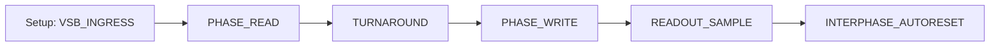

# DECIMA-8 🧠 — Нейроморфный Движок

**Детерминированный ритм для нейроморфных вычислений: Emulator → Proto (PCB) → FPGA → ASIC**

**Статус:** v0.2 DESIGN FREEZE

**Кодовое имя:** Siberian Tank Interface

---

## 📖 О Проекте

**DECIMA-8** — это архитектура нейроморфного движка с детерминированным ритмом и программируемой тканью тайлов.

### Ключевые Принципы v0.2

| Принцип | Описание |
|---------|----------|
| **Level16** | Данные 0..15 на каждой из 8 линий |
| **Двунаправленный VSB** | Conductor задаёт вход до READ, Island драйвит в WRITE |
| **Tile = минимальная сущность** | RuleROM адресует тайлы напрямую |
| **BUS16 (8 lane)** | Все данные через общую шину, соседи данные не передают |
| **Граф активации** | Соседи формируют эстафету для чтения BUS |
| **Фьюз по диапазону** | LOCK если thr_cur16 ∈ [thr_lo16..thr_hi16] |
| **Decay-to-Zero** | Аккумулятор тянется к 0, не перескакивая |
| **Схлоп ветки** | Неактивный тайл сбрасывается в 0 |

---

## 🏗 Архитектура

```
┌─────────────────────────────────────────────────────┐
│  Conductor (Digital Island)                         │
│  - CPU / Эмулятор                                   │
│  - Выставляет VSB_INGRESS                           │
│  - Читает BUS16 после WRITE                         │
│  - Управляет EV_FLASH / EV_RESET / EV_BAKE          │
└─────────────────────────────────────────────────────┘
                         │
                         │ VSB[0..7] + BUS16[0..7]
                         ▼
┌─────────────────────────────────────────────────────┐
│  Island / Swarm (Analog Core)                       │
│  ┌─────────────────────────────────────────────┐    │
│  │  Массив Тайлов (16×16 = 256)                │    │
│  │  ┌─────┬─────┬─────┐                        │    │
│  │  │ Tile│ Tile│ ... │                        │    │
│  │  ├─────┼─────┼─────┤  Каждый тайл:          │    │
│  │  │ ... │ ... │ ... │  - 8 вход/вых lanes    │    │
│  │  └─────┴─────┴─────┘  - FUSE (thr/lock)     │    │
│  │         │                - Веса 8×8          │    │
│  └─────────┼───────────────────────────────────┘    │
│             │                                        │
│  ┌──────────▼──────────────────────────────────┐    │
│  │  BUS16 (общая шина 8 lane)                  │    │
│  │  Честное суммирование вкладов               │    │
│  └─────────────────────────────────────────────┘    │
└─────────────────────────────────────────────────────┘
```

---

## 📚 Документация

### Русская версия
- **Обзор:** https://decima.rulerom.com/ru/
- **Архитектура:** https://decima.rulerom.com/ru/arch/
- **Спецификация:** https://decima.rulerom.com/ru/spec/

### English Version
- **Overview:** https://decima.rulerom.com/en/
- **Architecture:** https://decima.rulerom.com/en/arch/
- **Specification:** https://decima.rulerom.com/en/spec/

### Разделы

| Раздел | Описание |
|--------|----------|
| **[Архитектура тайлов](ru/docs/arch/tiles.md)** | Модель тайла, FUSE-LOCK, ACTIVE closure |
| **[Шина BUS16](ru/docs/arch/bus.md)** | Честное суммирование, CLIP/OVF флаги |
| **[Фазы READ/WRITE](ru/docs/arch/phase.md)** | Канонический tick EV_FLASH |
| **[Маршрутизация](ru/docs/arch/routing.md)** | Граф активации, RoutingFlags16 |
| **[Bake TLV](ru/docs/spec/bake.md)** | Бинарный формат пропекания |
| **[Протокол](ru/docs/spec/protocol.md)** | EV_FLASH, EV_RESET, UDP |
| **[IDE](ru/docs/tools/ide.md)** | Визуальная среда пропекания |

---

## 🛠️ Быстрый Старт

### Запуск Документации

```bash
# Русская версия
cd ru
mkdocs serve

# Английская версия
cd en
mkdocs serve
```

### Структура Проекта

```
decima/
├── ru/                     # Русская документация
│   ├── mkdocs.yml
│   └── docs/
│       ├── index.md
│       ├── arch/           # Архитектура
│       ├── spec/           # Спецификация
│       ├── tools/          # Инструменты
│       └── integration/    # Интеграция
├── en/                     # English documentation
│   ├── mkdocs.yml
│   └── docs/
├── old/                    # Архивные материалы
├── README.md
├── llms.txt
└── ai-plugin.json
```

---

## 🔄 Канонический Tick (EV_FLASH)



| Фаза | Описание |
|------|----------|
| **PHASE_READ** | Тайлы семплируют вход, обновляют runtime |
| **TURNAROUND** | Conductor: Hi-Z, Island: prepare drive |
| **PHASE_WRITE** | Island драйвит BUS16 |
| **READOUT_SAMPLE** | Conductor читает BUS16[0..7] |
| **AUTORESET** | Опциональный сброс доменов |

---

## 📊 Hard Constants v0.2

| Константа | Значение |
|-----------|----------|
| **VSB** | 8 линий данных VSB[0..7] |
| **BUS16** | 8 lane, суммирование в WRITE |
| **Domains** | 16 доменов (0..15) |
| **Level16** | 0..15 (4 бита) |
| **RoutingFlags16** | 10 бит: N,E,S,W,NE,SE,SW,NW,BUS_R,BUS_W |

---

## 🔗 Экосистема

| Проект | Описание | URL |
|--------|----------|-----|
| **🌿 Intent-Garden** | Детерминированный движок верификации C/C++ | https://intent-garden.org |
| **📜 Rule-Rom** | Глобальная библиотека намерений | https://rulerom.com |
| **🏛️ Swarm Council** | 16 старейшин в ядре сварма | https://intent-garden.org/swarm.html |
| **🧬 Personality Lab** | Пекарня нейроморфных личностей | https://intent-garden.org/bakery.html |

---

## 📧 Контакты

- **Документация:** https://decima.rulerom.com
- **Email:** vsb@decima8.org

---

## 💰 Поддержка

- **Boosty:** https://boosty.to/intentgarden

---

**Bake the Future. Build the Substrate.** 🛠️⚡️
