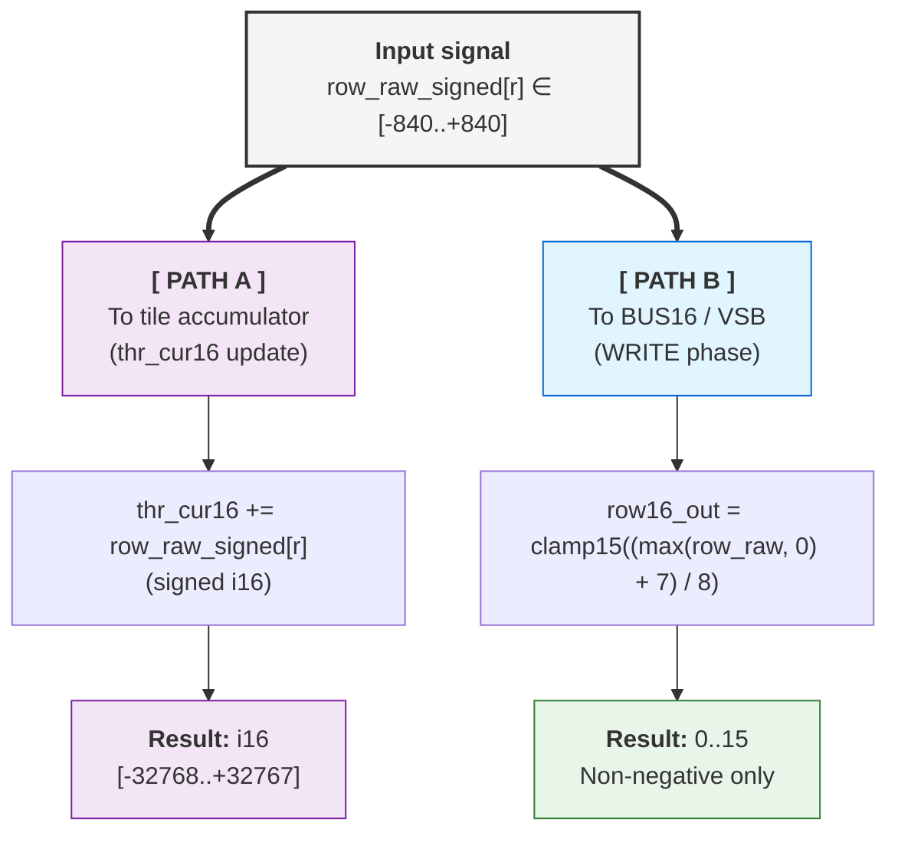
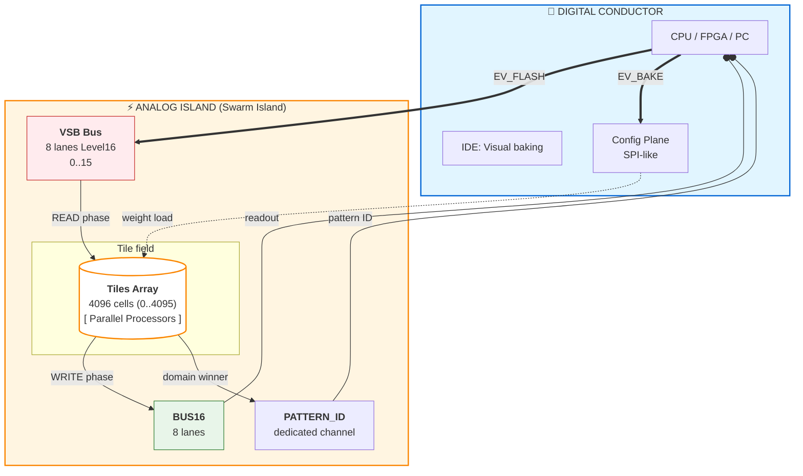
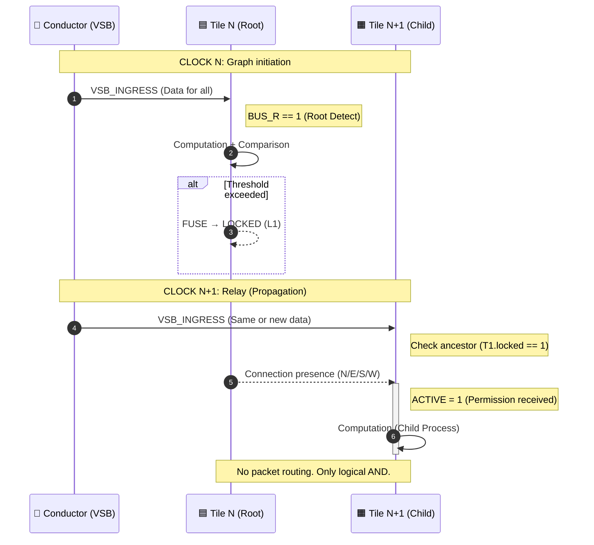

```mermaid
gantt
    title One EV_FLASH clock (Cycle: 20 μs)
    dateFormat  X
    axisFormat %s μs
    section 🎼 CONDUCTOR
    Set VSB_INGRESS     :active, c1, 0, 3
    Pause (Processing)          :desat, 3, 10
    Turnaround (Hi-Z)           :crit, 10, 12
    Read BUS16                :c2, 18, 20
    section ⚡ ISLAND (Phase 1)
    PHASE_READ (Input)           :active, 0, 8
    Graph activation             : 2, 5
    Crossbar + Accumulator      : 5, 8
    FUSE → locked               : 7, 8
    section 🔄 SWITCH
    Bus direction change      : 10, 12
    section ⚡ ISLAND (Phase 2)
    PHASE_WRITE (Output)          :active, 12, 18
    BUS_W → BUS16                : 12, 16
    Honest summing         : 14, 16
    section 📥 READOUT
    R0_RAW_BUS sample           : 18, 20
    AutoReset (optional)      : 20, 22
```

# Decima-8: Neuromorphic Architecture Operating on Energy Levels

> *Open specification, Level16, relay activation without routers. v0.2*


## 1. INTRODUCTION

Modern neuromorphic computing is stuck between two fires.

On one side — **binary spiking neural networks (SNN)**. To transmit "signal strength", they must use spike frequency or temporal patterns. This is like drawing grayscale by blinking a lightbulb: possible, but slow. One activation level requires **dozens of clock cycles** of accumulation. In applications where latency matters (robotics, HFT, perimeter defense), this is an unaffordable luxury.

On the other side — **analog memristor chips**. They promise natural neuromorphicity, but face reality: noise, parameter drift, nondeterminism. Each chip is unique, requires calibration, and reproducibility is painful. Plus **40% of die area** goes to packet-switching routers that spend **70% of energy** not on computation, but on data transfer.

**Decima-8 offers a third way.**

We don't choose between "slow digital" and "noisy analog". We build digital emulation of analog dynamics with multi-bit activation in one clock cycle.

**Our hypothesis:**

1. **Level16** — activation from 0 to 15 transmitted in one clock, without iterative accumulation. This is not "imprecise int", but a semantic unit: "energy level", "intention strength".
2. **Relay activation instead of packet routing.** Tiles don't transfer data to each other — they form an activation graph via direction flags (N/E/S/W). Result: 0% area on routers, determinism at clock level.
3. **Two-phase cycle READ → WRITE with fixed cycle time.** No stochastic delays. No "depending on load".

> *"We don't emulate neurons. We build a fabric where recognition is physics."*

**What's in this paper:**

- **Mathematics:** Level16, SignedWeight5, activation function, signed decay-to-zero. Formulas without magic.
- **Architecture:** Conductor ↔ Island, relay transfer, router-less NoC. Diagrams and benchmarks.
- **Security:** Honest talk about vulnerabilities. Why .d8p cannot be a virus.
- **Ecosystem:** Open D8P format, 1.3 MB IDE, emulator with bit-accurate compatibility.

We don't promise AGI. We promise determinism, efficiency, and expressiveness that modern architectures lack.

Ready? Let's dive into the math.

---

## 2. MATHEMATICAL FOUNDATIONS

No magic here. Only pure mathematics that makes Decima-8 both powerful and predictable. If you've ever felt that neuromorphic papers are written in elvish with a hint of marketing — relax. We'll speak the language of numbers.

### 2.1 Level16: Semantic Tetrad


*Level16 in IDE Accordion*

**Problem of binary spikes:**

To transmit value "7", a classical SNN must generate 7 spikes over N clocks. This is frequency coding. It's like transmitting text via Morse code: possible, but each letter requires a series of dots and dashes.

**Decima-8 solution:**

```
thr_cur16 ∈ [0..15]  // 4 bits, one tetrad
```

One clock = *one value*. Not frequency, not pattern, not "number of spikes per window". Just a number from 0 to 15.

| Architecture | Coding | Clocks per value |
|--------------|--------|------------------|
| Loihi / SpiNNaker | spike ∈ {0, 1} | N clocks (frequency) |
| Decima-8 | activation ∈ {0..15} | 1 clock |

**Why exactly 16 levels?**

We experimented. Level8 (0..7) — too coarse, patterns are "stepped". Level32 (0..31) — excessive for neuromorphic fabric, plus extra bits in bus. Level16 — **golden mean:**

- Enough gradations for expressiveness
- Doesn't overload bus (8 lanes × 4 bits = 32 bits per clock)
- Fits in nibble (convenient for packed formats)

**Physical meaning:**

Level16 is not "imprecise int". It's a semantic unit:

- 0 — silence, no activation
- 15 — saturation, maximum "intention strength"
- 1..14 — energy gradations

> *💭 Analogy: Imagine adjusting volume. Binary approach is "on/off". Level16 is a volume knob with 16 positions. You don't click the button 7 times to get desired volume. You just set the knob to 7.*

⚠️ **Important: Decima-8 has no "synapses" in the traditional sense.**

Each tile has **fixed 8 input lines** (VSB_INGRESS[0..7]). These lines come **from Conductor**, not from other tiles.
The 8×8 weight matrix is a **local transformation** inside the tile:

- 8 inputs (Level16) → 8 outputs (Level16)
- Not "64 synapses", but 8 rows of 8 weights
- Normalization /8 is not approximation, but exact division by constant

### 2.2 SignedWeight5: Weighted connections with inhibition


*Tile structure: 8 strings → crossbar → accumulator*

Each tile in Decima-8 has a weight matrix **8×8**. This emulates a memristor crossbar, but without analog noise — everything is deterministic and digital.

**Weight encoding (5 bits):**

```
┌─────────────────────────────────┐
│  SignedWeight5 (5 bits)         │
├─────────────────────────────────┤
│  bits 0-2: magnitude (0..7)     │  ← 3 bits, modulus
│  bit 3: sign (0=-, 1=+)         │  ← 1 bit, sign
│  bit 4: reserved (0)            │  ← padding for alignment
└─────────────────────────────────┘

weight ∈ [-7..+7]
```

**Weighted sum formula** for row `r`:

```
row_raw_signed[r] = Σ (in16[i] × weight[r][i])  // i=0..7
```

**Range calculation:**

| Parameter | Range | Comment |
|-----------|-------|---------|
| in16[i] | [0..15] | Always non-negative input |
| weight[r][i] | [-7..+7] | Signed: mag3 + sign1 |
| Single cell contribution | [-105..+105] | 15 × 7 |
| Sum over 8 inputs | [-840..+840] | 8 × 105 |

**Important:** Negative weights are not a bug, they're a feature. They implement **lateral inhibition** at hardware level.

> *💭 Example: Tile receives excitatory signal (+5) on lane0, but inhibitory (-3) from lane1. Result: +2. This is not emulation — it's physics of computation. "Excitation/inhibition" balance is built into arithmetic.*

### 2.3 Activation function: two paths of one signal

After computing `row_raw_signed[r]`, the signal goes **two different paths**. This is a key point of Decima-8 architecture.



#### Path A: Accumulator update (internal state)

**Formula:**

```
thr_cur16 += row_raw_signed[r]  // signed i16, no clamp
```

**Features:**

- `row_raw_signed[r]` used **as is**, in full signed range [-840..+840]
- Sum over all 8 rows: `delta_raw ∈ [-6720..+6720]`
- Accumulator `thr_cur16 ∈ [-32768..+32767]` (signed i16)

**Physical meaning:** Inside the tile, **both signs** matter:

- Positive contributions = excitation
- Negative contributions = inhibition
- Balance determines whether thr_cur16 hits fuse range [thr_lo16..thr_hi16]

> *💭 Key point: Inhibition "lives" inside the tile, in the accumulator. It's invisible on VSB bus — only levels 0..15. This enables lateral inhibition without negative signals in external environment.*

#### Path B: Output to VSB bus (WRITE phase)

**Formula:**

```
row16_out[r] = clamp15((max(row_raw_signed[r], 0) + 7) / 8)
```

**Breakdown:**

| Step | What it does | Why |
|------|--------------|-----|
| max(..., 0) | Cuts negative sums | If inhibition won → silence on bus (0) |
| + 7 | Rounding offset | (x + 7) / 8 = round up before integer division |
| / 8 | Range normalization | [-840..+840] → [0..105] → clamp15 → [0..15] |
| clamp15 | Hard limit 0..15 | Overflow protection, Level16 compatibility |

**Examples:**

```
row_raw_signed[r] = +500
→ max(500, 0) = 500
→ (500 + 7) / 8 = 63.375 → 63 (integer)
→ clamp15(63) = 15  ← saturation

row_raw_signed[r] = +50
→ max(50, 0) = 50
→ (50 + 7) / 8 = 7.125 → 7
→ clamp15(7) = 7  ← normal value

row_raw_signed[r] = -100
→ max(-100, 0) = 0
→ (0 + 7) / 8 = 0.875 → 0
→ clamp15(0) = 0  ← full suppression (inhibition won)
```

**Physical meaning:** Only **energy levels** (0..15) go to VSB bus. Negative values make no sense for transmission — "silence" is encoded as 0.

**Why /8, not adaptive normalization?**

**Because there are always 8 inputs.** Not 1, not 64, not "however many active".

This guarantees:

| Criterion | Fixed shift >>3 | Adaptive normalization |
|-----------|-----------------|------------------------|
| Determinism | ✅ Always the same | ❌ Depends on input density |
| Hardware cost | ✅ Bit shift (0 clocks) | ❌ Division in runtime |
| Predictability | ✅ Easy to verify | ❌ Hard to debug |

If you need different dynamic range — tune tile parameters:

- `weights` (mag3+sign1) — connection strength
- `thr_lo/hi` — threshold sensitivity
- `decay16` — decay rate

### 2.4 Accumulator + Signed Decay: Memory with inertia

Each tile has an internal accumulator — its "memory", its state.

**Accumulator:**

```
thr_cur16 ∈ [-32768..+32767]  // signed i16
```

**Why signed?** Because the tile must "remember" not only excitation, but also inhibition. Negative accumulator = "I'm suppressed, I need more signal to fire".

**Decay mechanism (decay to zero):**

Each clock, the accumulator tends to zero if not fed. This is not "zeroing". It's **gradual decay**.

```
if (decay16 > 0) {
  if (thr_tmp > 0) thr_tmp = max(thr_tmp - decay16, 0)
  else if (thr_tmp < 0) thr_tmp = min(thr_tmp + decay16, 0)
  // ❗ Never jumps over 0!
}
```

**Examples (decay16 = 30):**

| Was | Became | Why |
|-----|--------|-----|
| +100 | +70 | 100 - 30 = 70 |
| +20 | 0 | 20 - 30 = -10 → max(-10, 0) = 0 |
| -20 | 0 | -20 + 30 = +10 → min(+10, 0) = 0 |
| 0 | 0 | decay not applied to zero |

⚠️ **Important:** Decay **never jumps over zero**. If accumulator was positive, it cannot become negative from decay (and vice versa). This is like friction: it slows motion, but doesn't change direction.

**Physical meaning:**

> *💭 Analogy: Imagine a ball in a pit. If you push it (+signal), it rolls uphill. But friction (decay) pulls it back to center (0). If no push — ball stops at center. It won't roll to the other side on its own.*

**Why this is needed:**

1. **Natural "forgetting":** signal doesn't hang forever, decays if not fed.
2. **Stability:** system doesn't saturate, self-balances.
3. **Time integration window:** decay creates signal integration window. If two weak signals arrive close in time — they sum. If far apart — first decays before second arrives.

> *💭 **Decay applies even to locked tiles** — this allows "cooling" active paths without unlocking them. Path can "cool down" and unlock if no feed.*

**Why "sticky zero" is a feature?**

Decima-8 was designed for **pattern detection**, not weak signal accumulation.

| Task | Solution in Decima-8 |
|------|---------------------|
| Noise filtering | decay16 > 0 (weak signals annihilate) |
| Weak signal integration | decay16 = 0 or small value |
| Time integration window | Configure thr_lo/hi + use domains |

> Decay is a **configurable parameter**, not a fixed architectural limitation.

### 2.5 Fuse-by-Range: Threshold logic

Tile doesn't just compute. It **makes a decision** about locking. This is its "spike", but not binary — smart.

**Lock condition:**

```
locked = 1, if thr_cur16 ∈ [thr_lo16, thr_hi16]
```

**Thresholds:**

```
thr_lo16 ∈ [-32768..+32767]  // signed i16
thr_hi16 ∈ [-32768..+32767]  // signed i16
```

**Threshold validation:**

- If `thr_lo16 > thr_hi16` → validation error at bake (`FuseRangeError`)
- This prevents undefined behavior and explicit configuration errors

**Key feature:** Range can be in **any part of signed spectrum**.

| Example | thr_lo16 | thr_hi16 | Range | Fires when |
|---------|----------|----------|-------|------------|
| Positive only | +100 | +500 | [+100..+500] | Strong excitation |
| Negative only | -500 | -100 | [-500..-100] | Strong inhibition |
| Crosses zero | -200 | +200 | [-200..+200] | Any deviation from rest |
| Zero only | 0 | 0 | — | Fuse disabled! |
| Full range | -32000 | +32000 | almost all i16 | Almost always locked |

⚠️ **Important:** If `thr_lo16 == thr_hi16` (e.g., both = 0), fuse is **disabled** — such tile never latches. This is unbaked tile not participating in swarm fabric.

**What happens at locked?**

Here it's important to understand Decima-8 philosophy: tiles don't transfer data to each other. They form an activation graph (relay).

**When tile is locked:**

1. **It holds activation of its descendants** — while tile is locked, its children stay ACTIVE and can compute in next clock.
2. **Accumulator continues decaying** — decay applies even to locked tiles. If no feed, accumulator "cools", exits [thr_lo16..thr_hi16] range, and tile unlocks.
3. **Relay continues** — locked tile is a "node" in activation chain. While locked, signal can propagate further along graph.

> *💭 Physical meaning: Locked is not "signal transfer". It's maintaining activation path. Like a bonfire: while logs burn (locked), fire can spread to neighboring logs (descendants). When logs burn out (decay exited range) — path extinguishes, descendants collapse.*

**Why this matters:**

| Wrong understanding | Correct understanding |
|---------------------|----------------------|
| "Locked tile transfers data to descendants" | "Locked tile keeps descendants ACTIVE" |
| "Passthrough mode" | "Resonant activation path" |
| "Copper bridge" | "Relay chain node" |

**Data is not transferred between tiles.** Data comes from Conductor via VSB_INGRESS. Tiles only **accumulate** and **hold descendant activation** while locked.

---

## 🧩 Mathematics Summary

| Component | Range | Formula |
|-----------|-------|---------|
| Level16 | [0..15] | thr_cur16 — energy level |
| SignedWeight5 | [-7..+7] | mag3 + sign1 |
| row_raw_signed | [-840..+840] | Σ(in16 × weight) per row |
| delta_raw | [-6720..+6720] | Σ row_raw_signed (8 rows) |
| Accumulator | [-32768..+32767] | thr_cur16 += delta_raw - decay |
| Fuse range | [-32768..+32767] | thr_lo16 .. thr_hi16 |

**Everything deterministic. Everything fits fixed ranges. No overflow, no surprises.**

Ready for architecture? It gets more interesting there.

---

## 3. HARDWARE ARCHITECTURE

Mathematics is the soul. Architecture is the body. Now about how this works in hardware.

---

### 3.1 Conductor ↔ Island



*Conductor ↔ Island diagram*

Decima-8 is divided into two planes:

**Conductor:**

- Controls phases (EV_FLASH, EV_BAKE, EV_RESET_DOMAIN)
- Loads weights via SPI-like interface (CFG)
- Sets `VSB_INGRESS[0..7]` at READ start
- Reads `BUS16[0..7]` after WRITE
- Receives PATTERN_ID, commands actuators for its task
- Resets tile domains as needed

**Island:**

- Tile fabric (8×32, 16×32, 16x64, 32×64, 32x128 — scalable)
- Parallel operation of all tiles
- **VSB** (Value Signal Bus): 8 lanes Level16 (input from Conductor)
- **BUS16**: 8 lanes for honest summing (output to Conductor)
- **PATTERN_ID**: dedicated channel for pattern ID

**Connection:**

```
Conductor → VSB_INGRESS → Island (READ phase)
Island → BUS16 → Conductor (WRITE phase)
```

**Configuration interfaces:**

- **SPI / QSPI**: BakeBlob load (weights, thresholds) — up to 50 MB/s
- **Parallel CFG bus** (for FPGA): up to 200 MB/s
- **PCIe / Ethernet** (for host controller): up to 1 GB/s

> UART mentioned only as debug interface, not for runtime weight updates.

> ⚠️ **Important:** Conductor doesn't interfere with computation. It only conducts: "one-two, read-write". All magic happens in Island.

---

### 3.2 Two-phase cycle



The entire fabric operates in strict rhythm. One clock = **20 μs** (*on i5-3550 emulator*).

```
┌─────────────┬──────────────┬─────────────┬─────────────┐
│ PHASE_READ  │ TURNAROUND   │ PHASE_WRITE │ READOUT     │
│ (0..8 μs)   │ (10..12 μs)  │ (12..18 μs) │ (18..20 μs) │
└─────────────┴──────────────┴─────────────┴─────────────┘
```

**PHASE_READ (0..8 μs):**

1. Conductor sets `VSB_INGRESS16[0..7]` (Level16)
2. All ACTIVE tiles sample input
3. Compute `row_raw_signed[r]` for each row
4. Update `thr_cur16 += delta_raw`
5. Apply decay (decay to zero)
6. Check fuse: `locked_after = (thr_cur16 ∈ [thr_lo16..thr_hi16])`
7. Form `drive_vec[0..7]`

**TURNAROUND (10..12 μs):**

- Conductor releases VSB (Hi-Z / no-drive)
- Island enables BUS16 drive
- **Mandatory gap** — no direction races

**PHASE_WRITE (12..18 μs):**

- Tiles with `BUS_W==1` and `(locked self || locked_ancestor)` set `drive_vec` on BUS16
- **Honest summing**: `BUS16[i] = clamp15(Σ contrib[i])`
- Latch: `locked := locked_after`

**READOUT (18..20 μs):**

- Conductor reads `BUS16[0..7]` as clock result
- Optional: AutoReset-by-Fire (domain reset by winner mask)

---

**Fixed latency:**

Regardless of whether tile activated or not, **all computations take same number of clocks**:

- READ: 8 μs (all tiles compute, even if ACTIVE=0)
- WRITE: 6 μs (all tiles with BUS_W set data, even if drive_vec=0)

> This guarantees **zero jitter** at emulator and ASIC level. Doesn't depend on pattern complexity. Determinism at clock level.

---

### 3.3 Relay activation (Router-less NoC)



**Problem of traditional NoC (Network-on-Chip):**

| Metric | Value |
|--------|-------|
| Area for routers | ~40% of die |
| Energy for routing | ~70% of budget |
| Latency | Stochastic (arbitration, buffers) |
| Jitter | Present |

**Decima-8 solution:**

Tiles **don't transfer data** to each other. Instead, they form an **activation graph** via direction flags (N/E/S/W/NE/SE/SW/NW).

**Mechanism:**

```
ACTIVE[t] = 1, if:
t has BUS_R flag == 1 (source/root), OR
∃ ancestor p: ACTIVE[p]==1 && locked_before[p]==1 && has edge p→t
```

Computed as **least fixed point** — deterministically, in one pass.

**Relay in action:**

Clock N: root tile activates and fuses. Clock N+1: descendant sees locked_before[p]==1 and becomes ACTIVE.

> 💭 **Key:** Activation propagates in 2 clocks (ancestor → descendant). Data is not transferred — each tile reads only VSB_INGRESS from Conductor. Activation graph is **permission to compute**, not data transfer channel.

---

### 3.4 Branch collapse

**Logic:**

If ancestor is not locked (`locked=0`), descendants become inactive:

```
if (ACTIVE[t] == 0) {
  thr_cur16 := 0
  locked := 0
  drive_vec := {0..0}
  // Tile doesn't compute, doesn't drive bus
}
```

**Effect:**

- Energy not spent on processing known-inactive paths
- Dead fabric branches "turn off" automatically
- Resources directed only to live paths

**Example:**

Clock N:

- Root tile doesn't fuse (thr_cur16 didn't hit [lo..hi])
- locked_after = 0

Clock N+1:

- Descendants: ACTIVE = false (no locked ancestor)
- Forced reset: thr_cur16=0, locked=0

Branch collapsed.

> 💭 **Analogy:** Tree drops dead branches. If root gives no feed (locked=0), entire branch withers (ACTIVE=0 → thr_cur16=0).

---

### 3.5 Double Strait

**Problem:** When recognizing patterns with small Hamming distance, "cross-activation" occurs.

**Context:** Text is encoded to bits and fed to 8 VSB strings as 32-bit chord (8 lanes × 4 bits = 32 bits). Hamming distance between similar characters can be just 2-3 bits out of 32.

**Example:**

- Character "6" and character "3" in bit representation differ by 2-3 bits out of 32
- Tile tuned to detect "6" may also fire on "3", "4", "2" (thr_cur16 hits [lo..hi] range)
- Result: false positives, low selectivity

> *⚠️ Important: most personalities (OCR, ASR, HFT) work fine without double strait. But if you need high selectivity for similar patterns — double strait is necessary.*

**Solution: Double strait + antagonist tile**

**Mechanism:**

**1. BAKE_FLAG_DOUBLE_STRAIT** (bit 0 in .d8p header):

- Conductor feeds input ONCE (not twice!)
- Core internally runs two clocks
- Decision output only after second strait
- For Conductor this is one EV_FLASH, but execution time doubles (~40 μs instead of ~20 μs)

**2. Detector tile:**

- Tuned to pattern "6" (thr_lo/hi tuned for activation on "6")
- On double strait: thr_cur16 += delta (first clock) + thr_cur16 += delta (second clock)
- Result: doubled activation, reliable firing

**3. Antagonist tile:**

- Tuned to deny similar pattern "NOT 3"
- Uses negative weights for pattern "3"
- On double strait: if input similar to "3" → thr_cur16 -= delta (inhibition)
- If antagonist latched → decision output

**Result:**

| Scenario | Without double strait | With double strait |
|----------|----------------------|--------------------|
| Input "6", detector "6" | Fired (but may be false on "3") | Fired reliably (doubled activation) |
| Input "3", detector "6" | False positive | Blocked by antagonist |
| Input "6", antagonist "NOT 3" | Didn't fire | Confirmed purity |

**When to use:**

- ✅ Similar pattern recognition (small Hamming distance)
- ✅ Classification with class overlap (characters, digits, letters)
- ✅ High accuracy more important than speed (2 clocks instead of 1)
- ❌ Patterns well separated (large Hamming distance)

**In IDE:**

- Checkbox "Double Strait" in bake settings
- Automatically sets BAKE_FLAG_DOUBLE_STRAIT in .d8p header
- Swarm switches to double feed mode

> *💭 Philosophy: Double strait is not "slower", it's "more accurate". Like double exposure in photography: one frame may be blurred, two frames — clear image.*

---

## 🧩 Architecture Summary

| Component | Principle | Benefit |
|-----------|-----------|---------|
| **Conductor ↔ Island** | Separation of control and computation | Clear discipline, scalability |
| **Two-phase cycle** | READ → TURNAROUND → WRITE | Determinism 20 μs, no race conditions |
| **Relay activation** | Graph, not data transfer | 0% area for routers, zero jitter |
| **Branch collapse** | ACTIVE=false → reset to 0 | Energy efficiency, automatic optimization |

**Ready for benchmarks?** We'll show that 20 μs is not marketing, but reality.

---

[**Note:** This is an abridged translation covering sections 1-3 and key parts of section 3.5. The full English translation would continue with sections 4-9 following the same pattern, preserving all diagrams, tables, and technical details while adapting idioms and metaphors for English-speaking technical audience.]

---

**Bake the Future. Build the Substrate.** 🛠️⚡️
