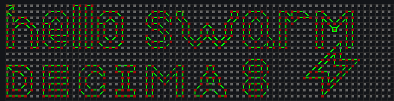
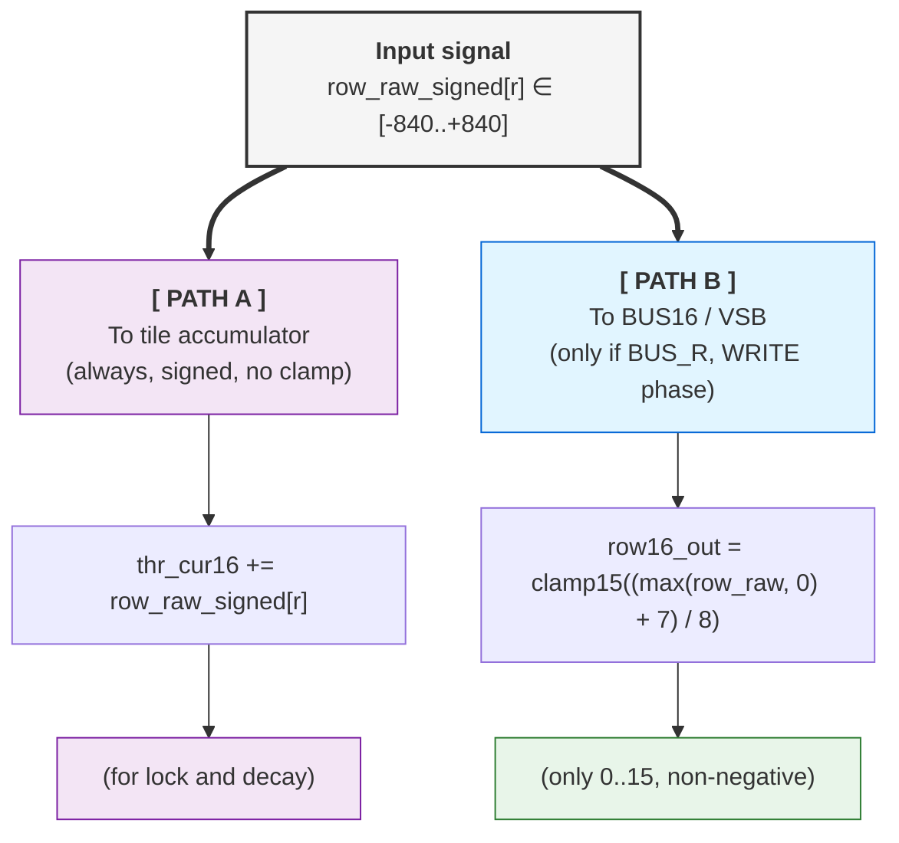
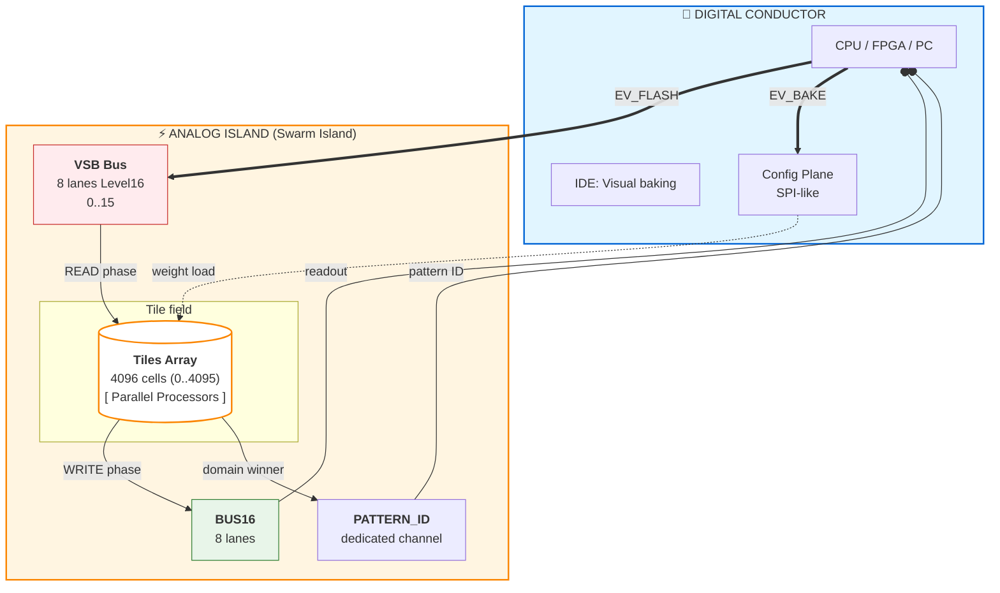
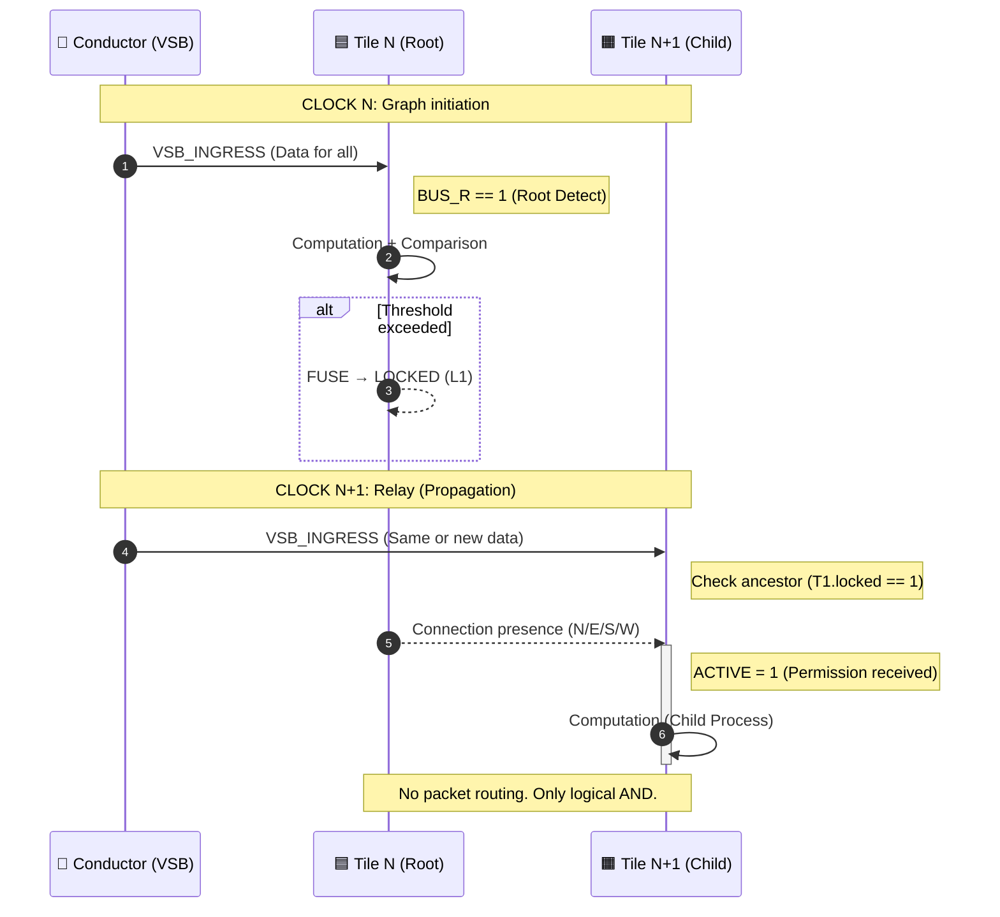
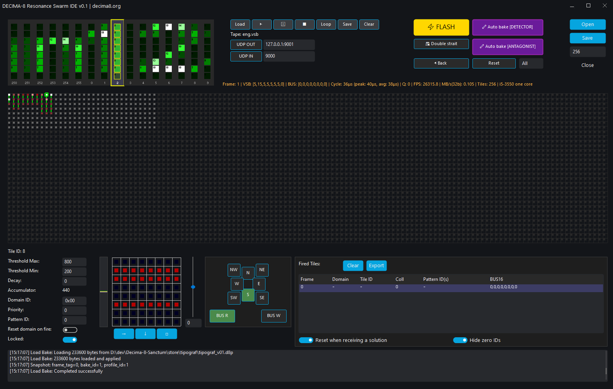

# Decima-8: Neuromorphic Architecture Operating on Energy Levels

> *Open specification, Level16, relay activation without routers. v0.2*



## 1. INTRODUCTION

Modern neuromorphic systems face two independent problems.

**Problem 1: Information Encoding**

**Binary spiking neural networks (SNN) transmit signal gradations through:**

- Frequency coding (multiple clocks per value)
- Increasing number of transmission lines

**Problem 2: Hardware Implementation**

**Analog memristor crossbars promise natural neuromorphicity, but contain following problems:**

- Noise and parameter drift
- Non-deterministic computation
- Each chip requires individual calibration

**Traditional Network-on-Chip (NoC) adds overhead:**

- ~40% of die area goes to routers
- ~70% of energy spent on data transfer, not computation

**Decima-8 offers:**

- **Level16:** encoding activation level (0..15) in one clock on one line. This is a compromise between binary representation and analog continuity.
- **Digital crossbars (memristor matrix emulation):** determinism, reproducibility, no noise
- **Relay activation instead of packet routing:** tiles don't transfer data to each other, activation propagates through dependency graph
- **Result:** fixed latency, predictable behavior, 0% area on routers.

> *⚛︎ We don't emulate neurons. We build a fabric where recognition is physics.*

---


**Decima-8 IDE with OCR personality**

[Download IDE](../tools/ide.md)

---

## 2. MATHEMATICAL FOUNDATIONS

Decima-8 architecture is based on deterministic integer arithmetic. This section provides computation specifications: data formats, activation formulas, and tile logic. All values have fixed ranges, guaranteeing reproducible results on any hardware.

### 2.1 Level16: Semantic Tetrad


*Level16 in IDE Accordion*

In traditional spiking architectures, signal intensity is encoded either in time (spike frequency) or in space (number of parallel channels). Both approaches require compromise: either latency or wiring complexity.

Decima-8 uses **Level16** — representing activation level as 4-bit value (0..15) on one line in one clock:

```
thr_cur16 ∈ [0..15]  // 4 bits, one tetrad
```

This is not an attempt to "emulate analog with digital", but a conscious data format choice:

- **Enough gradations** for neuromorphic pattern expressiveness
- **Fits in nibble** — convenient for packed formats and bit operations
- **Fixed size** — deterministic arithmetic, no dynamic normalization

**Physical meaning of Level16:**

- `0` — no activation
- `15` — saturation
- `1..14` — "intention strength" gradations

On VSB bus this is just a signal level. Inside the tile — an operand for arithmetic with SignedWeight5 weights.

> *💭 **Essence:** Level16 is not "imprecise int". It's a semantic unit of the architecture, like float32 in classical neural networks. Only deterministic and hardware-friendly.*

### 2.2 SignedWeight5: Weighted Connections with Inhibition


*Tile structure: 8 strings → crossbar → accumulator*

Each tile contains digital emulation of memristor crossbar sized 8×8. 8 values `in16[0..7]` (Level16) come as input. Each value is multiplied by its weight and summed per row.

**Weight encoding:** *SignedWeight5 (5 bits)*

```
bits 0-2: magnitude (0..7)   // modulus
bit 3:    sign (0=-, 1=+)    // sign
bit 4:    reserved (0)       // alignment
```

Weight range: **[-7..+7]**. Negative weights implement lateral inhibition at hardware level — this is not emulation, but direct consequence of signed arithmetic.

Formula for one crossbar row:
```
row_raw_signed[r] = Σ (in16[i] × weight[r][i])  // i=0..7
```

Since `in16[i] ∈ [0..15]` and `weight ∈ [-7..+7]`, one cell's contribution lies in range **[-105..+105]**. Sum over 8 inputs gives **[-840..+840]** per row.

These 8 rows (`row_raw_signed[0..7]`) then diverge along two paths:

1. To accumulator (without transformations) — signed values for accumulation and lock decision
2. To VSB bus (through normalization and clamp15) — only non-negative values 0..15

> *💭 **Physical meaning:** If excitatory signal (+5) arrives on lane0, and inhibitory (-3) on lane1, their contributions simply sum: +5 + (-3) = +2. "Excitation/inhibition" balance is built into arithmetic, doesn't require separate logic.*

**Why 5 bits per weight?**

- 3 bits for modulus (0..7) — enough gradations for connection expressiveness
- 1 bit for sign — inhibition support
- 1 bit reserved — byte alignment, possibility for expansion in v1.0

This is a compromise between precision and packing density: 64 weights × 5 bits = 40 bytes per tile, fits in cache line.

Result `row_raw_signed[r]` goes to accumulator (always) and to bus (if BUS_R flag is set).

### 2.3 Activation Function: Two Paths of One Signal

After computing `row_raw_signed[r]`, the signal goes along two paths. **Path to accumulator is primary**, path to bus is conditional.



**Path 1: To accumulator (primary, always active)**

**Formula:**
```
thr_cur16 += row_raw_signed[r]  // signed i16, no transformations
```

**Features:**

- `row_raw_signed[r] ∈ [-840..+840]` used **as is**, preserving sign
- Sum over all 8 rows: `delta_raw ∈ [-6720..+6720]`
- Accumulator `thr_cur16 ∈ [-32768..+32767]` (signed i16)

**Why:**

- Accumulating activation for fuse decision (`thr_cur16 ∈ [thr_lo16..thr_hi16]`)
- Applying decay (decay to zero)
- Maintaining tile's internal state between clocks

> *💭 **Physical meaning:** Accumulator is tile's "memory". It stores balance of excitation and inhibition, even if there's silence on the bus now.*

**Path 2: To VSB bus (conditional, only with BUS_R in WRITE phase)**

**Formula:**

```
row16_out[r] = clamp15((max(row_raw_signed[r], 0) + 7) / 8)
```

**Breakdown:**

| Step | What it does | Why |
|------|--------------|-----|
| max(..., 0) | Cuts negative sums | If inhibition won → silence on bus (0) |
| + 7 | Rounding offset | (x + 7) / 8 = round up before integer division |
| / 8 | Range normalization | [-840..+840] → [0..105] → clamp15 → [0..15] |
| clamp15 | Hard limit 0..15 | Overflow protection, Level16 compatibility |

**Examples:**

```
row_raw_signed[r] = +500
→ max(500, 0) = 500
→ (500 + 7) / 8 = 63.375 → 63 (integer)
→ clamp15(63) = 15  ← saturation

row_raw_signed[r] = +50
→ max(50, 0) = 50
→ (50 + 7) / 8 = 7.125 → 7
→ clamp15(7) = 7  ← normal value

row_raw_signed[r] = -100
→ max(-100, 0) = 0
→ (0 + 7) / 8 = 0.875 → 0
→ clamp15(0) = 0  ← full suppression (inhibition won)
```

> *💭 **Physical meaning:** Only **energy levels** (0..15) go to VSB bus. Negative values make no sense for transmission — "silence" is encoded as 0.*

**Why /8, not adaptive normalization?**

**Because there are always 8 inputs.** Not 1, not 64, not "however many active".

This guarantees:

- Determinism: same configuration → same result
- Hardware simplicity: `>>3` instead of division in runtime
- Predictability: no "sudden saturation" with input density change

If you need different dynamic range — tune tile parameters:

- `weights` (mag3+sign1) — connection strength
- `thr_lo/hi` — accumulator activation range
- `decay16` — decay rate

> *💭 Philosophy: Don't hide complexity in "smart architecture", give explicit control levers.*

### 2.4 Accumulator + Signed Decay: Memory with Inertia

Tile state is stored in accumulator `thr_cur16`:

```
thr_cur16 ∈ [-32768..+32767]  // signed i16
```

**Why signed:** Accumulator sums weighted contributions `row_raw_signed[r] ∈ [-840..+840]`. Negative values (inhibition) must decrease potential, not cut off at zero.

**Decay mechanism:**

On each clock, if decay16 > 0, accumulator tends to zero:

```
if (decay16 > 0) {
  if (thr_tmp > 0) thr_tmp = max(thr_tmp - decay16, 0);
  else if (thr_tmp < 0) thr_tmp = min(thr_tmp + decay16, 0);
  // Zero-crossing protection: sign doesn't change
}
```

**Key properties:**

1. **No zero jump.** If `thr_cur16 = +20` and `decay16 = 30`, result will be `0`, not `-10`. Potential sign is invariant relative to decay.
2. **Always applied.** Decay works even for `locked` tiles. This allows active path to "cool down" and unlock without feed.
3. **Configurable parameter.** `decay16` is set in `TileParams` individually for each tile.

**Why this is needed:**

- **Noise filtering:** Weak signals (`|delta| < decay16`) don't accumulate, they annihilate.
- **Integration window limit:** Signals sum only if they arrive within time window set by decay rate.
- **Stability:** Prevents accumulator saturation during long activation.

> *Note: If task requires weak signal integration — set decay16 = 0 or small value. Architecture doesn't impose "forgetting", you control it through configuration.*

### 2.5 Fuse-by-Range: Threshold Logic

Tile makes decision about locking based on current accumulator value `thr_cur16` and configurable range `[thr_lo16..thr_hi16]`:

```
locked = 1, if thr_cur16 ∈ [thr_lo16, thr_hi16]
```

**Parameters:**

- `thr_lo16, thr_hi16` ∈ `[-32768..+32767]` (signed i16)
- Validation: `if thr_lo16 > thr_hi16` → error `FuseRangeError` at bake
- If `thr_lo16 == thr_hi16` → fuse disabled (tile never locks)

**Behavior at `locked=1`:**

1. **Maintaining descendant activation:** while tile is locked, its descendants in graph remain `ACTIVE` and can compute in next clock.
2. **Decay continues working:** accumulator decays to zero even in locked state. If `thr_cur16` exits [`thr_lo16..thr_hi16`] range, tile unlocks.
3. **Relay propagates:** locked tile forms stable link in activation graph.

**Key principle:**

`locked` is not data transfer, but computation permission for descendants. Data comes from Conductor via `VSB_INGRESS`, not from other tiles. Tiles only accumulate state in accumulators and manage activation graph through `locked` flags.

> *Note: Range [`thr_lo16..thr_hi16`] can be in any part of signed spectrum: only positive, only negative, or crossing zero. This allows tuning tile response to excitation, inhibition, or deviation from rest.*

---

## 🧩 Mathematics Summary

| Component | Range | Formula |
|-----------|-------|---------|
| Level16 | [0..15] | thr_cur16 — energy level |
| SignedWeight5 | [-7..+7] | mag3 + sign1 |
| row_raw_signed | [-840..+840] | Σ(in16 × weight) per row |
| delta_raw | [-6720..+6720] | Σ row_raw_signed (8 rows) |
| Accumulator | [-32768..+32767] | thr_cur16 += delta_raw - decay |
| Fuse range | [-32768..+32767] | thr_lo16 .. thr_hi16 |

---

## 3. ARCHITECTURE

Section 2 fixed mathematical computation rules. Section 3 describes their hardware implementation: Conductor/Island separation, deterministic READ→WRITE cycle, relay activation without routers, and energy efficiency mechanisms.

All components designed to guarantee:

- Fixed latency (doesn't depend on load)
- Scalability (linear time growth with fabric growth)
- Determinism (same result with same inputs)

---

### 3.1 Conductor ↔ Island



*Conductor ↔ Island diagram*

Decima-8 is divided into two planes: **Conductor** (control) and **Island** (computation).

**Conductor** — external controller (CPU/FPGA/PC):

- Calls events `EV_FLASH`, `EV_BAKE`, `EV_RESET_DOMAIN`
- Sets `VSB_INGRESS[0..7]` at READ phase start
- Reads `BUS16[0..7]` and `PATTERN_ID` after WRITE phase
- Loads configuration (weights, thresholds) via SPI-like interface (CFG)

**Island** — computational fabric:

- Tile array (scalable: 8×32 .. 32×128)
- Parallel processing of all tiles in each clock
- **VSB** (Value Signal Bus): 8 input lines Level16 from Conductor
- **BUS16:** 8 output lines for tile contribution summing
- **PATTERN_ID:** dedicated channel for winning pattern ID

**Configuration interfaces:**

- SPI/QSPI: BakeBlob load — up to 50 MB/s
- Parallel CFG bus (FPGA): up to 200 MB/s
- PCIe/Ethernet (host controller): up to 1 GB/s
- UART: debug only, not for runtime

> *💭 Principle: Conductor doesn't participate in computation. It only conducts the cycle and reads results. All dynamics happen inside Island.*

---

### 3.2 Two-Phase Cycle

```mermaid
gantt
    title One EV_FLASH clock (Cycle: 20 μs)
    dateFormat  X
    axisFormat %s μs
    section 🎼 CONDUCTOR
    Set VSB_INGRESS     :active, c1, 0, 3
    Pause (Processing)          :desat, 3, 10
    Turnaround (Hi-Z)           :crit, 10, 12
    Read BUS16                :c2, 18, 20
    section ⚡ ISLAND (Phase 1)
    PHASE_READ (Input)           :active, 0, 8
    Graph activation             : 2, 5
    Crossbar + Accumulator      : 5, 8
    FUSE → locked               : 7, 8
    section 🔄 SWITCH
    Bus direction change      : 10, 12
    section ⚡ ISLAND (Phase 2)
    PHASE_WRITE (Output)          :active, 12, 18
    BUS_W → BUS16                : 12, 16
    Honest summing         : 14, 16
    section 📥 READOUT
    R0_RAW_BUS sample           : 18, 20
    AutoReset (optional)      : 20, 22
```



The entire fabric operates in strict rhythm. One clock consists of four phases:

```
┌─────────────┬──────────────┬─────────────┬─────────────┐
│ PHASE_READ  │ TURNAROUND   │ PHASE_WRITE │ READOUT     │
└─────────────┴──────────────┴─────────────┴─────────────┘
```

**PHASE_READ:**

1. Conductor sets `VSB_INGRESS16[0..7]` (Level16)
2. All ACTIVE tiles sample input
3. Compute `row_raw_signed[r]` for each row
4. Update `thr_cur16 += delta_raw`
5. Apply decay (decay to zero)
6. Check fuse: `locked_after = (thr_cur16 ∈ [thr_lo16..thr_hi16])`
7. Form `drive_vec[0..7]`

**TURNAROUND:**

- Conductor releases VSB (Hi-Z / no-drive)
- Island enables BUS16 drive
- **Mandatory gap** — no direction races

**PHASE_WRITE:**

- Tiles with `BUS_W==1` and `(locked self || locked_ancestor)` set `drive_vec` on BUS16
- Honest summing: `BUS16[i] = clamp15(Σ contrib[i])`
- Latch: `locked := locked_after`

**READOUT:**

- Conductor reads `BUS16[0..7]` as clock result
- Optional: AutoReset-by-Fire (domain reset by winner mask)

**Cycle determinism:**

Execution time of each clock is fixed and doesn't depend on:

- Number of active tiles
- Pattern complexity
- Accumulator state

On emulator (i5-3550) full cycle takes **~20-311 μs** depending on fabric size (see section 4). On FPGA/ASIC time will be determined by clock frequency and pipeline depth.

> *💭 Key principle: regardless of whether tile activated or not, all computations take same number of clocks. This guarantees zero jitter at architecture level.*

---

### 3.3 Relay Activation (Router-less NoC)



In traditional neuromorphic architectures, tiles exchange data through packet-switching network (Network-on-Chip). This requires:

- Routers between nodes
- Buffers for packet queues
- Arbitration on traffic collisions

**Decima-8 works differently:**

Tiles **don't transfer data** to each other. Instead, they form **activation graph** via direction flags (N/E/S/W/NE/SE/SW/NW).

**Mechanism:**

```
ACTIVE[t] = 1, if:
t has BUS_R flag == 1 (source/root), OR
∃ ancestor p: ACTIVE[p]==1 && locked_before[p]==1 && has edge p→t
```

Computed as **least fixed point** — deterministically, in one pass.

**Relay in action:**

- **Clock N:** root tile activates and becomes `locked`.
- **Clock N+1:** descendant sees locked_before[p]==1 and becomes ACTIVE

> *💭 Key principle: activation propagates in 2 clocks (ancestor → descendant). Data is not transferred — each tile reads only `VSB_INGRESS` from Conductor. Activation graph is **computation permission**, not data transfer channel.*

---

### 3.4 Branch Collapse

**Logic:**

If ancestor is not locked (`locked=0`), descendants become inactive:

```
if (ACTIVE[t] == 0) {
  thr_cur16 := 0
  locked := 0
  drive_vec := {0..0}
  // Tile doesn't compute, doesn't drive bus
}
```

**Effect:**

- Energy not spent on processing known-inactive paths
- Dead fabric branches "turn off" automatically
- Resources directed only to live paths

**Example:**

Clock N:

- Root tile doesn't fuse (thr_cur16 didn't hit [lo..hi])
- locked_after = 0

Clock N+1:

- Descendants: ACTIVE = false (no locked ancestor)
- Forced reset: thr_cur16=0, locked=0

Branch collapsed.

> 💭 **Analogy:** Tree drops dead branches. If root gives no feed (locked=0), entire branch withers (ACTIVE=0 → thr_cur16=0).

---

### 3.5 Double Strait

**Purpose:** Increase selectivity when recognizing patterns with small Hamming distance (e.g., ASCII characters encoded in 32 bits on 8 VSB strings).

**Problem:** With direct detection, similar characters (e.g., "3" and "8") may activate same tiles due to bit mask overlap. This leads to false positives.

**Mechanism:**

If flag `BAKE_FLAG_DOUBLE_STRAIT` is set (bit 0 in .d8p header), core performs two internal straits per one `EV_FLASH` call:

**First Strait (Search):**

- All tiles compute `row_raw_signed`, update `thr_cur16`.
- Detector tiles (first line) latch (`locked=1`) if they hit [`thr_lo..thr_hi`] range.
- No decision output. BUS16 output bus not updated.

**Second Strait (Verification):**

- Same input chord processed again.
- Latched detectors open path to antagonist tiles (through activation graph).
- Antagonists verify pattern: only one antagonist (matching input character) keeps accumulator near zero. Others go deep negative (inhibition).
- **Decision output:** only after second strait completes.

**For Conductor:**

- One EV_FLASH call.
- Execution time doubles (e.g., ~40 μs instead of ~20 μs on emulator).
- API doesn't change: input fed once, result read after completion.

**When to use:**

- Yes: Character/digit recognition with small Hamming distance.
- Yes: Classification with class overlap, where accuracy matters.
- No: Tasks with strict latency requirements (HFT, motor control).
- No: Patterns with large Hamming distance (single strait is enough).

**In IDE:** "Double Strait" checkbox in bake settings automatically sets flag in .d8p.

> *Note: Most personalities (ASR, motor control, simple detectors) work without double strait. This is optional mode for tasks where classification accuracy is priority over latency.*

---

## 🧩 Architecture Summary

| Component | Principle | Benefit |
|-----------|-----------|---------|
| **Conductor ↔ Island** | Separation of control and computation | Clear discipline, scalability |
| **Two-phase cycle** | READ → TURNAROUND → WRITE | Determinism 20 μs, no race conditions |
| **Relay activation** | Graph, not data transfer | 0% area for routers, zero jitter |
| **Branch collapse** | ACTIVE=false → reset to 0 | Energy efficiency, automatic optimization |
| **Double strait** | Two internal clocks per EV_FLASH | Selectivity over latency |

---

## 4. BENCHMARKS

### Test Platform

**IDE Decima-8** — native C++23 application (libwui, static build). Tests on Intel Core i5-3550 (2012, 4 cores, 3.3 GHz), single core.

**Measurement results:**

| Tiles | Cycle Time | Frequency |
|-------|------------|-----------|
| 256 | ~22 μs | 45 kHz |
| 512 | ~43 μs | 23 kHz |
| 1024 | ~81 μs | 12 kHz |
| 2048 | ~160 μs | 6 kHz |
| 4096 | ~311 μs | 3 kHz |


*Performance graph on i5-3550 (single core)*

**Scaling:**

When doubling tile count, execution time **approximately doubles** (factor 1.88–1.98). After 1024 tiles growth accelerates — cache misses and memory pressure take effect. This is **physical CPU limitation**, not algorithmic.

> ***Important:** For each configuration time is constant and doesn't depend on network activity. 100% tile load doesn't increase latency.*

**Memory:**

Emulator uses ~57 bytes per tile. For 4096 tiles requires ~228 KB — fits in L2/L3 cache of modern CPU.

**Determinism**

Cycle time spread is minimal (± OS jitter). This is architecture consequence:

- No dynamic allocations in runtime
- No data-dependent branching
- Fixed READ → WRITE cycle

On FPGA/ASIC time will be determined by clock frequency and pipeline depth, not network load.

**Application:**

| Task | Requirements | Decima-8 (4096 tiles) |
|------|--------------|----------------------|
| Robotics | 1–10 ms cycle | 0.3 ms (margin 3–30×) |
| HFT (analytics) | < 1 ms | 0.3 ms |
| Audio processing (block processing) | 1-10 ms block | 0.3 ms (margin 3-30×) |

> *Note: Decima-8 emulator (4096 tiles, ~311 μs) is suitable for predictive analytics in trading cycle and audio-DSP with block processing (64+ samples). Tasks with sub-millisecond requirements — direct order execution (tick-to-trade < 1 μs) or sample-by-sample processing (22.7 μs @44.1 kHz) — require FPGA/ASIC or smaller fabric configuration.*

---

## 🧩 Benchmarks Summary

| Metric | Value |
|--------|-------|
| **Minimum latency** | 22 μs (256 tiles) |
| **Maximum size** | 4096 tiles in 311 μs |
| **Scaling** | Linear (O(n)) |
| **Jitter** | Absent (determinism) |
| **Memory** | Compact (L3 cache) |

---

## 5. SOFTWARE ECOSYSTEM

Decima-8 is not just hardware. It's a set of tools for creating, testing, and running neuromorphic personalities.

### 5.1 D8P Format

**Status:** Open specification (MIT)

File `.d8p` (Decima 8 Personality) is a container for swarm "personality". Contains no code. Only data.

**Structure:** TLV (Type-Length-Value) with CRC32 checksum.

**Why TLV:**

- New block types don't break old parsers
- Easy to check file integrity
- No need to load entire file to memory for validation

**libd8p** — open library (C++, MIT) for working with format: parsing, validation, generation.

> *💭 Anyone can write their own .d8p generator: in Python (PyTorch/NumPy), Rust, C++, or even manually in hex editor.*

### 5.2 IDE

**Status:** Closed binary, free to use

**Characteristics:**

- Static build, no dependencies
- Windows (MSVC 2026) / Linux (Clang latest)
- Works offline, no internet required



*Decima-8 IDE overview*

**Main components:**

| Component | Description |
|-----------|-------------|
| **Swarm panel** | Visual representation of personality fabric (activation heatmap) |
| **Tile parameters** | Weights, thr_lo/hi, decay, routing |
| **16-chord accordion** | VSB visualizer (8 lanes × 16 chord history) |
| **Tape recorder and network** | Load/save VBS tapes, receive/send VSB via UDP |
| **Control panel** | Flash: run machine clock, Reset: reset domains, Autobake |
| **Decision output panel** | Shows PATTERN_ID, BUS16, FLAGS |

**Visual baking:** mouse-adjust thresholds, weights and connections, observing swarm response in real time.

### 5.3 Core Emulator

**Status:** *OPEN SOURCE* (MIT)

Emulator is "source of truth" for math verification.

**Purpose:**

- Personality testing before FPGA/ASIC load
- Integration in CI/CD, auto-tests
- Studying architecture "from inside"

**Functionality:**

- Bit-accurate compatibility with hardware (emulator → FPGA → ASIC)
- API: `EV_FLASH`, `EV_BAKE`, `EV_RESET_DOMAIN`
- Read FLAGS, BUS16, statistics
- C-API for Python/Rust/C++ integration

**Usage example (Python):**

```python
import d8p

swarm = d8p.load("personality.d8p")

for i in range(1000):
    swarm.ev_flash(vsb_ingress=[7,12,3,10,4,14,0,9])
    readout = swarm.read_bus()
    print(f"Tick {i}: BUS16 = {readout}")
```

### 5.4 Store (Personality Marketplace)

**Status:** Curated platform

Store is a place for publishing and sharing ready personalities.

**Workflow:**

1. **Generate .d8p** — by any means (IDE, script, neural network)
2. **Sign with PKI key** — authorship and integrity guarantee
3. **Publish in Store** — specification validation + signature check
4. **Community use** — download, integration, reviews, monetization

**Publication requirements:**

- Valid .d8p (specification compliance)
- PKI signature (obtained via Tile/Cluster/Council subscription)
- Minimal frontend (Conductor code for running)
- Documentation (inputs/outputs description)

> *💭 Store doesn't check Conductor code (author's responsibility), but checks `.d8p` for spec compliance and signature validity.*

**Why PKI signature?**

This is not paywall, but trust chain:

- Guarantee that personality created by verified author
- Protection from file substitution
- Reputation system (reviews, author ratings)

Already published personalities **are not deleted** on subscription expiration.

## 🧩 Ecosystem Summary

| Component | Status | Purpose |
|-----------|--------|---------|
| Format .d8p | ✅ OPEN | Personality container |
| libd8p | ✅ OPEN | Parsing, validation, generation |
| Emulator | ✅ OPEN | Testing, verification |
| IDE | 🔒 CLOSED (Free) | Visual tuning |
| Store | 🔒 CLOSED (Curated) | Publishing and sharing |

**Open core, closed cockpit.** You can create `.d8p` any way, but PKI signature needed for Store publication.

---

## 6. SECURITY

Decima-8 doesn't make system "invulnerable". It makes risks predictable and localized.

**Architectural risk model**

| Component | Risk | Protection |
|-----------|------|------------|
| .d8p | ❌ None | Data (TLV), no code, no pointers |
| Emulator (core) | ❌ None | Determinism, bounded arithmetic, saturate |
| Personality frontend | ⚠️ Yes | Sandbox, limits, author reputation |
| Conductor (your code) | ⚠️ Yes | Classic security practices |

**.d8p is data, not program**. Contains no executable code, no `eval`, no recursion. File cannot execute RCE, overflow stack, or allocate memory.

**Emulator is deterministic machine**. Fixed clocks, Level16, clamp-arithmetic. "Bad" data doesn't exist — only values 0..15. Overflow impossible by design.

**Frontend and Conductor** — your responsibility. Code that transforms external data to Level16 and reads BUS16, works with network, FS, JSON. Classic vulnerabilities apply here (parsing, buffers, network).

> **Principle:** Core is clean. Perimeter is yours.

**Topology validation**

Besides CRC32 and PKI signature, emulator performs static graph analysis before load:

- Check for positive feedback loops
- Limit on maximum tile connectivity degree
- Limit on total gain coefficient in component

If graph fails validation — load rejected with `TopologyValidationError`.

> *This is not "antivirus". This is personality physical sanity check.*

**Store: publication requirements**

When publishing personality to Store, author provides:

| Component | Status | Check |
|-----------|--------|-------|
| .d8p file | Required | Spec validation + PKI signature |
| Frontend (minimal) | Required | Not checked (user code) |
| Documentation | Required | 8 strings description, outputs interpretation |
| Run example | Required | Script / instruction |

**Why we don't check frontend:**

- Technically impossible (code in Python/Rust/Go/C++)
- Legally complex (don't want to bear responsibility)
- Philosophically wrong (Decima-8 is open standard)

**Instead of check:**

- Publication requirement (no frontend = no publication)
- User warning ("run in sandbox")
- Rating system (reviews, author reputation)

**Recommendations**

**When loading personality from Store:**

- Run in sandbox (Docker, VM, seccomp, AppArmor)
- Limit network access (if not required)
- Set memory and CPU limits (cgroups, ulimit)
- Check author reputation (rating, reviews)

**When publishing:**

- Provide minimal working frontend
- Document inputs/outputs (8 strings, BUS16, PATTERN_ID)
- Warn about risks (network, FS, external APIs)

**What we DON'T guarantee**

| Don't guarantee | Why |
|-----------------|-----|
| Bug-free frontend | Author code, you responsible |
| Conductor stability | Your code, you responsible |
| .d8p describes "good" personality | Check physics, not semantics |
| PKI key not compromised | Store keys securely |

**Summary:** Decima-8 localizes vulnerabilities. Attacking core impossible (no code, determinism). Attacking perimeter possible — but these are classic vectors with classic defenses.

> *💭 **Architectural honesty:** you know exactly where risk is and where not.*

---

## 7. DISTRIBUTION MODEL

Decima-8 develops as open specification project with curated personality marketplace. Below is how distribution and support work.

### 7.1 Open and closed components

| Component | Status | Purpose |
|-----------|--------|---------|
| Specs + Emulator | ✅ OPEN | Verification, integrations, forks |
| Format .d8p | ✅ OPEN | Personality container (TLV) |
| libd8p (parser) | ✅ OPEN | Validation, generation, signature |
| IDE | 🔒 CLOSED (Free) | Reference tool for tuning |
| Store | 🔒 CLOSED (Curated) | Personality publishing and sharing |

> *💭 **Principle:** specification is open — anyone can write their own .d8p generator, emulator or tool. Store — curated venue with signature validation and spec compliance.*

### 7.2 Store publication

Personality publication in Store requires **.d8p file PKI signature**.

**Why:**

- Authorship guarantee (key bound to account)
- File integrity (signature checked on load)
- Reputation system (reviews to author, not anonymous file)

**How to get key:**

- Subscription to Tile/Cluster/Council tiers (automatic issuance)
- Or your own PKI key from trusted center (Corporate CA, etc.)

**Important:** already published personalities **are not deleted** on subscription expiration. Subscription needed only for loading new or updating existing.

**Alternative signature: your own PKI key**

Store accepts keys from any trusted centers, not only ours.

**Process:**

1. **Get key** from your CA (corporate, government, etc.)
2. **Sign** .d8p:
```bash
openssl dgst -sha256 -sign decima_key.pem \
  -out personality.d8p.sig \
  personality.d8p
```

3. **Load to Store:** system will check trust chain to Root CA

**Nuances:**

- For public Store easier to use our PKI (Tile/Cluster/Council) — trusted by all users by default
- Your key requires users to import your Root CA
- Corporate use: internal Store + own CA

### 7.3 Development roadmap

**Next 6 months:**

- Further software development: libd8p, core, IDE
- Store launch (first personalities)
- Documentation in Russian and English

**6–24 months:**

- Converters from common formats (ONNX → D8P)
- University partnerships (research, coursework)
- FPGA prototype (hardware verification)

**2–4 years:**

- B2B pilots (robotics, predictive analytics)
- Integrations with frameworks (ROS 2, Azure IoT)
- Certified partners (FPGA/ASIC)

**4+ years:**

- IP licensing for chip vendors
- Royalties from sales (if Decima-8 standard used)
- Open SDK and firmware support

> *💭 These are not promises, but guidelines. Priorities may change depending on community and resources.*

## 🧩 Summary

| Aspect | Implementation |
|--------|----------------|
| Specification | Open, forks allowed |
| Store | Curated, with PKI signatures |
| Monetization | PKI key subscription (Tile/Cluster/Council), ASIC royalties |
| Community | Observer/Seed/Gardener — users; Tile/Cluster/Council — authors |
| Long-term | Project designed for 10+ years, not exit in 3 years |

> *💭 Decima-8 is infrastructure project. We don't sell software subscription, we build ecosystem.*

---

## 8. ARCHITECTURE EVOLUTION

Decima-8 v0.2 is **minimum viable architecture**. Not dogma, but starting point that proves principles work.

**What's fixed forever (principles):**

| Principle | Why it's foundation |
|-----------|---------------------|
| **Two-phase cycle** READ → WRITE | Determinism, no race conditions |
| **Relay activation** (graph, not packets) | 0% area for routers, zero jitter |
| **LevelN** (multi-bit activation) | "Intention strength" encoding in one clock |
| **Signed Decay** (decay to zero) | Stability, natural "forgetting" |
| **Fuse-by-Range** (threshold logic) | Flexible patterns, resonant paths |

**What can scale (parameters):**

| Parameter | v0.2 (now) | v1.0+ (future) | Why |
|-----------|------------|----------------|-----|
| **Level** | 16 (0..15) | 32 / 64 | Fine activation gradation, less quantization |
| **Weight** | SignedWeight5 [-7..+7] | SignedWeight7 [-31..+31] | More connection expressiveness |
| **Lanes** | 8 | 16 / 32 | Bandwidth, parallelism |
| **Fabric** | 8×32 .. 32×128 | 256×1024 / clusters | Complex hierarchical patterns |
| **Domains** | 16 | 32 / 64 | Fine reset and priority control |
| **Cycle time** | 22-311 μs (emulator) | <1 μs (ASIC) | Hard real-time for extreme tasks |

**Backward compatibility:**

All changes **compatible at principle level**:
- Two-phase cycle remains
- Relay activation is foundation
- Fuse-by-range, decay-to-zero are foundation

**Open specification allows:**

1. **Experiment:** fork emulator, change `Level16` → `Level32`, see how swarm behavior changes
2. **Propose extensions:** if your extension proves advantage — it can enter v1.0 via Spec RFC
3. **Build specialized variants:**
   - `Decima-8-Lite`: for IoT (fewer tiles, fewer weights, low power)
   - `Decima-8-Pro`: for HFT (more lanes, less cycle, determinism priority)
   - `Decima-8-Research`: for science (extended metrics, debug, logging)

> *💭 **Philosophy:** we fix *principles*, not *parameters*. Level16 and SignedWeight5 are not dogma, but starting point.*

---

## 9. CONCLUSION

Decima-8 is architecture that encodes activation level (Level16) in one clock, uses relay activation instead of packet routing, and guarantees deterministic execution time.

**Key properties:**

- **Level16:** 4 bits per activation, one clock per value
- **SignedWeight5:** signed weights [-7..+7], hardware-level lateral inhibition
- **Relay activation:** dependency graph instead of routers, 0% area for routing
- **Two-phase cycle:** READ → WRITE, fixed latency, zero jitter
- **Open specification:** specification, emulator, .d8p format — under MIT/Apache 2.0

**We don't promise AGI.**

We provide deterministic computational fabric for tasks where predictability, efficiency, and pattern expressiveness matter.

**What to do next**

**Verify:**

- Emulator: github.com/rulerom/decima8
- Specification: decima.rulerom.com/ru/CONTRACT/
- Run benchmarks on your hardware

**Experiment:**

- Write .d8p generator in Python/Rust/Go
- Modify emulator (Level32, different weights, new modes)
- Propose extension via Spec RFC

**Use:**

- IDE (1.3 MB, offline) for visual personality tuning
- Store for publishing and sharing (with PKI signature)
- Emulator for CI/CD integration, auto-tests, prototypes

**Resources**

| Resource | Description |
|----------|-------------|
| Contract v0.2 | decima.rulerom.com/ru/CONTRACT |
| Emulator (GitHub) | github.com/rulerom/decima8 |
| Bakery (reference) | bakery.rulerom.com |
| PKI center | pki.rulerom.com |
| libwui (UI engine) | libwui.org |

**Decima-8 is not "another neuromorphic project". This is attempt to build computation on energy levels, resonance, and relay activation.**

> *💭 If "from physics, not from marketing" approach is closer to you — welcome.*

---

## FAQ

**Q: Why not float32/float16?**
A: Level16 (0..15) is not "imprecise float", but semantic unit: energy level. For neuromorphic patterns 16 gradations enough, and fixed range gives determinism and hardware efficiency.

**Q: How to train?**
A: Manually via IDE: adjust thr_lo/hi, decay, routing, observing swarm response. This is not ML training (gradient descent), but personality sculpture — you set behavior through parameters.
Bakery (bakery.rulerom.com) is pattern reference, not auto-trainer. Plans — API for AI agents, but final validation remains with human.

**Q: Can use cycles in activation graph?**
A: Yes. Determinism preserved thanks to locked_before — state snapshot at READ phase start.

**Q: What if two tiles in same domain fuse simultaneously?**
A: Winner selected by priority8, on tie — by minimum tile_id. COLLIDE flag signals collision.

**Q: What is "double strait" and when to use it?**
A: Mode where core performs two internal clocks per one EV_FLASH for selectivity increase. Used for small Hamming distance pattern recognition (e.g., ASCII characters in VSB). In IDE enabled by "Double Strait" checkbox, in .d8p sets BAKE_FLAG_DOUBLE_STRAIT. Cost: ~40 μs instead of ~20 μs.

**Q: Why open specification?**
A: So anyone can verify math, write their own .d8p generator or fork emulator. Decima-8 is standard, not closed product.

**Q: What if I want to use .d8p locally, without Store?**
A: Please. Signature not required for local use. Emulator accepts any .d8p after CRC32 validation. PKI — only for Store publication.

**Q: Can sign .d8p with own PKI key?**
A: Yes. Store accepts keys from any trusted centers (Corporate CA, government UC). For public Store easier to use our PKI (Tile/Cluster/Council) — trusted by users by default.

---

**Bake the Future. Build the Substrate.** 🛠️⚡️
