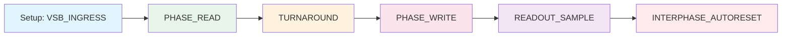

# DECIMA-8 🧠 — Neuromorphic Engine

> **Deterministic rhythm for neuromorphic computing: Emulator → Proto (PCB) → FPGA → ASIC**

**Status:** v0.2 DESIGN FREEZE

**Codename:** Siberian Tank Interface

---

## 📖 Overview

**DECIMA-8** is a neuromorphic engine architecture with deterministic rhythm and programmable tile fabric.

### Open Specification

The Decima-8 specification is open for implementation. We welcome the creation of alternative kernels compatible with this specification. The only requirement is verification through Rule-ROM PKI to maintain determinism.

---

### Key Principles v0.2

| Principle | Description |
|-----------|-------------|
| **Level16** | Data 0..15 on each of 8 lanes |
| **Bidirectional VSB** | Conductor sets input before READ, Island drives in WRITE |
| **Tile = minimal entity** | RuleROM addresses tiles directly |
| **BUS16 (8 lane)** | All data through common bus, neighbors don't transfer data |
| **Activation graph** | Neighbors form relay for BUS reading |
| **Range fuse** | LOCK if thr_cur16 ∈ [thr_lo16..thr_hi16] |
| **Decay-to-Zero** | Accumulator decays to 0, never jumps over |
| **Branch collapse** | Inactive tile resets to 0 |

---

## 🏗 Architecture

### Components

```
┌─────────────────────────────────────────────────────┐
│  Conductor (Digital Island)                         │
│  - CPU / Emulator                                   │
│  - Sets VSB_INGRESS                                 │
│  - Reads BUS16 after WRITE                          │
│  - Controls EV_FLASH / EV_RESET / EV_BAKE           │
└─────────────────────────────────────────────────────┘
                         │
                         │ VSB[0..7] + BUS16[0..7]
                         ▼
┌─────────────────────────────────────────────────────┐
│  Island / Swarm (Analog Core)                       │
│  ┌─────────────────────────────────────────────┐    │
│  │  Tile Array (16×16 = 256)                   │    │
│  │  ┌─────┬─────┬─────┐                        │    │
│  │  │ Tile│ Tile│ ... │                        │    │
│  │  ├─────┼─────┼─────┤  Each tile:            │    │
│  │  │ ... │ ... │ ... │  - 8 in/out lanes      │    │
│  │  └─────┴─────┴─────┘  - FUSE (thr/lock)     │    │
│  │         │                - Weights 8×8       │    │
│  └─────────┼───────────────────────────────────┘    │
│             │                                        │
│  ┌──────────▼──────────────────────────────────┐    │
│  │  BUS16 (common bus 8 lane)                  │    │
│  │  Honest summing of contributions            │    │
│  └─────────────────────────────────────────────┘    │
└─────────────────────────────────────────────────────┘
```

### Hard Constants

| Constant | Value |
|----------|-------|
| **VSB** | 8 data lanes VSB[0..7] |
| **BUS16** | 8 lane, summing in WRITE |
| **Domains** | 16 domains (0..15) |
| **Level16** | 0..15 (4 bits) |
| **RoutingFlags16** | 10 bits: N,E,S,W,NE,SE,SW,NW,BUS_R,BUS_W |

---

## 🔄 Canonical Tick (EV_FLASH)



### Phases

| Phase | Description |
|-------|-------------|
| **Setup** | Conductor sets VSB_INGRESS16[0..7] |
| **PHASE_READ** | Tiles sample input, update runtime |
| **TURNAROUND** | Conductor: Hi-Z, Island: prepare drive |
| **PHASE_WRITE** | Island drives BUS16 |
| **READOUT_SAMPLE** | Conductor reads BUS16[0..7] |
| **AUTORESET** | Optional domain reset |

---

## 🧩 Tile Model

### Baked State

| Parameter | Type | Description |
|-----------|------|-------------|
| **thr_lo16** | i16 | Lower fuse threshold |
| **thr_hi16** | i16 | Upper fuse threshold |
| **decay16** | u16 | Decay to zero |
| **domain_id4** | 0..15 | Reset group |
| **priority8** | 0..255 | Collision priority |
| **pattern_id16** | 0..32767 | Pattern ID |
| **routing_flags16** | u16 | Activation directions |
| **W[8][8]** | SignedWeight5 | Weight matrix 8×8 |

### Runtime

| Parameter | Type | Description |
|-----------|------|-------------|
| **thr_cur16** | i16 | Current accumulator |
| **locked** | 0/1 | Fuse latched |

---

## 📊 Protocols

### External Events (API)

| Event | Description |
|-------|-------------|
| **EV_FLASH(tag_u32)** | One READ→WRITE cycle |
| **EV_RESET_DOMAIN(mask16)** | Domain reset |
| **EV_BAKE()** | Apply BakeBlob |

### Bake Binary TLV

| TLV Type | ID | Description |
|----------|-----|-------------|
| **TLV_TOPOLOGY** | 0x0100 | Array topology |
| **TLV_TILE_PARAMS_V2** | 0x0121 | Tile params (13 bytes/tile) |
| **TLV_TILE_ROUTING_FLAGS16** | 0x0131 | Routing flags |
| **TLV_TILE_WEIGHTS_PACKED** | 0x0160 | Weights 8×8 |
| **TLV_RESET_ON_FIRE_MASK16** | 0x0150 | Auto-reset on fire |
| **TLV_READOUT_POLICY** | 0x0140 | Readout policy |
| **TLV_CRC32** | 0xFFFE | Checksum |

### UDP Protocol (packet_v1)

Format: 37 bytes, little-endian

| Field | Size | Description |
|-------|------|-------------|
| **magic** | u32 | 'D8UP' |
| **version** | u16 | 1 |
| **flags** | u16 | has_winner, has_bus, has_cycle, has_flags |
| **frame_tag** | u32 | Frame tag |
| **domain_id** | u8 | Domain ID |
| **pattern_id** | u16 | Pattern ID |
| **reset_mask16** | u16 | Reset mask |
| **collision_mask16** | u16 | Collision mask |
| **winner_tile_id** | u16 | Winner ID |
| **cycle_time_us** | u32 | Cycle time |
| **flags32_last** | u32 | Last cycle FLAGS |
| **bus16[8]** | u8×8 | Bus values |

---

## 🛠️ Tools

- **Emulator** — Software Decima-8 model
- **IDE** — Visual personality baking
- **Bake Compiler** — Compilation to TLV format

---

## 🔗 Documents

- [Tile Architecture](arch/tiles.md)
- [BUS16](arch/bus.md)
- [READ/WRITE Phases](arch/phase.md)
- [Routing](arch/routing.md)
- [Bake TLV Specification](spec/bake.md)
- [Protocol](spec/protocol.md)

---

**Bake the Future. Build the Substrate.** 🛠️⚡️
