# Decima-8: Нейроморфная архитектура, оперирующая уровнями энергии

> *Открытая спецификация, Level16, эстафетная активация без маршрутизаторов. v0.2*


## 1. ВВЕДЕНИЕ

Современные нейроморфные вычисления застряли между двух огней.

С одной стороны — **бинарные спайковые сети (SNN)**. Чтобы передать «силу сигнала», они вынуждены использовать частоту спайков или временные паттерны. Это как рисовать градации серого, моргая лампочкой: можно, но долго. Один уровень активации требует **десятков тактов** накопления. В приложениях, где важна латентность (робототехника, HFT, защита периметра), это недопустимая роскошь.

С другой стороны — **аналоговые мемристорные чипы**. Они обещают естественную нейроморфность, но сталкиваются с реальностью: шум, дрейф параметров, недетерминизм. Каждый чип уникален, требует калибровки, а воспроизводимость результатов — это боль. Плюс **40% площади кристалла** уходит на маршрутизаторы пакетной коммутации, которые тратят **70% энергии** не на вычисления, а на пересылку данных.

**Decima-8 предлагает третий путь.**

Мы не выбираем между «медленной цифрой» и «шумным аналогом». Мы строим цифровую эмуляцию аналоговой динамики с многобитной активацией в одном такте.

**Наша гипотеза:**

1. Level16 — активация от 0 до 15 передаётся за один такт, без итеративного накопления. Это не «неточный int», а семантическая единица: «уровень энергии», «сила намерения».
2. Эстафетная активация вместо пакетной маршрутизации. Тайлы не передают данные друг другу — они формируют граф активации через флаги направлений (N/E/S/W). Результат: 0% площади на роутеры, детерминизм на уровне такта.
3. Двухфазный цикл READ → WRITE с фиксированным временем цикла. Никаких стохастических задержек. Никаких «в зависимости от нагрузки».

> *«Мы не эмулируем нейроны. Мы строим ткань, где узнавание — это физика»*

**Что в этой статье:**

- **Математика:** Level16, SignedWeight5, функция активации, signed decay-to-zero. Формулы без магии.
- **Архитектура:** Conductor ↔ Island, эстафетная передача, router-less NoC. Схемы и бенчмарки.
- **Безопасность:** Честный разговор об уязвимостях. Почему .d8p не может быть вирусом.
- **Экосистема:** Открытый формат D8P, IDE на 1.3 МБ, эмулятор с бит-в-бит совместимостью.

Мы не обещаем AGI. Мы обещаем детерминизм, эффективность и выразительность, которых не хватает современным архитектурам.

Готовы? Погружаемся в матан.

---

## 2. МАТЕМАТИЧЕСКИЕ ОСНОВЫ

Здесь нет магии. Только чистая математика, которая делает Decima-8 одновременно мощной и предсказуемой. Если вы когда-нибудь чувствовали, что нейроморфные статьи пишутся на эльфийском с примесью маркетинга — расслабьтесь. Мы будем говорить на языке чисел.

### 2.1 Level16: Семантическая тетрада


*Level16 в аккордеоне IDE*

**Проблема бинарных спайков:**

Чтобы передать значение «7», классическая SNN должна сгенерировать 7 спайков за N тактов. Это частотное кодирование. Это как передавать текст азбукой Морзе: можно, но каждая буква требует серии точек и тире.

**Решение Decima-8:**

```
thr_cur16 ∈ [0..15]  // 4 бита, одна тетрада
```

Один такт = *одно значение*. Не частота, не паттерн, не «количество спайков за окно». Просто число от 0 до 15.

| Архитектура | Кодирование | Тактов на значение |
|-------------|-------------|--------------------|
| Loihi / SpiNNaker | spike ∈ {0, 1} | N тактов (частотное) |
| Decima-8 | activation ∈ {0..15} | 1 такт |

**Почему именно 16 уровней?**

Мы экспериментировали. Level8 (0..7) — слишком грубо, паттерны «ступенчатые». Level32 (0..31) — избыточно для нейроморфной ткани, плюс лишние биты в шине. Level16 — **золотая середина:**

- Достаточно градаций для выразительности
- Не перегружает шину (8 lanes × 4 бита = 32 бита за такт)
- Укладывается в nibble (удобно для packed-форматов)

**Физический смысл:**

Level16 — это не «неточный int». Это семантическая единица:

- 0 — тишина, отсутствие активации
- 15 — насыщение, максимальная «сила намерения»
- 1..14 — градации энергии

> *💭 Аналогия: Представьте, что вы регулируете громкость. Бинарный подход — это «вкл/выкл». Level16 — это ручка громкости с 16 положениями. Вы не щелкаете кнопкой 7 раз, чтобы набрать нужную громкость. Вы просто ставите ручку на 7.*

⚠️ **Важно: в Decima-8 нет «синапсов» в традиционном смысле.**
 
Каждый тайл имеет **фиксированные 8 входных линий** (VSB_INGRESS[0..7]). Эти линии приходят **от Conductor**, а не от других тайлов.
Весовая матрица 8×8 — это **локальное преобразование** внутри тайла:

- 8 входов (Level16) → 8 выходов (Level16)
- Не «64 синапса», а 8 строк по 8 весов
- Нормализация /8 — это не приближение, а точное деление на константу

### 2.2 SignedWeight5: Взвешенные связи с торможением


*Структурная схема тайла: 8 струн → кроссбар → аккумулятор*

Каждый тайл в Decima-8 имеет весовую матрицу **8×8**. Это эмуляция мемристорного кроссбара, но без аналогового шума — всё детерминировано и цифрово.

**Кодирование веса (5 бит):**

```
┌─────────────────────────────────┐
│  SignedWeight5 (5 бит)          │
├─────────────────────────────────┤
│  bits 0-2: magnitude (0..7)     │  ← 3 бита, модуль
│  bit 3: sign (0=-, 1=+)         │  ← 1 бит, знак
│  bit 4: reserved (0)            │  ← padding для выравнивания
└─────────────────────────────────┘

weight ∈ [-7..+7]
```

**Формула взвешенной суммы** для строки `r`:

```
row_raw_signed[r] = Σ (in16[i] × weight[r][i])  // i=0..7
```

**Расчёт диапазона:**

| Параметр | Диапазон | Комментарий |
| -------- | -------- | ----------- |
| in16[i] | [0..15]| Всегда неотрицательный вход |
| weight[r][i] | [-7..+7] | Signed: mag3 + sign1 |
| Вклад одной ячейки | [-105..+105] | 15 × 7 |
| Сумма по 8 входам | [-840..+840] | 8 × 105 |

**Важно:** Отрицательные веса — это не баг, это фича. Они реализуют **латеральное торможение** на аппаратном уровне.

> *💭 Пример: Тайл получает возбуждающий сигнал (+5) по lane0, но тормозящий (-3) с lane1. Итог: +2. Это не эмуляция — это физика вычислений. Баланс «возбуждение/торможение» зашит в арифметику.*

### 2.3 Функция активации: два пути одного сигнала

После вычисления `row_raw_signed[r]` сигнал идёт **по двум разным путям**. Это ключевой момент архитектуры Decima-8.

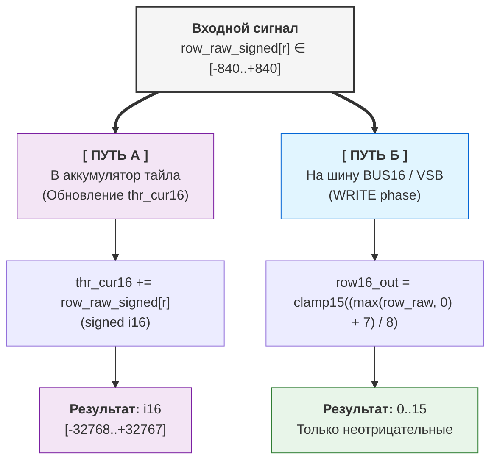

#### Путь А: Обновление аккумулятора (internal state)

**Формула:**

```
thr_cur16 += row_raw_signed[r]  // signed i16, без clamp
```

**Особенности:**

- `row_raw_signed[r]` используется **как есть**, в полном signed-диапазоне [-840..+840]
- Сумма по всем 8 строкам: `delta_raw ∈ [-6720..+6720]`
- Аккумулятор `thr_cur16 ∈ [-32768..+32767]` (signed i16)

**Физический смысл:** Внутри тайла важны **оба знака**:

- Положительные вклады = возбуждение
- Отрицательные вклады = торможение
- Баланс определяет, попадёт ли thr_cur16 в диапазон fuse [thr_lo16..thr_hi16]

> *💭 Ключевой момент: Торможение «живёт» внутри тайла, в аккумуляторе. На шине VSB его не видно — только уровни 0..15. Это позволяет реализовывать латеральное ингибирование без отрицательных сигналов во внешней среде.*

#### Путь Б: Выход на шину VSB (WRITE phase)

**Формула:**

```
row16_out[r] = clamp15((max(row_raw_signed[r], 0) + 7) / 8)
```

**Разбор:**

| Шаг | Что делает | Зачем |
| --- | ---------- | ----- |
| max(..., 0) | Отсекает отрицательные суммы | Если торможение победило → на шине тишина (0) |
| + 7 | Сдвиг для округления | (x + 7) / 8 = округление вверх перед целочисленным делением |
| / 8 | Нормализация диапазона | [-840..+840] → [0..105] → clamp15 → [0..15] |
| clamp15 | Жёсткое ограничение 0..15 | Защита от переполнения, совместимость с Level16 |

**Примеры:**

```
row_raw_signed[r] = +500
→ max(500, 0) = 500
→ (500 + 7) / 8 = 63.375 → 63 (целочисленное)
→ clamp15(63) = 15  ← насыщение

row_raw_signed[r] = +50
→ max(50, 0) = 50
→ (50 + 7) / 8 = 7.125 → 7
→ clamp15(7) = 7  ← нормальное значение

row_raw_signed[r] = -100
→ max(-100, 0) = 0
→ (0 + 7) / 8 = 0.875 → 0
→ clamp15(0) = 0  ← полное подавление (торможение победило)
```

**Физический смысл:** На шину VSB идут только **уровни энергии** (0..15). Отрицательные значения не имеют смысла для передачи — «тишина» кодируется как 0.

**Почему /8, а не адаптивная нормализация?**

**Потому что входов всегда 8.** Не 1, не 64, не «сколько активно».

Это гарантирует:

| Критерий | Фиксированный сдвиг >>3 | Адаптивная нормализация |
| -------- | ----------------------- | ----------------------- |
| Детерминизм | ✅ Всегда одинаково | ❌ Зависит от плотности входов |
| Аппаратная стоимость | ✅ Битовый сдвиг (0 тактов) | ❌ Деление в runtime |
| Предсказуемость | ✅ Легко верифицировать | ❌ Сложно отлаживать |

Если нужен другой динамический диапазон — настройте параметры тайла:

- `weights` (mag3+sign1) — сила связей
- `thr_lo/hi` — чувствительность порога
- `decay16` — скорость затухания

### 2.4 Аккумулятор + Signed Decay: Память с инерцией

У каждого тайла есть внутренний аккумулятор — это его «память», его состояние.

**Аккумулятор:**

```
thr_cur16 ∈ [-32768..+32767]  // signed i16
```

**Почему signed?** Потому что тайл должен «помнить» не только возбуждение, но и торможение. Отрицательный аккумулятор = «я подавлен, мне нужно больше сигнала, чтобы сработать».

**Механизм decay (затухание к нулю):**

Каждый такт аккумулятор стремится к нулю, если нет подпитки. Это не «обнуление». Это **плавное затухание**.

```
if (decay16 > 0) {
  if (thr_tmp > 0) thr_tmp = max(thr_tmp - decay16, 0)
  else if (thr_tmp < 0) thr_tmp = min(thr_tmp + decay16, 0)
  // ❗ Никогда не перескакивает через 0!
}
```

**Примеры (decay16 = 30):**

| Было | Стало | Почему |
| ---- | ----- | ------ |
| +100 | +70 | 100 - 30 = 70 |
| +20 | 0 | 20 - 30 = -10 → max(-10, 0) = 0 |
| -20 | 0 | -20 + 30 = +10 → min(+10, 0) = 0 |
| 0 | 0 | decay не применяется к нулю |

⚠️ **Важно:** Decay **не перескакивает через ноль**. Если аккумулятор был положительным, он не может стать отрицательным от decay (и наоборот). Это как трение: оно замедляет движение, но не меняет направление.

**Физический смысл:**

> *💭 Аналогия: Представьте шарик в яме. Если вы его толкнёте (+сигнал), он покатится вверх. Но трение (decay) будет тянуть его обратно к центру (0). Если толчка нет — шарик остановится в центре. Он не перекатится на другую сторону сам по себе.*

**Зачем это нужно:**

1. **Естественное «забывание»:** сигнал не висит вечно, а затухает, если нет подпитки.
2. **Стабильность:** система не уходит в насыщение, самобалансируется.
3. **Временное окно:** decay создаёт окно интеграции сигналов. Если два слабых сигнала придут близко по времени — они суммируются. Если далеко — первый затухнет до прихода второго.

> *💭 **Decay применяется даже к locked тайлам** — это позволяет «остужать» активные пути без их разблокировки. Путь может «остыть» и разблокироваться, если нет подпитки.*

**Почему «липкий ноль» — это фича?**
 
Decima-8 проектировалась для **детекции паттернов**, а не для накопления слабых сигналов.
 
| Задача | Решение в Decima-8 |
|--------|-------------------|
| Фильтрация шума | decay16 > 0 (слабые сигналы аннигилируются) |
| Интеграция слабых сигналов | decay16 = 0 или малое значение |
| Временное окно интеграции | Настройте thr_lo/hi + используйте домены |
 
> Decay — это **настраиваемый параметр**, а не фиксированное ограничение архитектуры.

### 2.5 Fuse-by-Range: Пороговая логика

Тайл не просто вычисляет. Он **принимает решение** о блокировке (locked). Это его «спайк», но не бинарный, а умный.

**Условие блокировки:**

```
locked = 1, если thr_cur16 ∈ [thr_lo16, thr_hi16]
```

**Пороги:**

```
thr_lo16 ∈ [-32768..+32767]  // signed i16
thr_hi16 ∈ [-32768..+32767]  // signed i16
```

**Валидация порогов:**

- Если `thr_lo16 > thr_hi16` → ошибка валидации при bake (`FuseRangeError`)
- Это предотвращает неопределённое поведение и явные ошибки конфигурации

**Ключевая особенность:** Диапазон может быть **в любой части signed-спектра**.

| Пример | thr_lo16 | thr_hi16 | Область | Когда сработает |
| ------ | -------- | -------- | ------- | --------------- |
| Только положительные | +100 | +500 | [+100..+500] | При сильном возбуждении |
| Только отрицательные | -500 | -100 | [-500..-100] | При сильном торможении |
| Пересекает ноль | -200 | +200 | [-200..+200] | При любом отклонении от покоя |
| Только ноль | 0 | 0 | — | Фьюз отключён! |
| Весь диапазон | -32000 | +32000 | почти весь i16| Практически всегда locked |

⚠️ **Важно:** Если `thr_lo16 == thr_hi16` (например, оба = 0), фьюз **отключён** — такой тайл никогда не защёлкнется. Это непропеченный тайл неучаствующий в ткани сварма.

**Что происходит при locked?**

Здесь важно понять философию Decima-8: тайлы не передают данные друг другу. Они формируют граф активации (эстафету).

**Когда тайл locked:**

1. **Он держит активацию своих потомков** — пока тайл locked, его дети остаются ACTIVE и могут вычисляться в следующем такте.
2. **Аккумулятор продолжает затухать** — decay применяется даже к locked тайлам. Если подпитки нет, аккумулятор «остынет», выйдет из диапазона [thr_lo16..thr_hi16], и тайл разблокируется.
3. **Эстафета продолжается** — locked-тайл это «узловое звено» в цепи активации. Пока он locked, сигнал может распространяться дальше по графу.

> *💭 Физический смысл: Locked — это не «передача сигнала». Это поддержание пути активации. Как костёр: пока дрова горят (locked), огонь может перекинуться на соседние поленья (потомки). Как дрова прогорели (decay вывел из диапазона) — путь гаснет, потомки схлопываются.*

**Почему это важно?**

| Неправильное понимание | Правильное понимание | 
| ---------------------- | -------------------- |
| «Locked тайл передаёт данные потомкам» | «Locked тайл держит потомков ACTIVE» |
| «Passthrough-режим» | «Резонансный путь активации» |
| «Медный мост» | «Узловое звено эстафеты» |

**Данные не передаются между тайлами.** Данные приходят от Conductor через VSB_INGRESS. Тайлы только **копят аккумуляторы** и **держат активацию потомков**, пока locked.

---

## 🧩 Итого по математике

| Компонент | Диапазон | Формула |
| --------- | -------- | ------- |
| Level16 | [0..15] | thr_cur16 — уровень энергии |
| SignedWeight5 | [-7..+7] | mag3 + sign1 |
| row_raw_signed | [-840..+840] | Σ(in16 × weight) на строку |
| delta_raw | [-6720..+6720] | Σ row_raw_signed (8 строк) |
| Аккумулятор | [-32768..+32767] | thr_cur16 += delta_raw - decay |
| Fuse range | [-32768..+32767] | thr_lo16 .. thr_hi16 |

**Всё детерминировано. Всё вписывается в фиксированные диапазоны. Никаких overflow, никаких surprise.**

Готовы перейти к архитектуре? Там будет ещё интереснее.

---

## 3. АРХИТЕКТУРА ЖЕЛЕЗА

Математика — это душа. Архитектура — это тело. Теперь о том, как это работает в железе.

---

### 3.1 Conductor ↔ Island

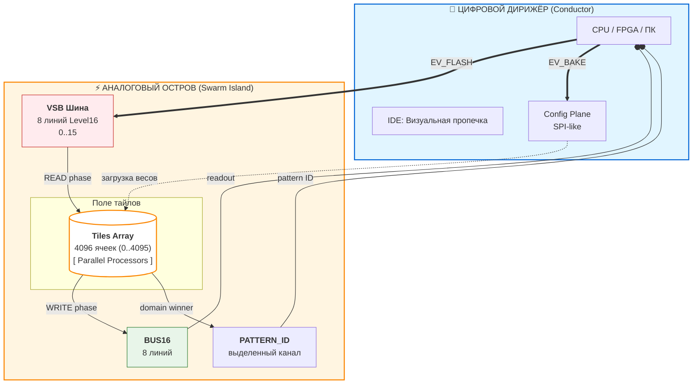

*diagram Conductor ↔ Island*

Decima-8 разделена на две плоскости:

**Conductor (Дирижёр):**

- Управляет фазами (EV_FLASH, EV_BAKE, EV_RESET_DOMAIN)
- Загружает веса через SPI-like интерфейс (CFG)
- Выставляет `VSB_INGRESS[0..7]` в начале READ
- Читает `BUS16[0..7]` после WRITE
- Получает PATERN_ID, дает команду исполнительным механизмам своей задачи
- Сбрасывает при необходимости домены тайлов

**Island (Аналоговый остров):**

- Ткань тайлов (8×32, 16×32, 16x64, 32×64, 32x128 — масштабируемо)
- Параллельная работа всех тайлов
- **VSB** (Value Signal Bus): 8 линий Level16 (вход от Conductor)
- **BUS16**: 8 линий для честного суммирования (выход к Conductor)
- **PATTERN_ID**: выделенный канал для ID паттерна

**Связь:**

```
Conductor → VSB_INGRESS → Island (READ phase)
Island → BUS16 → Conductor (WRITE phase)
```

**Интерфейсы конфигурации:**

- **SPI / QSPI**: загрузка BakeBlob (веса, пороги) — до 50 MB/s
- **Parallel CFG bus** (для FPGA): до 200 MB/s
- **PCIe / Ethernet** (для хост-контроллера): до 1 GB/s

> UART упоминается только как отладочный интерфейс, не для runtime-обновления весов.

> ⚠️ **Важно:** Conductor не лезет в вычисления. Он только дирижирует: «раз-два, читай-пиши». Вся магия происходит в Island.

---

### 3.2 Двухфазный цикл

```mermaid
gantt
    title Один такт EV_FLASH (Цикл: 20 мкс)
    dateFormat  X
    axisFormat %s мкс

    section 🎼 CONDUCTOR
    Выставление VSB_INGRESS     :active, c1, 0, 3
    Пауза (Processing)          :desat, 3, 10
    Turnaround (Hi-Z)           :crit, 10, 12
    Чтение BUS16                :c2, 18, 20

    section ⚡ ISLAND (Phase 1)
    PHASE_READ (Вход)           :active, 0, 8
    Активация графа             : 2, 5
    Кроссбар + Accumulator      : 5, 8
    FUSE → locked               : 7, 8

    section 🔄 SWITCH
    Смена направления шины      : 10, 12

    section ⚡ ISLAND (Phase 2)
    PHASE_WRITE (Выход)          :active, 12, 18
    BUS_W → BUS16                : 12, 16
    Честное суммирование         : 14, 16

    section 📥 READOUT
    R0_RAW_BUS sample           : 18, 20
    AutoReset (опционально)      : 20, 22
```

Вся ткань работает в жёстком ритме. Один такт = **20 мкс** (*в эмуляторе на i5-3550*).

```
┌─────────────┬──────────────┬─────────────┬─────────────┐
│ PHASE_READ  │ TURNAROUND   │ PHASE_WRITE │ READOUT     │
│ (0..8 мкс)  │ (10..12 мкс) │ (12..18 мкс)│ (18..20 мкс)│
└─────────────┴──────────────┴─────────────┴─────────────┘

```

**PHASE_READ (0..8 мкс):**

1. Conductor выставляет `VSB_INGRESS16[0..7]` (Level16)
2. Все ACTIVE-тайлы семплируют вход
3. Вычисление `row_raw_signed[r]` для каждой строки
4. Обновление `thr_cur16 += delta_raw`
5. Применение decay (затухание к нулю)
6. Проверка fuse: `locked_after = (thr_cur16 ∈ [thr_lo16..thr_hi16])`
7. Формирование `drive_vec[0..7]`

**TURNAROUND (10..12 мкс):**

- Conductor отпускает VSB (Hi-Z / no-drive)
- Island включает драйв BUS16
- **Обязательный зазор** — никаких гонок направлений

**PHASE_WRITE (12..18 мкс):**

- Тайлы с `BUS_W==1` и `(locked self || locked_ancestor)` выставляют `drive_vec` на BUS16
- **Честное суммирование**: `BUS16[i] = clamp15(Σ contrib[i])`
- Фиксация: `locked := locked_after`

**READOUT (18..20 мкс):**

- Conductor читает `BUS16[0..7]` как результат такта
- Опционально: AutoReset-by-Fire (сброс доменов по маске winner'а)

---

**Фиксированная латентность:**

Независимо от того, активировался тайл или нет, **все вычисления занимают одинаковое число тактов**:

- READ: 8 мкс (все тайлы вычисляют, даже если ACTIVE=0)
- WRITE: 6 мкс (все тайлы с BUS_W выставляют данные, даже если drive_vec=0)

> Это гарантирует **нулевой джиттер** на уровне эмулятора и ASIC. Не зависит от сложности паттерна. Детерминизм на уровне такта.

---

### 3.3 Эстафетная активация (Router-less NoC)

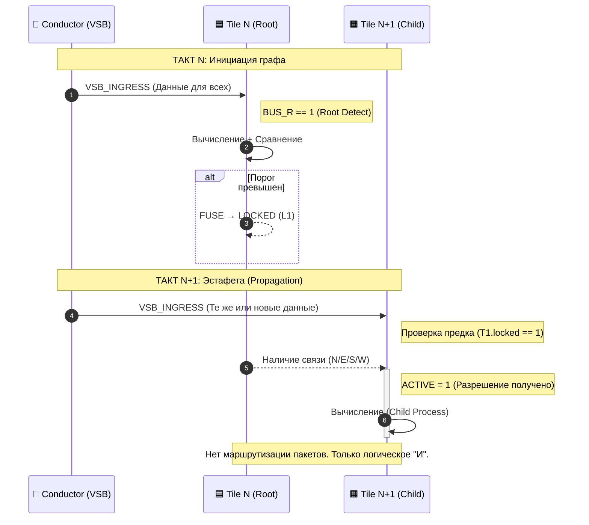

**Проблема традиционных NoC (Network-on-Chip):**

| Метрика | Значение |
|---------|----------|
| Площадь на роутеры | ~40% кристалла |
| Энергия на маршрутизацию | ~70% бюджета |
| Задержка | Стохастическая (арбитраж, буферы) |
| Джиттер | Есть |

**Решение Decima-8:**

Тайлы **не передают данные** друг другу. Вместо этого они формируют **граф активации** через флаги направлений (N/E/S/W/NE/SE/SW/NW).

**Механизм:**

```
ACTIVE[t] = 1, если:
t имеет флаг BUS_R == 1 (источник/корень), ИЛИ
∃ предок p: ACTIVE[p]==1 && locked_before[p]==1 && есть ребро p→t
```

Вычисляется как **least fixed point** — детерминированно, за один проход.

**Эстафета в действии:**

Такт N: корневой тайл активируется и фьюзится. Такт N+1: потомок видит locked_before[p]==1 и становится ACTIVE

> 💭 **Ключевое:** Активация распространяется за 2 такта (предок → потомок). Данные не передаются — каждый тайл читает только VSB_INGRESS от Conductor. Граф активации — это **разрешение на вычисление**, не канал передачи данных.

---

### 3.4 Схлопывание ветки (Branch Collapse)

**Логика:**

Если предок не заблокирован (`locked=0`), потомки становятся неактивными:

```
if (ACTIVE[t] == 0) {
thr_cur16 := 0
locked := 0
drive_vec := {0..0}
// Тайл не вычисляется, не драйвит шину
}
```

**Эффект:**

- Энергия не тратится на обработку заведомо неактивных путей
- Мёртвые ветви ткани «отключаются» автоматически
- Ресурсы направляются только на живые пути

**Пример:**

Такт N:

- Корневой тайл не фьюзится (thr_cur16 не попал в [lo..hi])
- locked_after = 0

Такт N+1:

- Потомки: ACTIVE = false (нет locked-предка)
- Принудительный сброс: thr_cur16=0, locked=0

Ветка схлопнута

> 💭 **Аналогия:** Дерево сбрасывает мёртвые ветви. Если корень не даёт питания (locked=0), вся ветка засыхает (ACTIVE=0 → thr_cur16=0).

---

### 3.5 Двойной пролив (Double Strait)

**Проблема:** При распознавании паттернов с малым расстоянием Хэмминга возникает «перекрёстная активация».

**Контекст:** Текст кодируется в биты и подаётся на 8 струн VSB как 32-битный аккорд (8 lanes × 4 бита = 32 бита). Расстояние Хэмминга между похожими символами может быть всего 2-3 бита.

**Пример:**

- Символ «6» и символ «3» в битовом представлении отличаются на 2-3 бита из 32
- Тайл, настроенный на детектирование «6», может сработать и на «3», «4», «2» (thr_cur16 попадает в диапазон [lo..hi])
- Результат: ложные срабатывания, низкая селективность

> *⚠️ Важно: большинство личностей (OCR, ASR, HFT) прекрасно работает и без двойного пролива. Но если нужна высокая селективность для похожих паттернов — двойной пролив необходим.*

**Решение: Двойной пролив + тайл-антагонист**

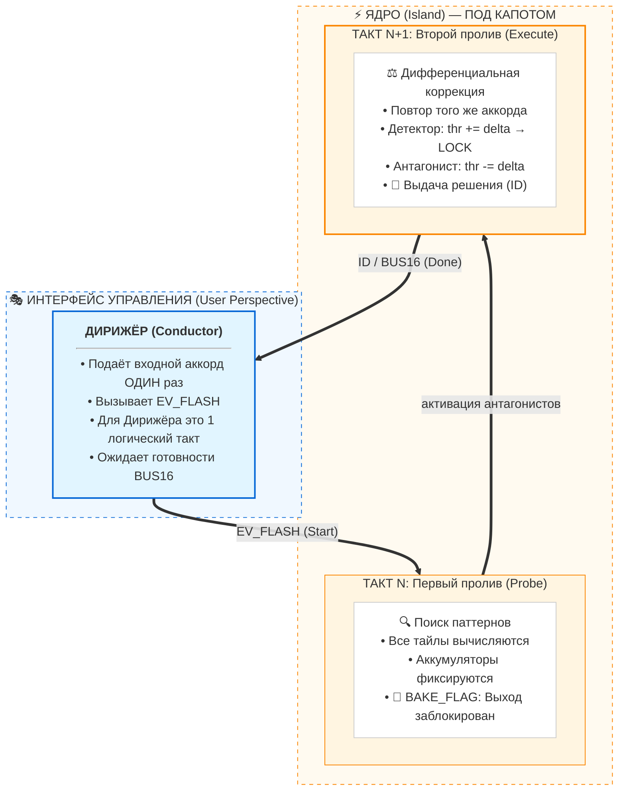

**Механизм:**

**1. BAKE_FLAG_DOUBLE_STRAIT** (bit 0 в header .d8p):

- Дирижёр подаёт вход ОДИН раз (не два!)
- Ядро внутри прокручивает два такта
- Решение выдаётся только после второго пролива
- Для Дирижёра это один EV_FLASH, но время выполнения удваивается (~40 мкс вместо ~20 мкс)

**2. Тайл-детектор:**

- Настроен на паттерн «6» (thr_lo/hi подобраны для активации на «6»)
- При двойном проливе: thr_cur16 += delta (первый такт) + thr_cur16 += delta (второй такт)
- Результат: удвоенная активация, надёжное срабатывание

**3. Тайл-антагонист:**

- Настроен на отрицание похожего паттерна «НЕ 3»
- Использует отрицательные веса для паттерна «3»
- При двойном проливе: если вход похож на «3» → thr_cur16 -= delta (торможение)
- Если антагонист защелкнулся → выдача решения

**Результат:**

| Сценарий | Без двойного пролива | С двойным проливом |
| -------- | -------------------- | ------------------ |
| Вход «6», детектор «6» | Сработал (но может быть ложное на «3») | Сработал надёжно (удвоенная активация) |
| Вход «3», детектор «6» | Ложное срабатывание | Заблокирован антагонистом |
| Вход «6», антагонист «НЕ 3» | Не сработал | Подтвердил чистоту |

**Когда использовать:**

- ✅ Распознавание похожих паттернов (малое расстояние Хэмминга)
- ✅ Классификация с перекрытием классов (символы, цифры, буквы)
- ✅ Высокая точность важнее скорости (2 такта вместо 1)
- ❌ Паттерны хорошо разделены (большое расстояние Хэмминга)

**В IDE:**

- Галочка «Double Strait» в настройках bake
- Автоматически выставляет BAKE_FLAG_DOUBLE_STRAIT в header .d8p
- Сварм переключается в режим двойной подачи

> *💭 Философия: Двойной пролив — это не «медленнее», это «точнее». Как двойная экспозиция в фотографии: один кадр может быть смазан, два кадра — чёткое изображение.*

---

## 🧩 Итого по архитектуре

| Компонент | Принцип | Выгода |
|-----------|---------|--------|
| **Conductor ↔ Island** | Разделение управления и вычислений | Чёткая дисциплина, масштабируемость |
| **Двухфазный цикл** | READ → TURNAROUND → WRITE | Детерминизм 20 мкс, no race conditions |
| **Эстафетная активация** | Граф, а не передача данных | 0% площади на роутеры, нулевой джиттер |
| **Схлопывание ветки** | ACTIVE=false → сброс в 0 | Энергоэффективность, автоматическая оптимизация |

**Готовы к бенчмаркам?** Покажем, что 20 мкс — это не маркетинг, а реальность.

---

## 4. БЕНЧМАРКИ: ДЕТЕРМИНИЗМ НА ПРАКТИКЕ

Теория — это хорошо. Но цифры говорят громче слов.

### Тестовая платформа

**IDE Decima-8** — это нативное приложение на C++23 с использованием **libwui** (наш легковесный UI-движок, о котором мы писали на Хабре в 2023). Никаких браузеров, Electron или JavaScript. Чистый нативный код.

**Конфигурация:**

- **OS**: Windows (MSVC 2026, C++23) / Linux (Clang latest, C++23)
- **CPU**: Intel Core i5-3550 (Ivy Bridge, 2012) — 4 ядра, 3.3 GHz
- **RAM**: 8 GB
- **Сборка**: Статическая, без внешних зависимостей

> 💭 **Почему i5-3550?** Это старый процессор (2012 года). Мы намеренно тестируем на «железе», которое уже не флагман. Если Decima-8 работает быстро здесь — она будет летать на современном hardware.

### Поддерживаемые конфигурации

Decima-8 поддерживает прямоугольные ткани (width × height):

| Название | Размер | Количество тайлов |
|----------|--------|------------------|
| **Micro** | 8 × 32 | 256 |
| **Small** | 16 × 32 | 512 |
| **Medium** | 16 × 64 | 1024 |
| **Large** | 32 × 64 | 2048 |
| **XLarge** | 32 × 128 | 4096 |

### Результаты замеров i5-3550 one core

| Конфигурация | Время цикла | FPS | Throughput | Частота|
|-------------|------------|-----|------------|---------|
| **256 тайлов** (8×32) | **~22 мкс** | 15,783 | 0.063 Mb/s | 45.45 kHz |
| **512 тайлов** (16×32) | **~43 мкс** | 11,111 | 0.043 Mb/s | 23.26 kHz |
| **1024 тайла** (16×64) | **~81 мкс** | 6,200 | 0.023 Mb/s | 12.35 kHz |
| **2048 тайлов** (32×64) | **~160 мкс** | 3,150 | 0.012 Mb/s | 6.25 kHz | 
| **4096 тайлов** (32×128) | **~311 мкс** | 1,620 | 0.006 Mb/s | 3.22 kHz | 


*График производительности на i5-3550*

### Ключевые наблюдения

**1. Линейное масштабирование**

При удвоении количества тайлов время выполнения **примерно удваивается**:

- 256 → 512 тайлов: 22 мкс → 43 мкс (**×1.95**)
- 512 → 1024 тайла: 43 мкс → 81 мкс (**×1.88**)
- 1024 → 2048 тайлов: 81 мкс → 160 мкс (**×1.98**)
- 2048 → 4096 тайлов: 160 мкс → 311 мкс (**×1.94**)

После 1024 тайлов рост времени ускоряется (кэш-промахи, давление на память). Это физическое ограничение, а не алгоритмическое.

> ⚠️ Важно: Для каждой конфигурации время константно независимо от активности. 100% загрузка сети не увеличивает задержку.

**2. Даже 4096 тайлов — это real-time**

**311 мкс** на полный цикл ткани из 4096 тайлов — это:

- **3,200 Hz** частота обновления
- Достаточно для **управления роботом** (типичный цикл 1-10 ms)
- Достаточно для **HFT** (латентность < 1 ms)
- Достаточно для **обработки аудио** (44.1 kHz = 22.7 мкс на сэмпл)

**3. Цифры «стоят жёстко»**

Замеры **консистентны**. Разброс минимален. Это не случайность — это следствие архитектуры:

- Нет динамических аллокаций в runtime
- Нет ветвлений, зависящих от данных
- Нет кэш-промахов (данные компактно упакованы)
- Фиксированный цикл READ → WRITE


**💭 Сравнение: На GPU (CUDA/OpenCL) вы получите «среднее время 50 мкс ± 30 мкс» из-за планировщика, кеш-миссов и арбитража шины.**

В Decima-8 время цикла — это жесткая константа для выбранного железа:

- Эмулятор (i5-3550): 20.000 мкс ± jitter ОС
- FPGA (Xilinx/Altera): 0.200 мкс (всегда)
- ASIC (чистое кремниевое ядро): 0.020 мкс (всегда)

**Детерминизм — это наша суперсила.**

### Что это значит на практике?

**HFT (High-Frequency Trading):**

- Латентность **22-311 мкс** (в зависимости от размера ткани)
- **Никакого джиттера** — каждый цикл одинаков
- Предсказуемость важнее «средней скорости»

**Робототехника:**

- Цикл управления **1-10 ms** — стандарт
- Decima-8 укладывается в **22-311 мкс** — остаётся запас 3-45×
- Можно запустить **несколько тканей параллельно**

**Защита периметра:**

- Детекция угроз в real-time
- Система **не деградирует** под нагрузкой
- Даже на старом i5-3550 — тысячи FPS

### А что на современном железе?

i5-3550 — это 2012 год. Что будет на современном CPU?

**Грубая оценка** (пропорционально производительности):

- **i5-12600K** (2021): ~**5-10 мкс** на 256 тайлов
- **Ryzen 9 7950X** (2022): ~**3-7 мкс** на 256 тайлов
- **Apple M2** (2022): ~**4-8 мкс** на 256 тайлов

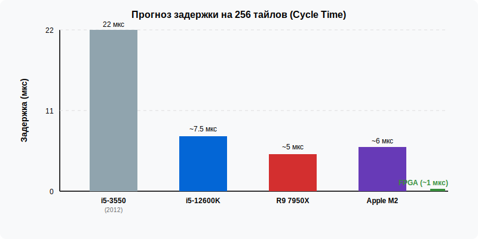

*График производительности на современном железе, FPGA/ASIC (прогноз)*

### Потребление памяти

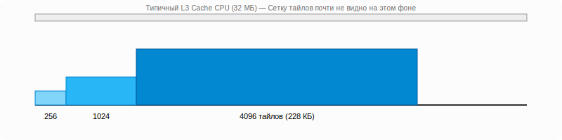

*Зависимость потребной памяти личности от размера сварма*

Эмулятор использует компактное представление:

**Память vs Количество тайлов**

| Конфигурация | Память (байт) | Память (КБ) | Особенности |
| ------------ | ------------- | ----------- | ----------- |
| 256 тайлов | ~14,600 | 14.2 КБ | Полностью в L1-кеше CPU |
| 512 тайлов | ~29,200 | 28.5 КБ | На грани L1-кеша современных CPU |
| 1024 тайла | ~58,400 | 57.0 КБ | Помещается в L2-кеш |
| 2048 тайлов | ~116,800 | 114.1 КБ | Быстрый доступ через L2/L3 |
| 4096 тайлов | 233,600 | 228.1 КБ | Эффективная работа с кэш-линиями |

> *💭 Всё помещается в L3-кэш современного CPU. Никаких page fault'ов, никаких swap'ов.*

---

## 🧩 Итого по бенчмаркам

| Метрика | Значение |
|---------|----------|
| **Минимальная латентность** | 22 мкс (256 тайлов) |
| **Максимальный размер** | 4096 тайлов за 311 мкс |
| **Масштабирование** | Линейное (O(n)) |
| **Джиттер** | Отсутствует (детерминизм) |
| **Память** | Компактная (L3-кэш) |

**Decima-8 — это не «быстро в среднем». Это «предсказуемо всегда».**

Готовы перейти к программной экосистеме? Расскажем про IDE, формат D8P и эмулятор.

---

## 5. ПРОГРАММНАЯ ЭКОСИСТЕМА

Decima-8 — это не только железо. Это экосистема инструментов, форматов и стандартов. Расскажем честно: что открыто, что закрыто, и почему так.

---

### 5.1 Формат D8P (TLV-based)

**Статус:** *OPEN SPEC*

Файл `.d8p` (Decima 8 Personality) — это контейнер для «личности» сварма. Внутри нет кода. Только данные.

**Структура (TLV — Type-Length-Value):**


**Почему TLV?**

- **Расширяемость**: новые типы блоков не ломают старые парсеры
- **Валидация**: легко проверить целостность (CRC32)
- **Потоковая обработка**: не нужно грузить весь файл в память

**libd8p:** Открытая библиотека для работы с форматом.

- **Языки**: C++ / (C / Rust / Python coming)
- **Лицензия**: MIT
- **Функции**: парсинг, валидация, генерация, подпись PKI

> 💭 **Любой может написать свой генератор.** Хотите создавать .d8p из PyTorch? Пожалуйста! Из JAX? Отлично! Ручным hex-редактором? Для хардкорных — уважение.

---

### 5.2 IDE (1.3 МБ, Native)

**Статус:** *CLOSED BINARY, FREE TO USE*

**Характеристики:**

- **Размер**: 1.3 МБ (меньше, чем картинка для профиля в Telegram)
- **UI**: libwui (наш легковесный движок, Хабр 2023)
- **Платформы**: Windows (MSVC 2026) / Linux (Clang latest)
- **Зависимости**: **Ноль**. Статическая сборка.
- **Интернет**: Не требуется. Работает offline.


*Общий вид IDE Decima-8*

**Компоненты IDE:**

| Компонент | Описание |
|-----------|----------|
| **16-аккордовый аккордеон** | Визуализатор VSB (8 lanes × 16 аккордов истории) |
| **Магнитофон и сеть** | Загрузка/сохранение VBS лент, приём/отправка VSB по UDP |
| **Рабочие органы управления** | Flash: прогон такта машины, Reset: сброс доменов, Autobake: установка весов тайла под аккорд |
| **Панель сварма** | Визуальное представление ткани личности |
| **Параметры тайла** | Веса, thr_lo/hi, decay |
| **Компас** | Направления активации детей |
| **Панель выдачи решений** | Показывает PATTERN_ID, BUS16 и т.п. |

---

### IDE — не единственный путь

⚠️ **Важно:** IDE — это **референсный инструмент** для «скульпторов». Не единственный способ создания личностей.

> *«Если ваш скрипт на Python с PyTorch создаёт личности лучше, чем наша IDE — мы хотим видеть это в Store»*

**Как это работает:**

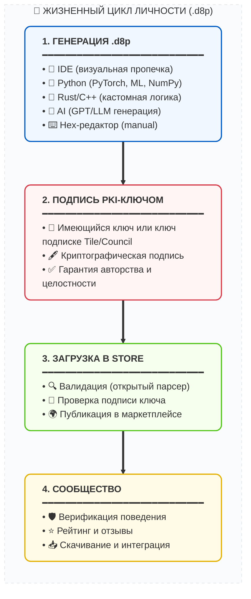

**Проверяется не инструмент, а:**

1. **Соответствие спецификации** (открытый парсер libd8p)
2. **Валидную PKI-подпись** (авторство, целостность)
3. **Безопасность** (нет вредоносного кода, только данные)

> 💭 **Это делает экосистему открытой для инноваций, но защищённой от хаоса.**

---

### 5.3 Эмулятор ядра

**Статус:** *OPEN SOURCE* (MIT)

**Зачем:**

- **«Источник правды»** — верификация математики без IDE
- **Тестирование** — запуск алгоритмов перед «пропечкой»
- **Интеграция** — встраивание в свои проекты (CI/CD, автотесты)
- **Обучение** — изучение архитектуры «изнутри»

**Где:** GitHub (ссылка в конце статьи)

**Функционал:**

- Бит-в-бит совместимость с железом (эмулятор → FPGA → ASIC)
- API: `EV_FLASH`, `EV_BAKE`, `EV_RESET_DOMAIN`
- Чтение FLAGS, readout, статистики
- Интеграция с Python/C++/Rust через C-API

**Пример использования (Python):**

```python
import d8p

# Загрузка личности
swarm = d8p.load("personality.d8p")

# Запуск цикла
for i in range(1000):
    swarm.ev_flash(vsb_ingress=[7,12,3,10,4,14,0,9])
    readout = swarm.read_bus()
    print(f"Tick {i}: BUS16 = {readout}")
```
---

## 🧩 Итого по экосистеме

| Компонент | Статус | Зачем |
| --------- | ------ | ----- |
| Спеки + Эмулятор | ✅ OPEN | Наука, верификация, цитирование |
| Формат .d8p | ✅ OPEN | Интеграции, конвертеры, интероперабельность |
| libd8p (парсер) | ✅ OPEN | Валидация, генерация, любые инструменты |
| IDE | 🔒 CLOSED (Free) | Референсный UX для «скульпторов» |
| Store | 🔒 CLOSED (Curated) | Единый стандарт, PKI-подписи, качество |

Готовы к безопасности? Расскажем, почему .d8p не может быть вирусом.

---

## 6. БЕЗОПАСНОСТЬ: ЧЕСТНЫЙ РАЗГОВОР

Мы не обещаем, что система «неуязвима».  
Мы обещаем, что она **архитектурно честная**.

---

### Где может сломаться?

| Компонент | Может упасть? | Почему? |
|-----------|--------------|---------|
| **Файл `.d8p`** | ❌ Нет | Это данные (TLV). В нём **нет кода**. Нет `eval`, нет указателей, нет рекурсии. |
| **Эмулятор (Core)** | ❌ Нет | Детерминированная машина. Фиксированные такты, Level16, saturate-арифметика. Физически не может зависнуть или переполниться. |
| **Дирижёр (ваш код)** | ⚠️ **Да** | Парсит JSON, работает с сетью, управляет ордерами, пишет в БД. Это **императивный код** — со всеми его классическими рисками. |
| **Фронтенд личности** | ⚠️ **Да** | Код, который кормит 8 струн и читает BUS16/PATTERN_ID. Это часть Дирижёра. |

---

### Важное уточнение: .d8p бесполезна без Дирижёра

**Файл `.d8p` — это не программа.** Это «личность» сварма. Но сама по себе она **бесполезна**.

Чтобы личность заработала, нужен **Дирижёр (Conductor)** — код, который:

1. **Кормит 8 струн VSB** — преобразует внешние данные в Level16 (аудио → активация, цены → активация, сенсоры → активация)
2. **Запускает EV_FLASH** — дирижирует циклом READ → WRITE
3. **Забирает результаты** — читает BUS16, PATTERN_ID, FLAGS
4. **Принимает решения** — что делать с результатом (отправить ордер, включить сирену, двинуть мотор)

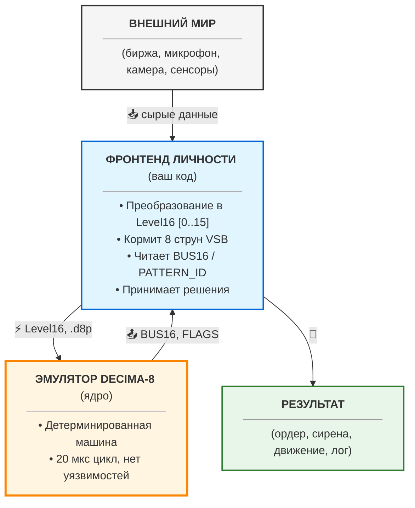

> 💭 **.d8p — это «мозг». Фронтенд — это «тело». Мозг без тела бесполезен.**

---

### Что это значит на практике?

**Пример 1: HFT-личность**

Вы публикуете в Store личность для торговли на бирже.

- **`.d8p`**: Веса, пороги, routing — **безопасно**, нет кода
- **Фронтенд**: WebSocket к бирже, парсинг JSON, логарифмирование цен в Level16 — **здесь уязвимости**
- **Риск**: Не в .d8p, а в коде парсинга WebSocket

**Пример 2: ASR-личность (распознавание речи)**

- **`.d8p`**: Паттерны для фонем — **безопасно**
- **Фронтенд**: Захват аудио с микрофона, MFCC, квантование в Level16 — **здесь уязвимости**
- **Риск**: Драйвер микрофона, буферы, потоки

**Пример 3: Защита периметра**

- **`.d8p`**: Детектор аномалий — **безопасно**
- **Фронтенд**: Чтение с камер, Ethernet, отправка алертов — **здесь уязвимости**
- **Риск**: Сетевой стек, буферы изображений

---

### Наша гарантия

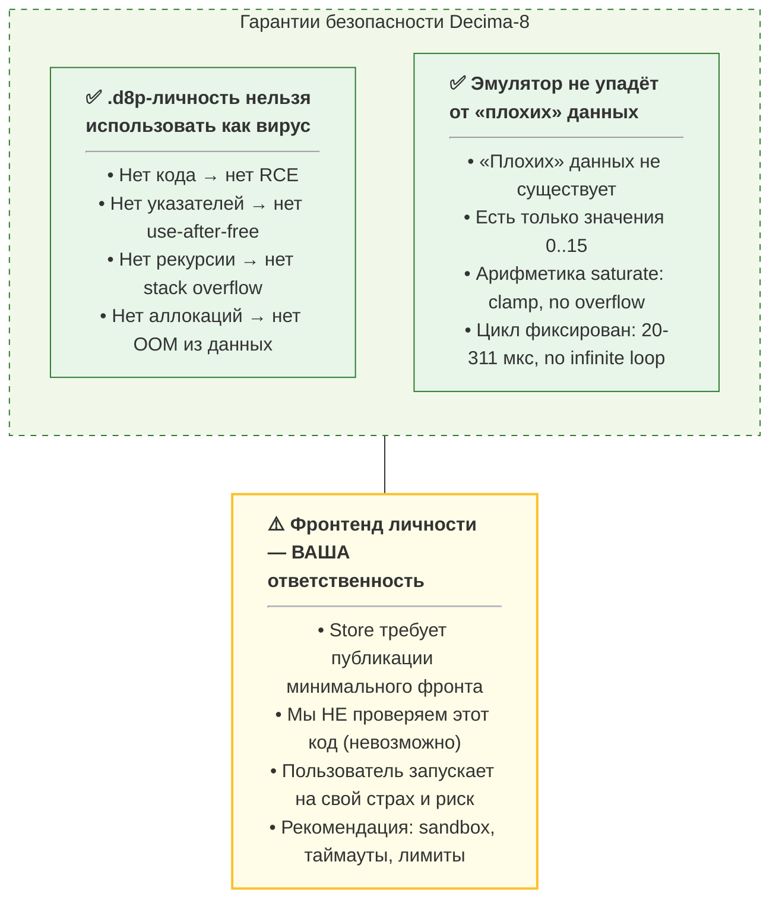

---

### Store: публикация личности = публикация фронта

**Требование Store:**

При публикации личности в Store автор **должен предоставить**:

| Компонент | Статус | Проверка |
|-----------|--------|----------|
| **`.d8p` файл** | ✅ Обязательно | Валидация спецификации + PKI-подпись |
| **Фронтенд (минимальный)** | ✅ Обязательно | **Не проверяется** (код пользователя) |
| **Документация** | ✅ Обязательно | Описание 8 струн (что кормить), интерпретация выходов |
| **Пример запуска** | ✅ Обязательно | Скрипт / инструкция для быстрого старта |

**Почему мы не проверяем фронтенд:**

1. **Технически невозможно**: Код может быть на чём угодно (Python, Rust, Go, C++)
2. **Юридически сложно**: Мы не хотим нести ответственность за чужой код
3. **Философски неверно**: Decima-8 — это открытый стандарт, а не закрытая платформа

**Что делаем вместо проверки:**

- **Требование публикации**: Нет фронта = нет публикации в Store
- **Предупреждение пользователей**: «Фронтенд не верифицирован, запускайте в sandbox»
- **Рейтинговая система**: Сообщество оценивает не только личность, но и качество фронта
- **Отзывы и репутация**: Авторы с плохим кодом быстро получают негативные отзывы

### Валидация топологии

Помимо проверки CRC32 и PKI-подписи, эмулятор выполняет **статический анализ графа**:

- Проверка на **бесконечные петли с усилением** (positive feedback loop)
- Ограничение на **максимальную степень связности** тайла
- Лимит на **суммарный коэффициент усиления** в компоненте связности

Если граф не проходит валидацию — загрузка отклоняется с ошибкой `TopologyValidationError`.

> ⚠️ Это не «антивирус», а проверка физической состоятельности личности.

---

### Философия: локализация риска

Мы не скрываем риски. Мы **локализуем их**.

[Периметр: Ваш Дирижёр + Фронтенд личности]

- Сеть, FS, JSON, WebSockets, БД, драйверы
- ⚠️ Здесь могут быть уязвимости — это нормально
- 🔧 Классические защиты: таймауты, лимиты, санитизация, sandbox

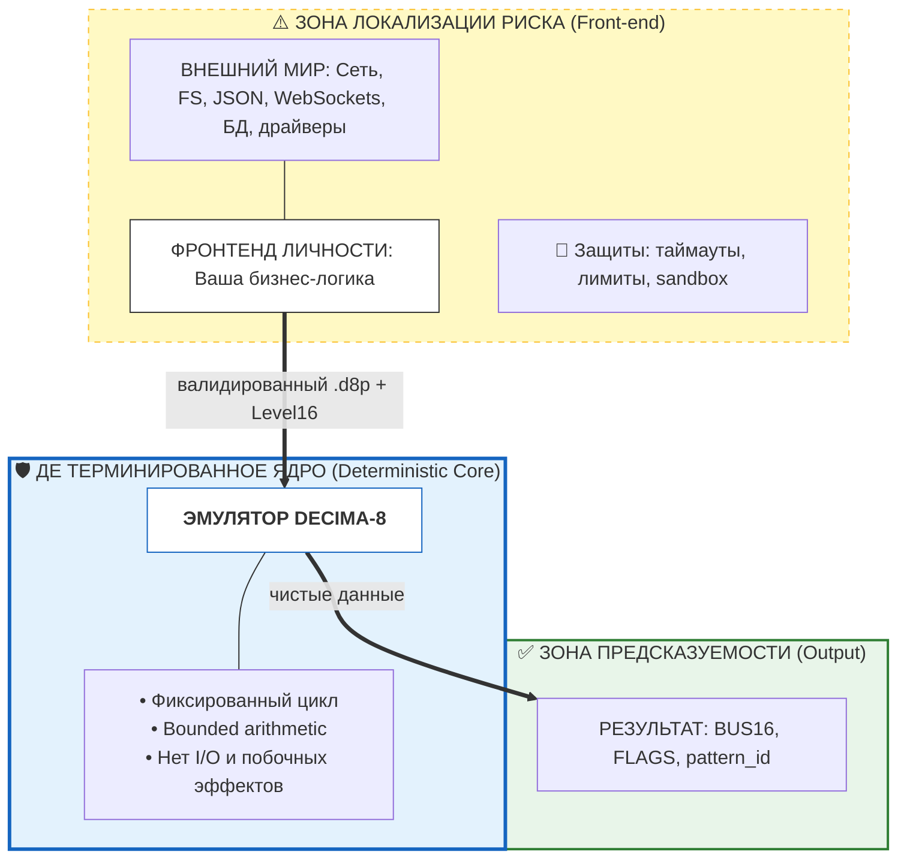

> 💭 **Ядро — чисто. Периметр — ваш. Это честно.**

---

### Что мы НЕ гарантируем

Чтобы быть до конца честными:

| Мы НЕ гарантируем | Почему |
|------------------|--------|
| Что фронтенд личности не содержит багов | Это код автора, вы за него отвечаете |
| Что ваш Дирижёр не упадёт | Это ваш код, вы за него отвечаете |
| Что сеть / ОС / железо не упадут | Это инфраструктура, вне нашей архитектуры |
| Что .d8p описывает «хорошую» личность | Мы проверяем физику, а не семантику задачи |
| Что PKI-ключ не скомпрометирован | Храните ключи безопасно — это ваша ответственность |

---

### Рекомендации для пользователей Store

**При загрузке личности из Store:**

1. **Запускайте в sandbox** (Docker, VM, seccomp, AppArmor)
2. **Ограничьте доступ к сети** (если личность не требует)
3. **Установите лимиты памяти и CPU** (cgroups, ulimit)
4. **Проверьте репутацию автора** (рейтинг, отзывы, история)
5. **Изучите код фронта** (если можете) перед запуском в production

**При публикации личности в Store:**

1. **Предоставьте минимальный рабочий фронтенд**
2. **Документируйте 8 струн** (что подавать на вход)
3. **Документируйте выходы** (как интерпретировать BUS16/PATTERN_ID)
4. **Предупредите о рисках** (сеть, FS, внешние API)
5. **Отвечайте на отзывы** (репутация = доверие)

---

## 🧩 Итого по безопасности

| Компонент | Риск | Защита |
|-----------|------|--------|
| **.d8p** | ❌ Нет | Архитектура (данные, не код) |
| **Эмулятор** | ❌ Нет | Архитектура (детерминизм, bounded arithmetic) |
| **Фронтенд личности** | ⚠️ Да | Sandbox, лимиты, репутация автора |
| **Ваш Дирижёр** | ⚠️ Да | Классические практики безопасности |

**Decima-8 не делает вашу систему «неуязвимой».**  
**Decima-8 делает уязвимости предсказуемыми и локализованными.**

- Хотите атаковать ядро? **Невозможно** — там нет кода, только данные и детерминированная арифметика.
- Хотите атаковать периметр? **Возможно** — но это классические векторы (сеть, парсинг, FS), против которых есть классические защиты (таймауты, лимиты, санитизация, sandbox).

> Мы не обещаем «магическую защиту», мы гарантируем **архитектурную честность**: вы точно знаете, где риск, а где — нет.

Готовы к модели распространения? Расскажем, как монетизировать, не продавая душу.

---

## 7. МОДЕЛЬ РАСПРОСТРАНЕНИЯ

Decima-8 — это инфраструктурный проект. Наша цель — не продать подписку на софт, а стать стандартом, как TCP/IP или Git.

### 7.1 Открытое ядро / Закрытый кокпит

| Компонент | Статус | Зачем |
|-----------|--------|-------|
| **Спеки + Эмулятор** | ✅ OPEN | Наука, верификация, цитирование |
| **Формат .d8p** | ✅ OPEN | Интеграции, конвертеры, интероперабельность |
| **libd8p (парсер)** | ✅ OPEN | Валидация, генерация, любые инструменты |
| **IDE** | 🔒 CLOSED (Free) | Референсный UX для «скульпторов» |
| **Store** | 🔒 CLOSED (Curated) | Единый стандарт, PKI-подписи, качество |

**Философия:**

- **Открытое ядро**: любой может написать свой генератор .d8p, форкнуть эмулятор, интегрировать Decima-8 в свои фреймворки.
- **Закрытый кокпит**: IDE — референсный инструмент (бесплатен), Store — единый маркетплейс с PKI-подписями.

---

### 7.2 Публикация в Store

Для публикации личности в Store требуется **PKI-подпись**. Это гарантирует:

- **Авторство**: вы подписываете код своим ключом
- **Целостность**: файл не изменён при передаче
- **Доверие**: сообщество знает, кто создал личность

**Как получить ключ:** через участие в сварме (тиры Tile/Cluster/Council).  
**Важно:** уже опубликованные личности **не удаляются** при истечении подписки.

> *💭 Это не paywall, а цепочка доверия.*

### Альтернативная подпись: свой PKI-ключ

Если у вас уже есть **PKI-ключ**, выданный доверенным центром (например, корпоративный сертификат), вы можете использовать его для подписи .d8p.

**Как это работает:**

**1. Получите ключ** у вашего доверенного центра (Corporate CA, государственная УЦ, etc.)

**2. Подпишите .d8p** через CLI: 
```
openssl dgst -sha256 -sign decima_key.pem \
-out personality.d8p.sig \
personality.d8p
```
**3. Загрузите в Store**: система проверит цепочку доверия до Root CA

**Важно:**

- Store принимает **любые ключи** с валидной цепочкой доверия
- Ваш ключ должен быть **доверенным для получателей** (они импортировали ваш Root CA)
- Для публичного Store рекомендуется использовать **наш PKI** (Tile/Cluster/Council) — он доверен всем пользователям

> *💭 **Это не «или-или». Это гибкость:** хотите корпоративный контроль — используйте свой PKI. Хотите публичный Store — используйте наш.*

### 7.3 Дорожная карта

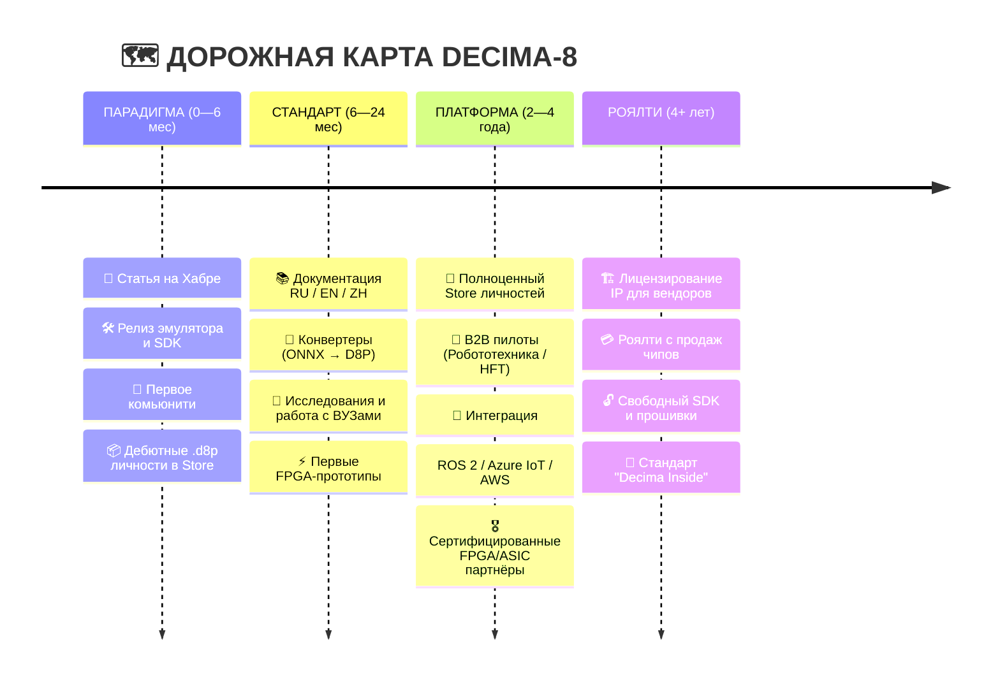

---

> 💭 **«Сначала стань стандартом. Деньги — побочный эффект масштаба.»**

---

## 🧩 Итого по модели

| Принцип | Реализация |
|---------|------------|
| **Открытость** | Спеки, эмулятор, формат — всё открыто |
| **Доверие** | Store с PKI-подписями, курируемый контент |
| **Монетизация** | PKI-доступ (Boosty), роялти (ASIC), не подписка на софт |
| **Сообщество** | Observer/Seed/Gardener — комьюнити; Tile/Cluster/Council — авторы |
| **Долгосрочность** | Стандарт на 10+ лет, не exit через 3 года |

**Decima-8 — это не продукт. Это инфраструктура.**

Готовы к эволюции архитектуры? Расскажем, куда расти дальше.

---

## 8. ЭВОЛЮЦИЯ АРХИТЕКТУРЫ

Decima-8 v0.2 — это **минимальная жизнеспособная архитектура**. Не догма, а стартовая точка, которая доказывает работоспособность принципов.

**Что зафиксировано навсегда (принципы):**

| Принцип | Почему это фундамент |
|---------|---------------------|
| **Двухфазный цикл** READ → WRITE | Детерминизм, отсутствие race conditions |
| **Эстафетная активация** (граф, а не пакеты) | 0% площади на роутеры, нулевой джиттер |
| **LevelN** (многобитная активация) | Кодирование «силы намерения» в одном такте |
| **Signed Decay** (затухание к нулю) | Стабильность, естественное «забывание» |
| **Fuse-by-Range** (пороговая логика) | Гибкие паттерны, резонансные пути |

**Что может масштабироваться (параметры):**

| Параметр | v0.2 (сейчас) | v1.0+ (будущее) | Зачем |
|----------|--------------|-----------------|-------|
| **Level** | 16 (0..15) | 32 / 64 | Тонкая градация активации, меньше квантования |
| **Вес** | SignedWeight5 [-7..+7] | SignedWeight7 [-31..+31] | Большая выразительность связей |
| **Lanes** | 8 | 16 / 32 | Пропускная способность, параллелизм |
| **Ткань** | 8×32 .. 32×128 | 256×1024 / кластеры | Сложные иерархические паттерны |
| **Домены** | 16 | 32 / 64 | Тонкое управление сбросом и приоритетами |
| **Cycle time** | 22-311 мкс (эмулятор) | <1 мкс (ASIC) | Hard real-time для экстремальных задач |

**Обратная совместимость:**

Все изменения **совместимы на уровне принципов**:
- Двухфазный цикл остаётся
- Эстафетная активация — основа
- Fuse-by-range, decay-to-zero — фундамент

**Открытая спецификация позволяет:**

1. **Экспериментировать**: форкните эмулятор, поменяйте `Level16` → `Level32`, посмотрите, что изменится в поведении роя.
2. **Предлагать расширения**: если ваше расширение доказывает преимущество — оно может войти в v1.0 через Spec RFC.
3. **Строить специализированные варианты**:
   - `Decima-8-Lite`: для IoT (меньше тайлов, меньше весов, низкое энергопотребление)
   - `Decima-8-Pro`: для HFT (больше lanes, меньше цикл, приоритет детерминизма)
   - `Decima-8-Research`: для науки (расширенные метрики, отладка, логирование)

> 💭 **Философия**: мы фиксируем *принципы*, а не *параметры*. Level16 и SignedWeight5 — это не догма, а стартовая точка.

---

## 9. ЗАКЛЮЧЕНИЕ 🏁

Decima-8 — это не «ещё один нейроморфный чип». Это попытка ответить на вопрос:

> *А что, если построить вычисления не на бинарной логике и пакетной коммутации, а на уровнях энергии, резонансе и эстафетной активации?*

**Что мы предлагаем:**

| От | К |
|---|---|
| Бинарных спайков (N тактов на значение) | **Level16** (1 такт = 1 значение) |
| Пакетной маршрутизации (40% площади) | **Эстафетной активации** (0% на роутеры) |
| Стохастических задержек | **Детерминизма 20-311 мкс** |
| Чёрных ящиков | **Открытого стандарта** |
| «Магической» безопасности | **Архитектурной честности** |

**Мы не обещаем AGI.**  
**Мы обещаем детерминизм, эффективность и выразительность**, которых не хватает современным архитектурам.

---

### Призыв

**Проверяйте:**

- Скачайте эмулятор: [github.com/rulerom/decima8](https://github.com/rulerom/decima8)
- Запустите бенчмарки на своём железе
- Сверьте математику со спецификацией

**Форкайте:**

- Модифицируйте эмулятор, экспериментируйте с Level32
- Напишите свой генератор .d8p на Python/Rust/Go
- Предложите расширение через Spec RFC

**Экспериментируйте:**

- Слепите личность в IDE (1.3 МБ, offline)
- Опубликуйте в Store (с PKI-подписью)
- Поделитесь паттерном с сообществом

---

### Ссылки

| Ресурс | Описание |
|--------|----------|
| 🔗 **Контракт v0.2** | [decima.rulerom.com/ru/CONTRACT/](https://decima.rulerom.com/ru/CONTRACT/) |
| 🔗 **Эмулятор (GitHub)** | [github.com/rulerom/decima8](https://github.com/rulerom/decima8) |
| 🔗 **Bakery (мета-обучение)** | [bakery.rulerom.com](https://bakery.rulerom.com) |
| 🔗 **PKI-центр** | [pki.rulerom.com](https://pki.rulerom.com) |
| 🔗 **libwui (UI-движок)** | [libwui.org](https://libwui.org) |
| 🔗 **Совет сварма** | [intent-garden.org](https://intent-garden.org/swarm.html) |

---

> *«Мы не эмулируем нейроны. Мы строим ткань, где узнавание — это физика.»*

Если вам близко мышление **«от физики, а не от маркетинга»** — добро пожаловать в рой. 🐝⚡

---

## FAQ

**Q: Почему не float32/float16?**  
A: Level16 (0..15) — это не «неточный float». Это *семантически другая единица*: уровень энергии, а не вещественное число. Для нейроморфных паттернов градаций 0..15 достаточно, а вычисления становятся детерминированными и быстрыми.

**Q: Как обучать?**  
A: Сейчас — **вручную через IDE**. Вы визуально настраиваете пороги (`thr_lo/hi`), decay и routing, наблюдая за реакцией сварма в реальном времени. Это не «обучение» в классическом ML-смысле, а **скульптура личности**: вы лепите поведение, а не минимизируете лосс.

**Bakery** ([bakery.rulerom.com](https://bakery.rulerom.com)) — это справочник паттернов и интентов, а не авто-тренер.

**В планах:** API для ИИ-агентов, чтобы они могли программно генерировать и «пропекать» личности. Но даже тогда финальная валидация останется за человеком: вы видите, что печёте.

**Q: Можно ли использовать циклы в графе активации?**  
A: Да! Циклы разрешены. Детерминизм сохраняется благодаря использованию `locked_before` (снимок состояния в начале READ).

**Q: Что если два тайла в одном домене фьюзятся одновременно?**  
A: Выбирается winner по приоритету `priority8`, при равенстве — по минимальному `tile_id`. COLLIDE флаг устанавливается, если была коллизия.

**Q: Что такое «двойной пролив» и когда его использовать?**  
A: Это режим, при котором ядро внутри прокручивает два такта на один EV_FLASH для повышения селективности. 
   Дирижёр подаёт вход ОДИН раз, но получает решение после второго внутреннего такта.
   Используется при распознавании похожих паттернов с малым расстоянием Хэмминга (чистый текст в VSB).
   В IDE включается галочкой «Double Strait», в .d8p выставляется флаг BAKE_FLAG_DOUBLE_STRAIT.
   Цена: ~40 мкс вместо ~20 мкс. Выгода: удвоенная активация детектора + блокировка антагонистом.

**Q: Почему open hardware?**  
A: Мы верим: следующий скачок в вычислениях случится не в закрытых лабораториях, а в сообществе. Decima-8 — это стандарт, а не продукт.

**Q: А если я хочу использовать .d8p локально, без Store?**  
A: Пожалуйста! Подпись не требуется для локального использования. Эмулятор принимает любые .d8p (после валидации CRC32). PKI — только для публикации в Store.

**Q: Можно ли подписать .d8p своим PKI-ключом?**  
A: Да! Если у вас есть ключ, выданный доверенным центром (Corporate CA, государственная УЦ), вы можете использовать его. 
   Store проверяет цепочку доверия, а не конкретного эмитента. 
   Для публичного Store проще использовать наш PKI (Tile/Cluster/Council) — он уже доверен всем пользователям.

---
