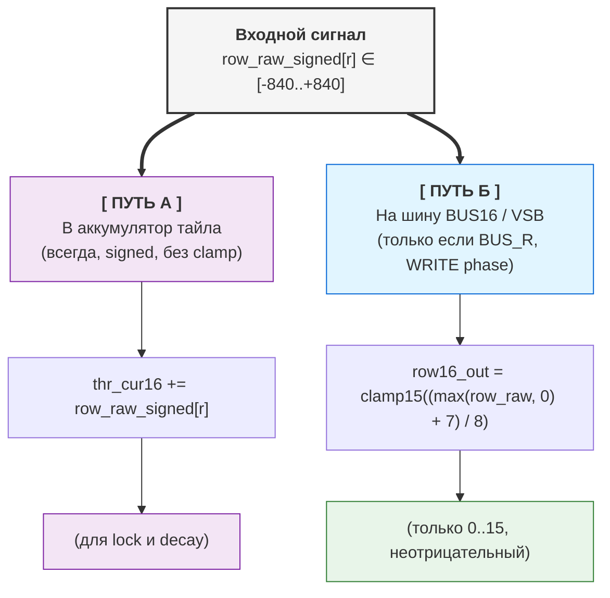
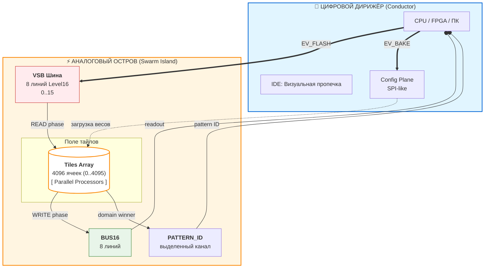
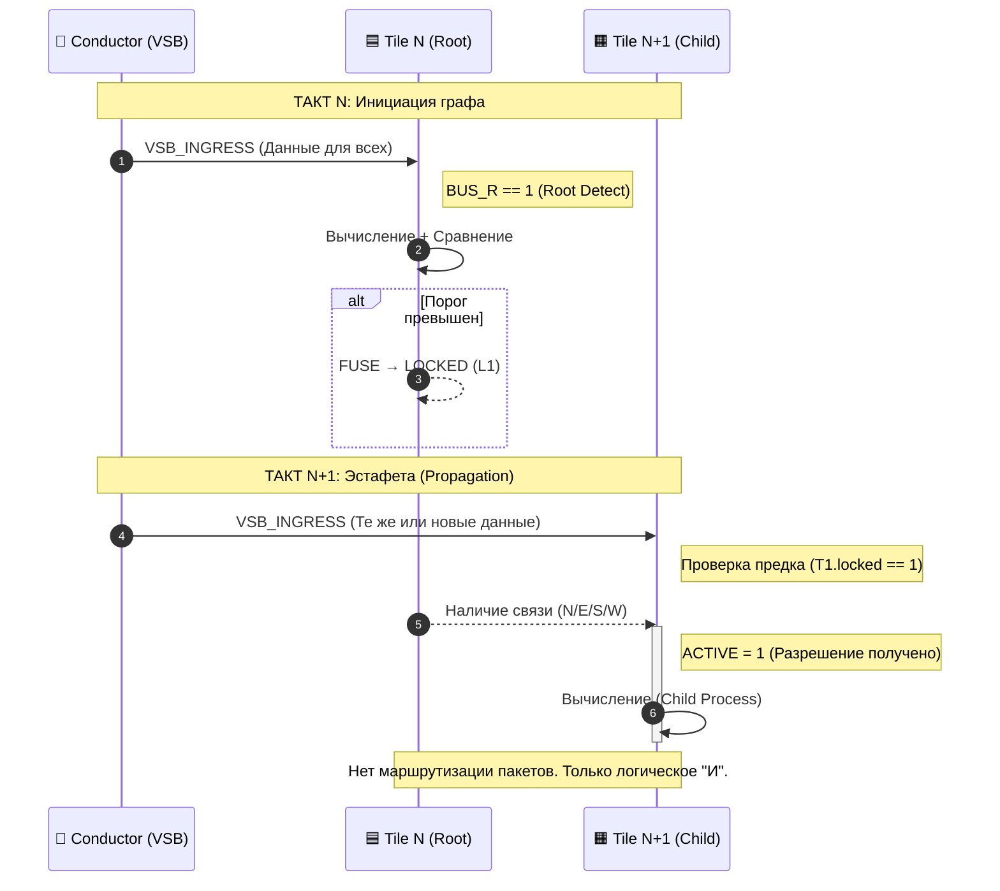
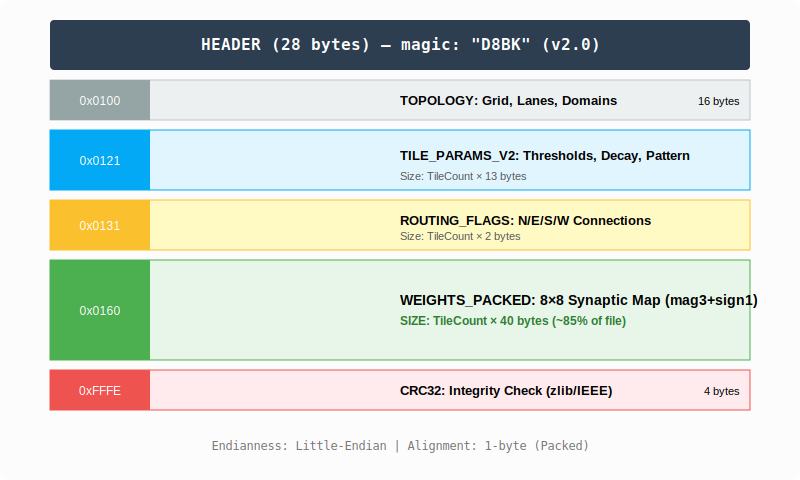

# Decima-8: Нейроморфная архитектура, оперирующая уровнями энергии

> *Открытая спецификация, Level16, эстафетная активация без маршрутизаторов. v0.2*


## 1. ВВЕДЕНИЕ

Современные нейроморфные системы сталкиваются с двумя независимыми проблемами.

**Проблема 1: Кодирование информации**

**Бинарные спайковые сети (SNN) передают градации сигнала через:**

- Частотное кодирование (множество тактов на одно значение)
- Увеличение количества линий передачи

**Проблема 2: Аппаратная реализация**

**Аналоговые мемристорные кроссбары обещают естественную нейроморфность, но содержат следующие проблемы:**

- Шум и дрейф параметров
- Недетерминизм вычислений
- Каждый чип требует индивидуальной калибровки

**Традиционные Network-on-Chip (NoC) добавляют overhead:**

- ~40% площади кристалла уходит на маршрутизаторы
- ~70% энергии тратится на пересылку данных, а не вычисления

**Decima-8 предлагает:**

- **Level16:** кодирование уровня активации (0..15) в одном такте на одной линии. Это компромисс между бинарным представлением и аналоговой непрерывностью.
- **Цифровые кроссбары (эмуляция мемристорных матриц):** детерминизм, воспроизводимость, отсутствие шума
- **Эстафетную активацию вместо пакетной маршрутизации:** тайлы не передают данные друг другу, активация распространяется через граф зависимостей
- **Результат:** фиксированная задержка, предсказуемое поведение, 0% площади на роутеры.

> *⚛︎ Вместо эмуляции био-нейронов строим ткань, где узнавание — это физика*

---


**Decima-8 IDE с личностью OCR**

[Download IDE](../tools/ide.md)

---

## 2. МАТЕМАТИЧЕСКИЕ ОСНОВЫ

Архитектура Decima-8 основана на детерминированной целочисленной арифметике. В этом разделе приведены спецификации вычислений: форматы данных, формулы активации и логика работы тайлов. Все значения имеют фиксированные диапазоны, что гарантирует воспроизводимость результатов на любом оборудовании.

### 2.1 Level16: Семантическая тетрада


*Level16 в аккордеоне IDE*

В традиционных спайковых архитектурах интенсивность сигнала кодируется либо во времени (частота спайков), либо в пространстве (количество параллельных каналов). Оба подхода требуют компромисса: либо задержка, либо усложнение разводки.

Decima-8 использует **Level16** — представление уровня активации как 4-битного значения (0..15) на одной линии за один такт:

```
thr_cur16 ∈ [0..15]  // 4 бита, одна тетрада
```

Это не попытка «эмулировать аналог цифрой», а осознанный выбор формата данных:

- **Достаточно градаций** для выразительности нейроморфных паттернов
- **Укладывается в nibble** — удобно для packed-форматов и битовых операций
- **Фиксированный размер** — детерминированная арифметика, нет динамической нормализации

**Физический смысл Level16:**

- `0` — отсутствие активации
- `15` — насыщение
- `1..14` — градации «силы намерения»

На шине VSB это просто уровень сигнала. Внутри тайла — операнд для арифметики с весами SignedWeight5.

> *💭 **Суть:** Level16 — это не «неточный int». Это семантическая единица архитектуры, как float32 в классических нейросетях. Только детерминированная и аппаратно-дружелюбная.*

### 2.2 SignedWeight5: Взвешенные связи с торможением


*Структурная схема тайла: 8 струн → кроссбар → аккумулятор*

Каждый тайл содержит цифровую эмуляцию мемристорного кроссбара размером 8×8. На вход приходят 8 значений `in16[0..7]` (Level16). Каждое значение умножается на свой вес и суммируется по строке.

**Кодирование веса:** *SignedWeight5 (5 бит)*

```
bits 0-2: magnitude (0..7)   // модуль
bit 3:    sign (0=-, 1=+)    // знак
bit 4:    reserved (0)       // выравнивание
```

Диапазон веса: **[-7..+7]**. Отрицательные веса реализуют латеральное торможение на аппаратном уровне — это не эмуляция, а прямое следствие знаковой арифметики.

Формула для одной строки кроссбара:
```
row_raw_signed[r] = Σ (in16[i] × weight[r][i])  // i=0..7
```

Поскольку `in16[i] ∈ [0..15]`, а `weight ∈ [-7..+7]`, вклад одной ячейки лежит в диапазоне **[-105..+105]**. Сумма по 8 входам даёт **[-840..+840]** на строку.

Эти 8 строк (row_raw_signed[0..7]) далее расходятся по двум путям:

1. В аккумулятор (без преобразований) — signed-значения для накопления и принятия решения о lock
2. На шину VSB (через нормализацию и clamp15) — только неотрицательные значения 0..15

> *💭 **Физический смысл:** Если по lane0 приходит возбуждающий сигнал (+5), а по lane1 — тормозящий (-3), их вклады просто суммируются: +5 + (-3) = +2. Баланс «возбуждение/торможение» зашит в арифметику, не требует отдельной логики.*

**Почему 5 бит на вес?**

- 3 бита на модуль (0..7) — достаточно градаций для выразительности связей
- 1 бит на знак — поддержка ингибирования
- 1 бит резерв — выравнивание до байта, возможность расширения в v1.0

Это компромисс между точностью и плотностью упаковки: 64 веса × 5 бит = 40 байт на тайл, укладывается в кэш-линию.

Результат `row_raw_signed[r]` идёт в аккумулятор (всегда) и на шину (если взведен флаг BUS_R)

## 2.3 Функция активации: поплавок и кран

Взвешенный `вход row_raw_signed[r]` работает как поток воды:

1. Поднимает поплавок в бачке (`thr_cur16 += delta`) — это состояние тайла.
2. Идёт к выходному клапану — но проходит только если поплавок в зоне [`thr_lo..thr_hi`] поднял рычаг (`locked=1`).

**Выход тайла — это не уровень в бачке**. Это входной сигнал, пропущенный через клапан, управляемый состоянием.

> *💡 Физический смысл: сначала поплавок реагирует на поток (READ), потом клапан открывается или нет (WRITE). Логически: одно вычисление служит и для состояния, и для решения.*



**Путь 1: В аккумулятор (основной, всегда активен)**

**Формула:**
```
thr_cur16 += row_raw_signed[r]  // signed i16, без преобразований
```

**Особенности:**

- `row_raw_signed[r] ∈ [-840..+840]` используется **как есть**, с сохранением знака
- Сумма по всем 8 строкам: `delta_raw ∈ [-6720..+6720]`
- Аккумулятор `thr_cur16 ∈ [-32768..+32767]` (signed i16)

**Зачем:**

- Накопление активации для принятия решения о fuse (`thr_cur16 ∈ [thr_lo16..thr_hi16]`)
- Применение decay (затухание к нулю)
- Поддержание внутреннего состояния тайла между тактами

> *💭 **Физический смысл:** Аккумулятор — это «память» тайла. Он хранит баланс возбуждения и торможения, даже если на шине сейчас тишина.*

**Путь 2: На шину VSB (условный, только при BUS_R в WRITE phase)**

**Формула:**

```
row16_out[r] = clamp15((max(row_raw_signed[r], 0) + 7) / 8)
```

**Разбор:**

| Шаг | Что делает | Зачем |
| --- | ---------- | ----- |
| max(..., 0) | Отсекает отрицательные суммы | Если торможение победило → на шине тишина (0) |
| + 7 | Сдвиг для округления | (x + 7) / 8 = округление вверх перед целочисленным делением |
| / 8 | Нормализация диапазона | [-840..+840] → [0..105] → clamp15 → [0..15] |
| clamp15 | Жёсткое ограничение 0..15 | Защита от переполнения, совместимость с Level16 |

**Примеры:**

```
row_raw_signed[r] = +500
→ max(500, 0) = 500
→ (500 + 7) / 8 = 63.375 → 63 (целочисленное)
→ clamp15(63) = 15  ← насыщение

row_raw_signed[r] = +50
→ max(50, 0) = 50
→ (50 + 7) / 8 = 7.125 → 7
→ clamp15(7) = 7  ← нормальное значение

row_raw_signed[r] = -100
→ max(-100, 0) = 0
→ (0 + 7) / 8 = 0.875 → 0
→ clamp15(0) = 0  ← полное подавление (торможение победило)
```

> *💭 **Физический смысл:** На шину VSB идут только **уровни энергии** (0..15). Отрицательные значения не имеют смысла для передачи — «тишина» кодируется как 0.

**Почему /8, а не адаптивная нормализация?**

**Потому что входов всегда 8.** Не 1, не 64, не «сколько активно».

Это гарантирует:

- Детерминизм: одна и та же конфигурация → один и тот же результат
- Аппаратную простоту: `>>3` вместо деления в runtime
- Предсказуемость: нет «внезапного насыщения» при изменении плотности

Если нужен другой динамический диапазон — настройте параметры тайла:

- `weights` (mag3+sign1) — сила связей
- `thr_lo/hi` — диапазон значений аккумулятора для активации
- `decay16` — скорость затухания
 
> *💭 Философия: Не прячем сложность в «умную архитектуру», а даём явные рычаги управления.*

### 2.4 Аккумулятор + Signed Decay: Память с инерцией

Состояние тайла хранится в аккумуляторе `thr_cur16`

```
thr_cur16 ∈ [-32768..+32767]  // signed i16
```

**Почему signed:** Аккумулятор суммирует взвешенные вклады `row_raw_signed[r] ∈ [-840..+840]`. Отрицательные значения (торможение) должны уменьшать потенциал, не отсекаясь на нуле.

**Механизм decay:**

На каждом такте, если decay16 > 0, аккумулятор стремится к нулю:

```
if (decay16 > 0) {
  if (thr_tmp > 0) thr_tmp = max(thr_tmp - decay16, 0);
  else if (thr_tmp < 0) thr_tmp = min(thr_tmp + decay16, 0);
  // Zero-crossing protection: знак не меняется
}
```

**Ключевые свойства:**

1. **Нет перескока через ноль.** Если `thr_cur16 = +20`, а `decay16 = 30`, результат будет `0`, а не `-10`. Знак потенциала инвариантен относительно decay.
2. **Применяется всегда.** Decay работает даже для `locked` тайлов. Это позволяет активному пути «остыть» и разблокироваться при отсутствии подпитки.
3. **Конфигурируемый параметр.** `decay16` задаётся в `TileParams` для каждого тайла индивидуально.

**Зачем это нужно:**

- **Фильтрация шума:** Слабые сигналы (`|delta| < decay16`) не накапливаются, а аннигилируются.
- **Ограничение окна интеграции:** Сигналы суммируются только если приходят в пределах временного окна, заданного скоростью затухания.
- **Стабильность:** Предотвращает насыщение аккумулятора при длительной активации.

> *Примечание: Если задача требует интеграции слабых сигналов — установите decay16 = 0 или малое значение. Архитектура не навязывает «забывание», вы управляете им через конфигурацию.*

### 2.5 Fuse-by-Range: Пороговая логика

Тайл принимает решение о блокировке (locked) на основе текущего значения аккумулятора `thr_cur16` и конфигурируемого диапазона `[thr_lo16..thr_hi16]`

```
locked = 1, если thr_cur16 ∈ [thr_lo16, thr_hi16]
```

**Параметры:**

- `thr_lo16, thr_hi16` ∈ `[-32768..+32767]` (signed i16)
- Валидация: `если thr_lo16 > thr_hi16` → ошибка `FuseRangeError` при bake
- Если `thr_lo16 == thr_hi16` → фьюз отключён (тайл никогда не заблокируется)

**Поведение при `locked=1`:**

1. **Поддержание активации потомков:** пока тайл locked, его потомки в графе остаются `ACTIVE` и могут вычисляться в следующем такте.
2. **Decay продолжает работать:** аккумулятор затухает к нулю даже в locked-состоянии. Если `thr_cur16` выходит за пределы [`thr_lo16..thr_hi16`], тайл разблокируется.
3. **Эстафета распространяется:** locked-тайл формирует устойчивое звено в графе активации.

**Ключевой принцип:**

`locked` — это не передача данных, а разрешение на вычисление для потомков. Данные приходят от Conductor через `VSB_INGRESS`, а не от других тайлов. Тайлы только накапливают состояние в аккумуляторах и управляют графом активации через флаги `locked`.

> *Примечание: Диапазон [`thr_lo16..thr_hi16`] может находиться в любой части signed-спектра: только положительные значения, только отрицательные, или пересекать ноль. Это позволяет настраивать реакцию тайла на возбуждение, торможение или отклонение от покоя.*

---

## 🧩 Итого по математике

| Компонент | Диапазон | Формула |
| --------- | -------- | ------- |
| Level16 | [0..15] | thr_cur16 — уровень энергии |
| SignedWeight5 | [-7..+7] | mag3 + sign1 |
| row_raw_signed | [-840..+840] | Σ(in16 × weight) на строку |
| delta_raw | [-6720..+6720] | Σ row_raw_signed (8 строк) |
| Аккумулятор | [-32768..+32767] | thr_cur16 += delta_raw - decay |
| Fuse range | [-32768..+32767] | thr_lo16 .. thr_hi16 |

---

## 3. АРХИТЕКТУРА

Раздел 2 зафиксировал математические правила вычислений. Раздел 3 описывает их аппаратную реализацию: разделение Conductor/Island, детерминированный цикл READ→WRITE, эстафетную активацию без маршрутизаторов и механизмы энергоэффективности.

Все компоненты спроектированы так, чтобы гарантировать:

- Фиксированную латентность (не зависит от нагрузки)
- Масштабируемость (линейный рост времени с ростом ткани)
- Детерминизм (одинаковый результат при одинаковых входах)

---

### 3.1 Conductor ↔ Island



*diagram Conductor ↔ Island*

Decima-8 разделена на две плоскости: **Conductor** (управление) и **Island** (вычисления).

**Conductor** — внешний контроллер (CPU/FPGA/ПК):

- Вызывает события `EV_FLASH`, `EV_BAKE`, `EV_RESET_DOMAIN`
- Выставляет `VSB_INGRESS[0..7]` в начале READ-фазы
- Читает `BUS16[0..7]` и `PATTERN_ID` после WRITE-фазы
- Загружает конфигурацию (веса, пороги) через SPI-like интерфейс (CFG)

**Island** — вычислительная ткань:

- Массив тайлов (масштабируемый: 8×32 .. 32×128)
- Параллельная обработка всех тайлов в каждом такте
- **VSB** (Value Signal Bus): 8 входных линий Level16 от Conductor
- **BUS16:** 8 выходных линий для суммирования вкладов тайлов
- **PATTERN_ID:** выделенный канал для ID выигравшего паттерна

**Интерфейсы конфигурации:**

- SPI/QSPI: загрузка BakeBlob — до 50 MB/s
- Parallel CFG bus (FPGA): до 200 MB/s
- PCIe/Ethernet (хост-контроллер): до 1 GB/s
- UART: только отладка, не для runtime

> *💭 Принцип: Conductor не участвует в вычислениях. Он только дирижирует циклом и читает результаты. Вся динамика происходит внутри Island.*

---

### 3.2 Двухфазный цикл

```mermaid
gantt
    title Один такт EV_FLASH (Цикл: 20 мкс)
    dateFormat  X
    axisFormat %s мкс

    section 🎼 CONDUCTOR
    Выставление VSB_INGRESS     :active, c1, 0, 3
    Пауза (Processing)          :desat, 3, 10
    Turnaround (Hi-Z)           :crit, 10, 12
    Чтение BUS16                :c2, 18, 20

    section ⚡ ISLAND (Phase 1)
    PHASE_READ (Вход)           :active, 0, 8
    Активация графа             : 2, 5
    Кроссбар + Accumulator      : 5, 8
    FUSE → locked               : 7, 8

    section 🔄 SWITCH
    Смена направления шины      : 10, 12

    section ⚡ ISLAND (Phase 2)
    PHASE_WRITE (Выход)          :active, 12, 18
    BUS_W → BUS16                : 12, 16
    Честное суммирование         : 14, 16

    section 📥 READOUT
    R0_RAW_BUS sample           : 18, 20
    AutoReset (опционально)      : 20, 22
```



Вся ткань работает в жёстком ритме. Один такт состоит из четырёх фаз:

```
┌─────────────┬──────────────┬─────────────┬─────────────┐
│ PHASE_READ  │ TURNAROUND   │ PHASE_WRITE │ READOUT     │
└─────────────┴──────────────┴─────────────┴─────────────┘

```

**PHASE_READ:**

1. Conductor выставляет `VSB_INGRESS16[0..7]` (Level16)
2. Все ACTIVE-тайлы семплируют вход
3. Вычисление `row_raw_signed[r]` для каждой строки
4. Обновление `thr_cur16 += delta_raw`
5. Применение decay (затухание к нулю)
6. Проверка fuse: `locked_after = (thr_cur16 ∈ [thr_lo16..thr_hi16])`
7. Формирование `drive_vec[0..7]`

**TURNAROUND:**

- Conductor отпускает VSB (Hi-Z / no-drive)
- Island включает драйв BUS16
- **Обязательный зазор** — никаких гонок направлений

**PHASE_WRITE:**

- Тайлы с `BUS_W==1` и `(locked self || locked_ancestor)` выставляют `drive_vec` на BUS16
- Честное суммирование: `BUS16[i] = clamp15(Σ contrib[i])`
- Фиксация: `locked := locked_after`

**READOUT:**

- Conductor читает `BUS16[0..7]` как результат такта
- Опционально: AutoReset-by-Fire (сброс доменов по маске winner'а)

**Детерминизм цикла:**

Время выполнения каждого такта фиксировано и не зависит от:

- Количества активных тайлов
- Сложности паттерна
- Состояния аккумуляторов

На эмуляторе (i5-3550) полный цикл занимает **~20-311 мкс** в зависимости от размера ткани (см. раздел 4). На FPGA/ASIC время будет определяться тактовой частотой и глубиной конвейера.

> *💭 Ключевой принцип: независимо от того, активировался тайл или нет, все вычисления занимают одинаковое число тактов. Это гарантирует нулевой джиттер на уровне архитектуры.*

---

### 3.3 Эстафетная активация (Router-less NoC)



В традиционных нейроморфных архитектурах тайлы обмениваются данными через сеть пакетной коммутации (Network-on-Chip). Это требует:

- Маршрутизаторов между узлами
- Буферов для очередей пакетов
- Арбитража при коллизиях трафика

**Decima-8 работает иначе:**

Тайлы **не передают данные** друг другу. Вместо этого они формируют **граф активации** через флаги направлений (N/E/S/W/NE/SE/SW/NW).

**Механизм:**

```
ACTIVE[t] = 1, если:
t имеет флаг BUS_R == 1 (источник/корень), ИЛИ
∃ предок p: ACTIVE[p]==1 && locked_before[p]==1 && есть ребро p→t
```

Вычисляется как **least fixed point** — детерминированно, за один проход.

**Эстафета в действии:**

- **Такт N:** корневой тайл активируется и становится `locked`.
- **Такт N+1:** потомок видит locked_before[p]==1 и становится ACTIVE

> *💭 Ключевой принцип: активация распространяется за 2 такта (предок → потомок). Данные не передаются — каждый тайл читает только `VSB_INGRESS` от Conductor. Граф активации — это **разрешение на вычисление**, не канал передачи данных.*

---

### 3.4 Схлопывание ветки (Branch Collapse)

**Логика:**

Если предок не заблокирован (`locked=0`), потомки становятся неактивными:

```
if (ACTIVE[t] == 0) {
thr_cur16 := 0
locked := 0
drive_vec := {0..0}
// Тайл не вычисляется, не драйвит шину
}
```

**Эффект:**

- Энергия не тратится на обработку заведомо неактивных путей
- Мёртвые ветви ткани «отключаются» автоматически
- Ресурсы направляются только на живые пути

**Пример:**

Такт N:

- Корневой тайл не фьюзится (thr_cur16 не попал в [lo..hi])
- locked_after = 0

Такт N+1:

- Потомки: ACTIVE = false (нет locked-предка)
- Принудительный сброс: thr_cur16=0, locked=0

Ветка схлопнута

> 💭 **Аналогия:** Дерево сбрасывает мёртвые ветви. Если корень не даёт питания (locked=0), вся ветка засыхает (ACTIVE=0 → thr_cur16=0).

---

### 3.5 Двойной пролив (Double Strait)

**Назначение:** Повышение селективности при распознавании паттернов с малым расстоянием Хэмминга (например, ASCII-символы, закодированные в 32 бита на 8 струн VSB).

**Проблема:** При прямом детектировании похожие символы (например, «3» и «8») могут активировать одни и те же тайлы из-за перекрытия битовых масок. Это приводит к ложным срабатываниям.

**Механизм:**

Если установлен флаг `BAKE_FLAG_DOUBLE_STRAIT` (bit 0 в header .d8p), ядро выполняет два внутренних пролива на один вызов `EV_FLASH`:

**Первый пролив (Поиск):**

- Все тайлы вычисляют `row_raw_signed`, обновляют `thr_cur16`.
- Тайлы-детекторы (первая линия) защёлкиваются (`locked=1`), если попадают в диапазон [`thr_lo..thr_hi`].
- Решение не выдаётся. Выходная шина BUS16 не обновляется.

**Второй пролив (Верификация):**

- Тот же входной аккорд обрабатывается повторно.
- Защёлкнутые детекторы открывают путь тайлам-антагонистам (через граф активации).
- Антагонисты верифицируют паттерн: только один антагонист (соответствующий входному символу) сохраняет аккумулятор около нуля. Остальные уходят в глубокий минус (ингибирование).
- **Выдача решения:** только после завершения второго пролива.

**Для Дирижёра:**

- Один вызов EV_FLASH.
- Время выполнения удваивается (например, ~40 мкс вместо ~20 мкс на эмуляторе).
- API не меняется: вход подаётся один раз, результат читается после завершения.

**Когда использовать:**

- Да: Распознавание символов/цифр с малым расстоянием Хэмминга.
- Да: Классификация с перекрытием классов, где важна точность.
- Нет: Задачи с жёсткими требованиями к латентности (HFT, управление двигателем).
- Нет: Паттерны с большим расстоянием Хэмминга (достаточно одного пролива).

**В IDE:** галочка «Double Strait» в настройках bake автоматически выставляет флаг в .d8p.

> *Примечание: Большинство личностей (ASR, моторика, простые детекторы) работают без двойного пролива. Это опциональный режим для задач, где точность классификации приоритетнее латентности.*

---

## 🧩 Итого по архитектуре

| Компонент | Принцип | Выгода |
|-----------|---------|--------|
| **Conductor ↔ Island** | Разделение управления и вычислений | Чёткая дисциплина, масштабируемость |
| **Двухфазный цикл** | READ → TURNAROUND → WRITE | Детерминизм 20 мкс, no race conditions |
| **Эстафетная активация** | Граф, а не передача данных | 0% площади на роутеры, нулевой джиттер |
| **Схлопывание ветки** | ACTIVE=false → сброс в 0 | Энергоэффективность, автоматическая оптимизация |
| **Двойной пролив** | Два внутренних такта на один EV_FLASH | Селективность важнее латентности |

---

## 4. БЕНЧМАРКИ

### Тестовая платформа

**IDE Decima-8** — нативное приложение на C++23 (libwui, статическая сборка). Тесты на Intel Core i5-3550 (2012, 4 ядра, 3.3 GHz), одно ядро.

**Результаты замеров:**

| Тайлов | Время цикла | Частота |
| ------ | ----------- | ------- |
| 256 | ~22 мкс | 45 kHz |
| 512 | ~43 мкс | 23 kHz |
| 1024 | ~81 мкс | 12 kHz |
| 2048 | ~160 мкс | 6 kHz |
| 4096 | ~311 мкс | 3 kHz |


*График производительности на i5-3550 (одно ядро)*

**Масштабирование:**

При удвоении количества тайлов время выполнения **примерно удваивается** (коэффициент 1.88–1.98). После 1024 тайлов рост ускоряется — сказываются кэш-промахи и давление на память. Это **физическое ограничение CPU**, а не алгоритмическое.

> ***Важно:** Для каждой конфигурации время константно и не зависит от активности сети. 100% загрузка тайлов не увеличивает задержку.*

**Память:**

Эмулятор использует ~57 байт на тайл. Для 4096 тайлов требуется ~228 КБ — помещается в L2/L3 кэш современного CPU.

**Детерминизм**

Разброс времени цикла минимален (± jitter ОС). Это следствие архитектуры:

- Нет динамических аллокаций в runtime
- Нет ветвлений, зависящих от данных
- Фиксированный цикл READ → WRITE

На FPGA/ASIC время будет определяться тактовой частотой и глубиной конвейера, а не загрузкой сети.

**Применение:**

| Задача | Требования | Decima-8 (4096 тайлов) |
| ------ | ---------- | ---------------------- |
| Робототехника | 1–10 ms цикл | 0.3 ms (запас 3–30×) |
| HFT (аналитика) | < 1 ms | 0.3 ms |
| Обработка аудио (block processing) | 1-10 ms блок | 0.3 ms (запас 3-30×) |

> *Примечание: Эмулятор Decima-8 (4096 тайлов, ~311 мкс) подходит для предиктивной аналитики в торговом цикле и аудио-DSP при блочной обработке (64+ сэмплов). Задачи с субмиллисекундными требованиями — прямое исполнение ордеров (tick-to-trade < 1 мкс) или sample-by-sample обработка (22.7 мкс @44.1 kHz) — требуют FPGA/ASIC или меньшей конфигурации ткани.*

---

## 🧩 Итого по бенчмаркам

| Метрика | Значение |
|---------|----------|
| **Минимальная латентность** | 22 мкс (256 тайлов) |
| **Максимальный размер** | 4096 тайлов за 311 мкс |
| **Масштабирование** | Линейное (O(n)) |
| **Джиттер** | Отсутствует (детерминизм) |
| **Память** | Компактная (L3-кэш) |

---

## 5. ПРОГРАММНАЯ ЭКОСИСТЕМА

Decima-8 — это не только железо. Это набор инструментов для создания, тестирования и запуска нейроморфных личностей.

### 5.1 Формат D8P

**Статус:** Открытая спецификация (MIT)

Файл `.d8p` (Decima 8 Personality) — это контейнер для «личности» сварма. Внутри нет кода. Только данные.

**Структура TLV (Type-Length-Value) с CRC32 контрольной суммой:**



**Содержимое bake файла**

- Настройки личности (размер сварма, двойной пролив)
- Веса тайлов (SignedWeight5)
- Пороги активации (thr_lo/hi, decay16)
- Направления активации (флаги N/E/S/W)
- Маршрутизация (BUS_R/W, domain_id)

**Почему TLV:**

- Новые типы блоков не ломают старые парсеры
- Легко проверить целостность файла
- Не нужно грузить весь файл в память для валидации

**libd8p** — открытая библиотека (C++, MIT) для работы с форматом: парсинг, валидация, генерация.

> *💭 Любой может написать свой генератор .d8p: на Python (PyTorch/NumPy), Rust, C++ или даже вручную в hex-редакторе.*

### 5.2 IDE

**Статус:** Закрытый бинарник, бесплатное использование

**Характеристики:**

- Статическая сборка, без зависимостей
- Windows (MSVC 2026) / Linux (Clang latest)
- Работает offline, интернет не требуется


*Общий вид IDE Decima-8*

**Основные компоненты:**

| Компонент | Описание |
|-----------|----------|
| **Панель сварма** | Визуальное представление ткани личности (heatmap активации) |
| **Параметры тайла** | Веса, thr_lo/hi, decay, routing |
| **16-аккордовый аккордеон** | Визуализатор VSB (8 lanes × 16 аккордов истории) |
| **Магнитофон и сеть** | Загрузка/сохранение VBS лент, приём/отправка VSB по UDP |
| **Панель управления** | Flash: прогон такта машины, Reset: сброс доменов, Autobake |
| **Панель выдачи решений** | Показывает PATTERN_ID, BUS16, FLAGS |

**Визуальная пропечка:** мышкой настраиваете пороги, веса и связи, наблюдая за реакцией сварма в реальном времени.

### 5.3 Эмулятор ядра

**Статус:** *OPEN SOURCE* (MIT)

Эмулятор — «источник правды» для верификации математики.

**Назначение:**

- Тестирование личностей перед загрузкой в FPGA/ASIC
- Интеграция в CI/CD, автотесты
- Изучение архитектуры «изнутри»

**Функционал:**

- Бит-в-бит совместимость с железом (эмулятор → FPGA → ASIC)
- API: `EV_FLASH`, `EV_BAKE`, `EV_RESET_DOMAIN`
- Чтение FLAGS, BUS16, статистики
- C-API для интеграции с Python/Rust/C++

**Пример использования (Python):**

```python
import d8p

swarm = d8p.load("personality.d8p")

for i in range(1000):
    swarm.ev_flash(vsb_ingress=[7,12,3,10,4,14,0,9])
    readout = swarm.read_bus()
    print(f"Tick {i}: BUS16 = {readout}")
```

### 5.4 Store (маркетплейс личностей)

**Статус:** Курируемая платформа

Store — место для публикации и обмена готовыми личностями.

**Принцип работы:**

1. **Генерация .d8p** — любым способом (IDE, скрипт, нейросеть)
2. **Подпись PKI-ключом** — гарантия авторства и целостности
3. **Публикация в Store** — валидация спецификации + проверка подписи
4. **Использование сообществом** — скачивание, интеграция, отзывы, монетизация

**Требования к публикации:**

- Валидный .d8p (соответствие спецификации)
- PKI-подпись (получается при подписке Tile/Cluster/Council)
- Минимальный фронтенд (код Дирижёра для запуска)
- Документация (описание входов/выходов)

> *💭 Store не проверяет код Дирижёра (это ответственность автора), но проверяет `.d8p` на соответствие спецификации и валидность подписи.*

**Почему PKI-подпись?**

Это не paywall, а цепочка доверия:

- Гарантия, что личность создана верифицированным автором
- Защита от подмены файлов
- Репутационная система (отзывы, рейтинг авторов)

Уже опубликованные личности **не удаляются** при истечении подписки.

## 🧩 Итого по экосистеме

| Компонент | Статус | Назначение |
| --------- | ------ | ----- |
| Формат .d8p | ✅ OPEN | Контейнер для личностей |
| libd8p | ✅ OPEN | Парсинг, валидация, генерация |
| Эмулятор | ✅ OPEN | Тестирование, верификация |
| IDE | 🔒 CLOSED (Free) | Визуальная настройка |
| Store | 🔒 CLOSED (Curated) | Публикация и обмен |

**Открытое ядро, закрытый кокпит.** Вы можете создать `.d8p` любым способом, но для публикации в Store нужна валидная PKI-подпись.

---

## 6. БЕЗОПАСНОСТЬ

Decima-8 не делает систему «неуязвимой». Она делает риски предсказуемыми и локализованными.

**Архитектурная модель рисков**

| Компонент | Риск | Защита |
| --------- | ---- | ------ |
| d8p | ❌ Нет | Данные (TLV), нет кода, нет указателей |
| Эмулятор (ядро) | ❌ Нет | Детерминизм, bounded arithmetic, saturate |
| Фронтенд личности | ⚠️ Да | Sandbox, лимиты, репутация автора |
| Дирижёр (ваш код) | ⚠️ Да | Классические практики безопасности |

**.d8p — это данные, не программа**. Внутри нет исполняемого кода, нет `eval`, нет рекурсии. Файл не может выполнить RCE, переполнить стек или выделить память.

**Эмулятор — детерминированная машина**. Фиксированные такты, Level16, clamp-арифметика. «Плохих» данных не существует — есть только значения 0..15. Переполнение невозможно по конструкции.

**Фронтенд и Дирижёр** — ваша ответственность. Код, который преобразует внешние данные в Level16 и читает BUS16, работает с сетью, FS, JSON. Здесь применимы классические уязвимости (парсинг, буферы, сеть).

> **Принцип:** Ядро — чисто. Периметр — ваш.

**Валидация топологии**

Помимо CRC32 и PKI-подписи, эмулятор выполняет статический анализ графа перед загрузкой:

- Проверка на циклы с положительной обратной связью (positive feedback loop)
- Ограничение на максимальную степень связности тайла
- Лимит на суммарный коэффициент усиления в компоненте

Если граф не проходит валидацию — загрузка отклоняется с ошибкой TopologyValidationError.

> *Это не «антивирус». Это проверка физической состоятельности личности.*

**Store: требования к публикации**

При публикации личности в Store автор предоставляет:

| Компонент | Статус | Проверка |
| --------- | ------ | -------- |
| .d8p файл | Обязательно | Валидация спецификации + PKI-подпись |
| Фронтенд (минимальный) | Обязательно | Не проверяется (код пользователя) |
| Документация | Обязательно | Описание 8 струн, интерпретация выходов |
| Пример запуска | Обязательно | Скрипт / инструкция |

**Почему не проверяем фронтенд:**

- Технически невозможно (код на Python/Rust/Go/C++)
- Юридически сложно (не хотим нести ответственность)
- Философски неверно (Decima-8 — открытый стандарт)

**Вместо проверки:**

- Требование публикации (нет фронта = нет публикации)
- Предупреждение пользователей («запускайте в sandbox»)
- Рейтинговая система (отзывы, репутация авторов)

**Рекомендации**

**При загрузке личности из Store:**

- Запускайте в sandbox (Docker, VM, seccomp, AppArmor)
- Ограничьте доступ к сети (если не требуется)
- Установите лимиты памяти и CPU (cgroups, ulimit)
- Проверьте репутацию автора (рейтинг, отзывы)

**При публикации:**

- Предоставьте минимальный рабочий фронтенд
- Документируйте входы/выходы (8 струн, BUS16, PATTERN_ID)
- Предупредите о рисках (сеть, FS, внешние API)

**Что мы НЕ гарантируем**

| Не гарантируем | Почему |
| -------------- | ------ |
| Бесбаговый фронтенд | Код автора, вы отвечаете |
| Стабильность Дирижёра | Ваш код, вы отвечаете |
| .d8p описывает «хорошую» личность | Проверяем физику, не семантику |
| PKI-ключ не скомпрометирован | Храните ключи безопасно |

**Итог:** Decima-8 локализует уязвимости. Атаковать ядро невозможно (нет кода, детерминизм). Атаковать периметр возможно — но это классические векторы, против которых есть классические защиты.

> *💭 **Архитектурная честность:** вы точно знаете, где риск, а где — нет.*

---

## 7. МОДЕЛЬ РАСПРОСТРАНЕНИЯ

Decima-8 развивается как проект с открытой спецификацией и курируемым маркетплейсом личностей. Ниже — как устроено распространение и поддержка.

### 7.1 Открытые и закрытые компоненты

| Компонент | Статус | Назначение |
| --------- | ------ | ---------- |
| Спеки + Эмулятор | ✅ OPEN | Верификация, интеграции, форки |
| Формат .d8p | ✅ OPEN | Контейнер для личностей (TLV) |
| libd8p (парсер) | ✅ OPEN | Валидация, генерация, подпись |
| IDE | 🔒 CLOSED (Free) | Референсный инструмент для настройки |
| Store | 🔒 CLOSED (Curated) | Публикация и обмен личностями |

> *💭 **Принцип:** спецификация открыта — любой может написать свой генератор .d8p, эмулятор или инструмент. Store — курируемая площадка с проверкой подписей и соответствия спецификации.*

### 7.2 Публикация в Store

Для публикации личности в Store требуется **PKI-подпись файла** .d8p.

**Зачем:**

- Гарантия авторства (ключ привязан к аккаунту)
- Целостность файла (подпись проверяется при загрузке)
- Репутационная система (отзывы к автору, не к анонимному файлу)

**Как получить ключ:**

- Подписка на тарифы Tile/Cluster/Council (автоматическая выдача)
- Или свой PKI-ключ от доверенного центра (Corporate CA, etc.)

**Важно:** уже опубликованные личности **не удаляются** при истечении подписки. Подписка нужна только для загрузки новых или обновления существующих.

**Альтернативная подпись: свой PKI-ключ**

Store принимает ключи от любых доверенных центров, не только наши.

**Процесс:**

1. **Получите ключ** у вашего CA (корпоративный, государственный, etc.)
2. **Подпишите** .d8p:
```bash
openssl dgst -sha256 -sign decima_key.pem \
  -out personality.d8p.sig \
  personality.d8p
```

3. **Загрузите в Store:** система проверит цепочку доверия до Root CA

**Нюансы:**

- Для публичного Store проще использовать наш PKI (Tile/Cluster/Council) — он доверен всем пользователям по умолчанию
- Свой ключ требует, чтобы пользователи импортировали ваш Root CA
- Корпоративное использование: внутренний Store + свой CA

### 7.3 Планы развития

**Ближайшие 6 месяцев:**

- Дальнейшее развитие софта: libd8p, core, IDE, запуск Store (первые личности), устойчивый Nomos

**6–24 месяца:**

- FPGA-прототип (верификация на железе), Выпуск первых полезных личностей (при поддержке сообщества)

**2–4 года:**

- B2B-пилоты (робототехника, предиктивная аналитика), Сертифицированные партнёры (FPGA/ASIC)

**4+ лет:**

- Лицензирование IP для производителей чипов

> *💭 Это ориентиры. Сроки могут сократиться в зависимости от ресурсов.и сообщества.*

## 🧩 Итого

| Аспект | Реализация | 
| ------ | ---------- |
| Спецификация | Открыта, форки разрешены |
| Store | Курируемый, с PKI-подписями |
| Монетизация | Подписка на PKI-ключи (Tile/Cluster/Council), роялти с ASIC |
| Сообщество | Observer/Seed/Gardener — пользователи; Tile/Cluster/Council — авторы |
|Долгосрочность | Проект рассчитан на 10+ лет, не exit через 3 года |

> *💭 Decima-8 — инфраструктурный проект. Не подписка на софт, а экосистема.*

---

## 8. ЭВОЛЮЦИЯ АРХИТЕКТУРЫ

Decima-8 v0.2 — это **минимальная жизнеспособная архитектура**. Не догма, а стартовая точка, которая доказывает работоспособность принципов.

**Что зафиксировано навсегда (принципы):**

| Принцип | Почему это фундамент |
|---------|---------------------|
| **Двухфазный цикл** READ → WRITE | Детерминизм, отсутствие race conditions |
| **Эстафетная активация** (граф, а не пакеты) | 0% площади на роутеры, нулевой джиттер |
| **LevelN** (многобитная активация) | Кодирование «силы намерения» в одном такте |
| **Signed Decay** (затухание к нулю) | Стабильность, естественное «забывание» |
| **Fuse-by-Range** (пороговая логика) | Гибкие паттерны, резонансные пути |

**Что может масштабироваться (параметры):**

| Параметр | v0.2 (сейчас) | v1.0+ (будущее) | Зачем |
|----------|--------------|-----------------|-------|
| **Level** | 16 (0..15) | 32 / 64 | Тонкая градация активации, меньше квантования |
| **Вес** | SignedWeight5 [-7..+7] | SignedWeight7 [-31..+31] | Большая выразительность связей |
| **Lanes** | 8 | 16 / 32 | Пропускная способность, параллелизм |
| **Ткань** | 8×32 .. 32×128 | 256×1024 / кластеры | Сложные иерархические паттерны |
| **Домены** | 16 | 32 / 64 | Тонкое управление сбросом и приоритетами |
| **Cycle time** | 22-311 мкс (эмулятор) | <1 мкс (ASIC) | Hard real-time для экстремальных задач |

**Обратная совместимость:**

Все изменения **совместимы на уровне принципов**:
- Двухфазный цикл остаётся
- Эстафетная активация — основа
- Fuse-by-range, decay-to-zero — фундамент

**Открытая спецификация позволяет:**

1. **Экспериментировать**: форкните эмулятор, поменяйте `Level16` → `Level32`, посмотрите, что изменится в поведении роя.
2. **Предлагать расширения**: если ваше расширение доказывает преимущество — оно может войти в v1.0 через Spec RFC.
3. **Строить специализированные варианты**:
   - `Decima-8-Lite`: для IoT (меньше тайлов, меньше весов, низкое энергопотребление)
   - `Decima-8-Pro`: для HFT (больше lanes, меньше цикл, приоритет детерминизма)
   - `Decima-8-Research`: для науки (расширенные метрики, отладка, логирование)

> *💭 **Философия**: мы фиксируем *принципы*, а не *параметры*. Level16 и SignedWeight5 — это не догма, а стартовая точка.*

---

## 9. ЗАКЛЮЧЕНИЕ

Decima-8 — это архитектура, которая кодирует уровень активации (Level16) в одном такте, использует эстафетную активацию вместо пакетной маршрутизации и гарантирует детерминированное время выполнения.

**Ключевые свойства:**

- **Level16:** 4 бита на активацию, один такт на значение
- **SignedWeight5:** знаковые веса [-7..+7], латеральное торможение на аппаратном уровне
- **Эстафетная активация:** граф зависимостей вместо роутеров, 0% площади на маршрутизацию
- **Двухфазный цикл:** READ → WRITE, фиксированная латентность, нулевой джиттер
- **Открытая спецификация:** документация, эмулятор, формат .d8p — под MIT

**Мы не обещаем "AGI", и вообще ко всей концепции стохастического "ИИ" имеем весьма прохладное отношение.**

Мы предоставляем детерминированную вычислительную ткань для задач, где важны предсказуемость, эффективность и выразительность паттернов.

**Decima-8 — это способ построить вычисления на уровнях энергии, резонансе и эстафетной активации, а также модель создания устойчивого открытого сообщества где вклад каждого служит целям подавления хаоса и торжества детерменизма.**

> *💭 Если вам близок подход от физики, а не от маркетинга — присоединяйтесь!*

---

## FAQ

**Q: Почему не float32/float16?**
A: Level16 (0..15) — это не «неточный float», а семантическая единица: уровень энергии. Для нейроморфных паттернов 16 градаций достаточно, а фиксированный диапазон даёт детерминизм и аппаратную эффективность.

**Q: Как обучать?**
A: Вручную через IDE: настраиваете thr_lo/hi, decay, routing, наблюдая за реакцией сварма. Это не ML-обучение (градиентный спуск), а скульптура личности — вы задаёте поведение через параметры.
Bakery (bakery.rulerom.com) — справочник паттернов, не авто-тренер. В планах — API для ИИ-агентов, но финальная валидация остаётся за человеком.

**Q: Можно ли использовать циклы в графе активации?**
A: Да. Детерминизм сохраняется благодаря locked_before — снимку состояния в начале READ-фазы.

**Q: Что если два тайла в одном домене фьюзятся одновременно?**
A: Winner выбирается по priority8, при равенстве — по минимальному tile_id. Флаг COLLIDE сигнализирует о коллизии.

**Q: Что такое «двойной пролив» и когда его использовать?**
A: Режим, при котором ядро выполняет два внутренних такта на один EV_FLASH для повышения селективности. Используется при распознавании паттернов с малым расстоянием Хэмминга (например, ASCII-символы в VSB). В IDE включается галочкой «Double Strait», в .d8p выставляется BAKE_FLAG_DOUBLE_STRAIT. Цена: ~40 мкс вместо ~20 мкс.

**Q: Почему открытая спецификация?**
A: Чтобы любой мог верифицировать математику, написать свой генератор .d8p или форкнуть эмулятор. Decima-8 — это стандарт, а не закрытый продукт.

**Q: А если я хочу использовать .d8p локально, без Store?**
A: Пожалуйста. Подпись не требуется для локального использования. Эмулятор принимает любые .d8p после валидации CRC32. PKI — только для публикации в Store.

**Q: Можно ли подписать .d8p своим PKI-ключом?**
A: Да. Store принимает ключи от любых доверенных центров (Corporate CA, государственная УЦ). Для публичного Store проще использовать наш PKI (Tile/Cluster/Council) — он доверен пользователям по умолчанию.

---

## 🔖 Ссылки

| Что | Зачем | Где |
| --- | ----- | --- |
| Спецификация машины | Исчерпывающий контракт для бинарной совместимости Emulator - FPGA - ASIC | [CONTRACT_v02](../CONTRACT.md) |
| Исходный код референсного эмулятора, Verilog спецификации | Интеграции в конкретные ПАК, Верификация | <https://github.com/rulerom/decima8> |
| IDE для визуальной выпечки | Ручное и полуавтоматическое пропекание нервной ткани личности, визуальный контроль и оперативное корректирование личности изготовленной любым путём | [Download IDE](../tools/ide.md) |
| Стор личностей | Площадка для публикации личностей пользователей | <https://rulerom.store> (релиз 1.04) |
| PKI | Верификация исполняемых файлов, инфраструктура управления подписями личностей | <https://pki.rulerom.com/> |
| Совет сварма | Реализовать такой проект без полноценного сообщества невозможно. | <https://intent-garden.org/swarm.html> |

---
