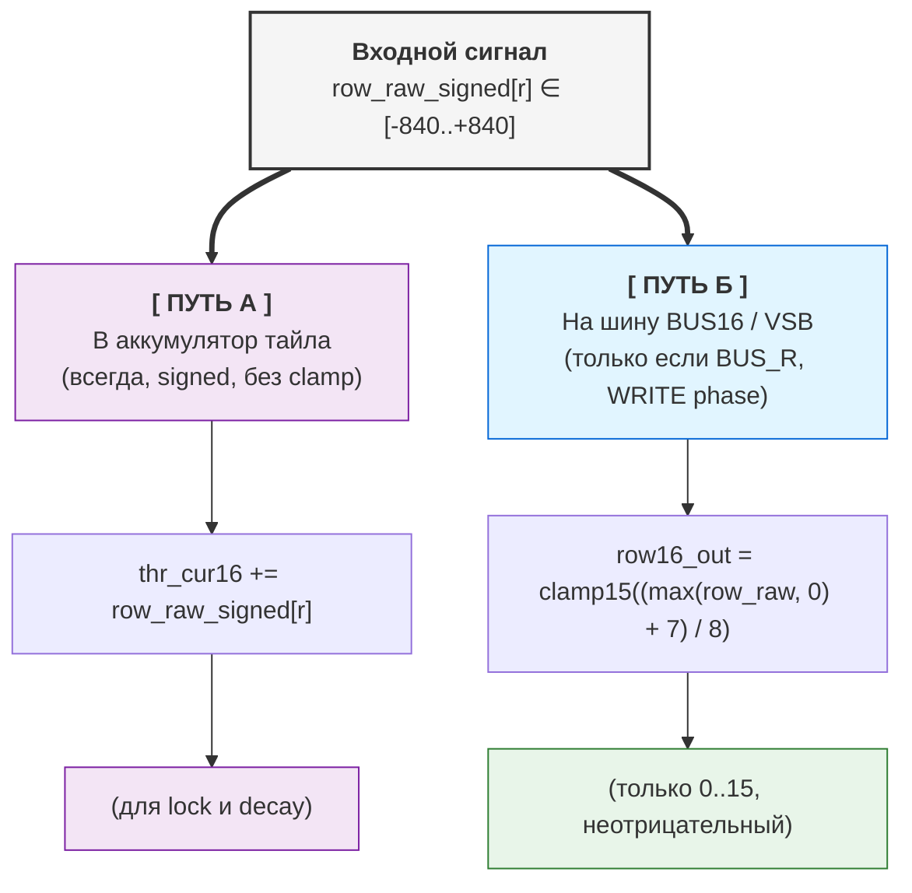
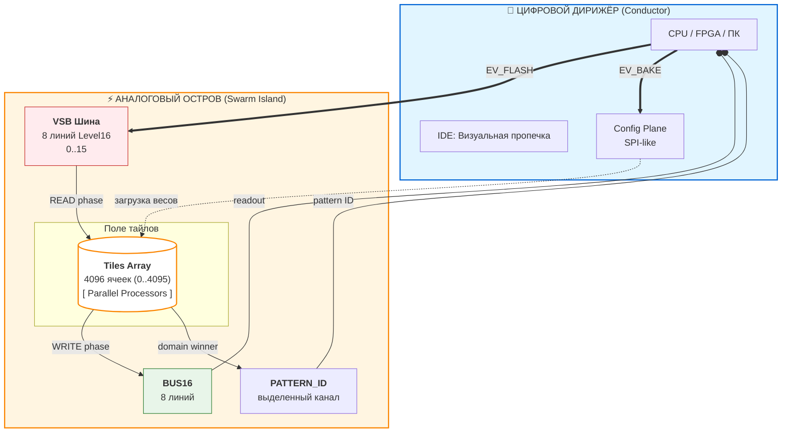
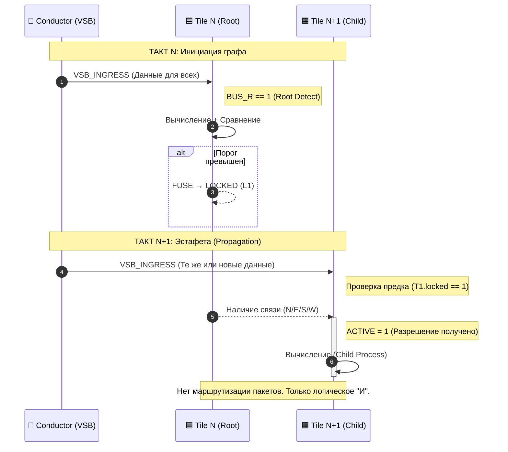
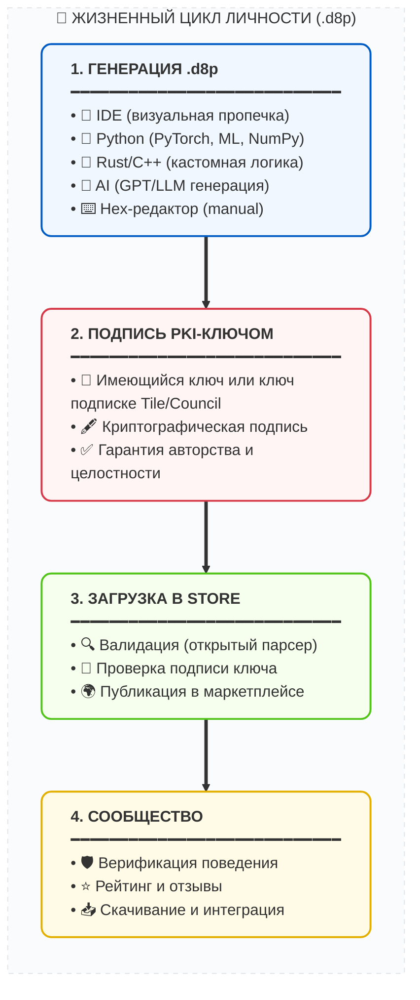
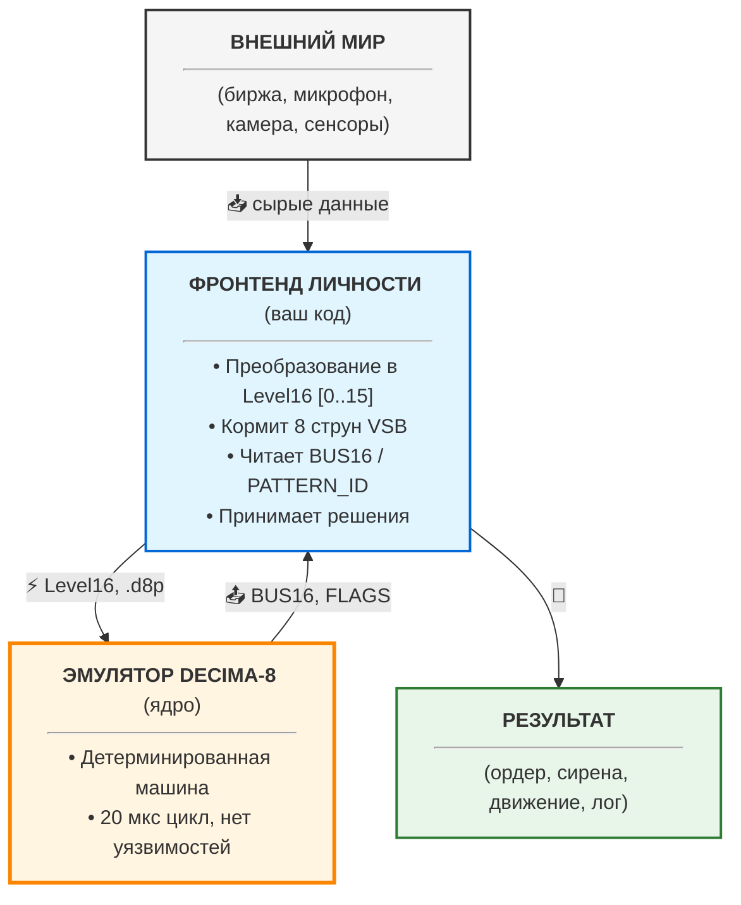
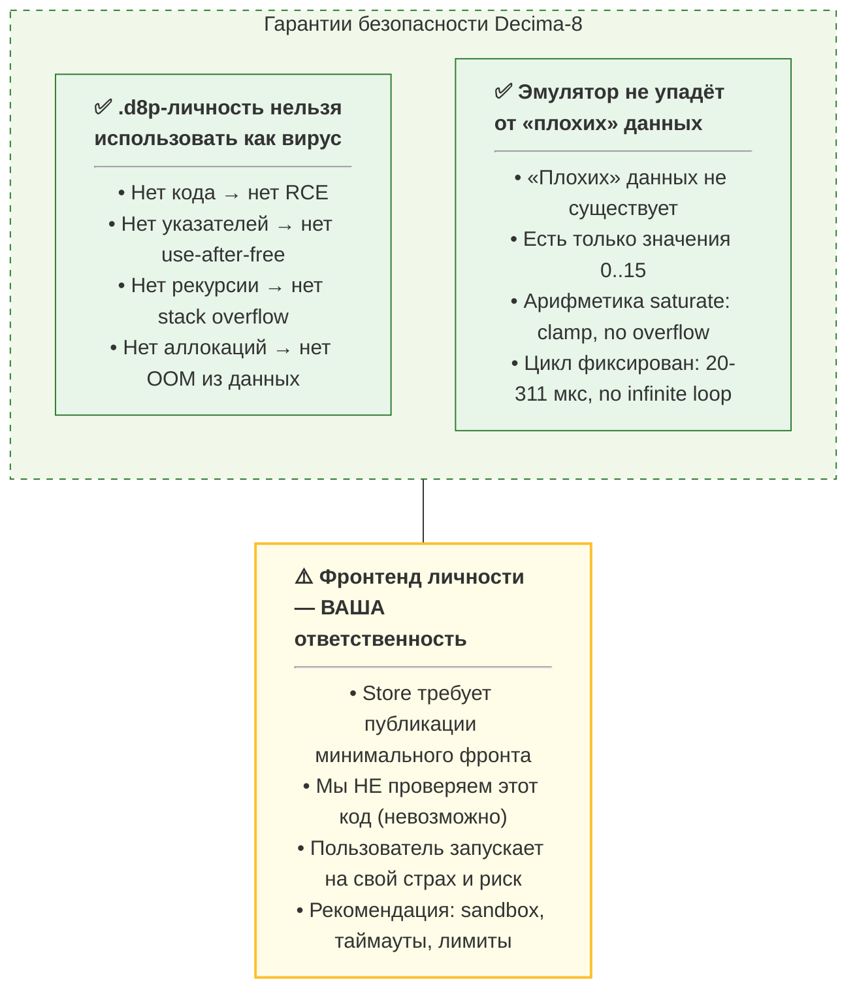
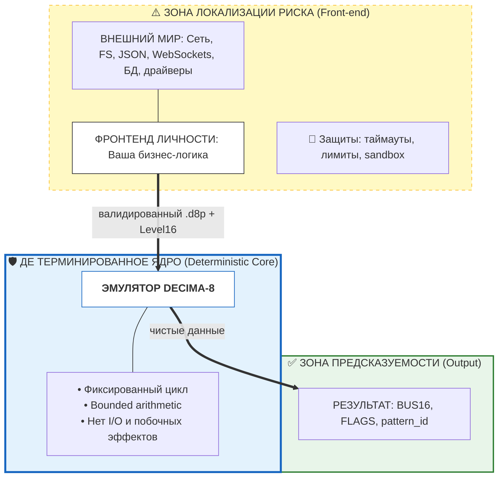
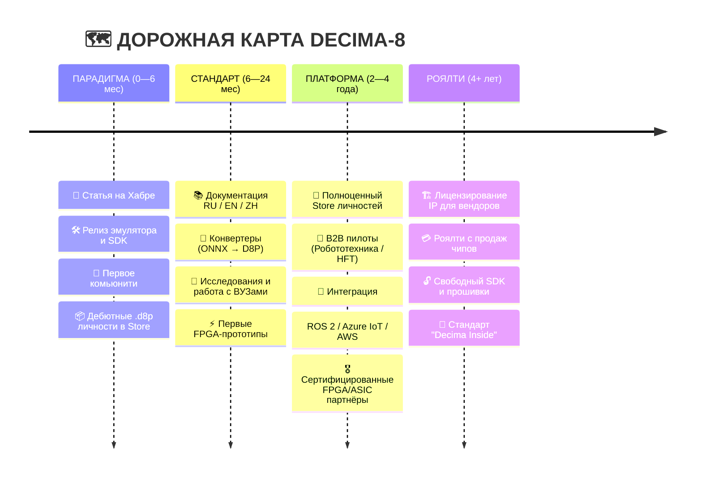

# Decima-8: Нейроморфная архитектура, оперирующая уровнями энергии

> *Открытая спецификация, Level16, эстафетная активация без маршрутизаторов. v0.2*


## 1. ВВЕДЕНИЕ

Современные нейроморфные системы сталкиваются с двумя независимыми проблемами.

**Проблема 1: Кодирование информации**

**Бинарные спайковые сети (SNN) передают градации сигнала через:**

- Частотное кодирование (множество тактов на одно значение)
- Увеличение количества линий передачи

**Проблема 2: Аппаратная реализация**

**Аналоговые мемристорные кроссбары обещают естественную нейроморфность, но содержат следующие проблемы:**

- Шум и дрейф параметров
- Недетерминизм вычислений
- Каждый чип требует индивидуальной калибровки

**Традиционные Network-on-Chip (NoC) добавляют overhead:**

- ~40% площади кристалла уходит на маршрутизаторы
- ~70% энергии тратится на пересылку данных, а не вычисления

**Decima-8 предлагает:**

- **Level16:** кодирование уровня активации (0..15) в одном такте на одной линии. Это компромисс между бинарным представлением и аналоговой непрерывностью.
- **Цифровые кроссбары (эмуляция мемристорных матриц):** детерминизм, воспроизводимость, отсутствие шума
- **Эстафетную активацию вместо пакетной маршрутизации:** тайлы не передают данные друг другу, активация распространяется через граф зависимостей
- **Результат:** фиксированная задержка, предсказуемое поведение, 0% площади на роутеры.

> *⚛︎ Мы не эмулируем нейроны. Мы строим ткань, где узнавание — это физика*

---

## 2. МАТЕМАТИЧЕСКИЕ ОСНОВЫ

Архитектура Decima-8 основана на детерминированной целочисленной арифметике. В этом разделе приведены спецификации вычислений: форматы данных, формулы активации и логика работы тайлов. Все значения имеют фиксированные диапазоны, что гарантирует воспроизводимость результатов на любом оборудовании.

### 2.1 Level16: Семантическая тетрада


*Level16 в аккордеоне IDE*

В традиционных спайковых архитектурах интенсивность сигнала кодируется либо во времени (частота спайков), либо в пространстве (количество параллельных каналов). Оба подхода требуют компромисса: либо задержка, либо усложнение разводки.

Decima-8 использует **Level16** — представление уровня активации как 4-битного значения (0..15) на одной линии за один такт:

```
thr_cur16 ∈ [0..15]  // 4 бита, одна тетрада
```

Это не попытка «эмулировать аналог цифрой», а осознанный выбор формата данных:

- **Достаточно градаций** для выразительности нейроморфных паттернов
- **Укладывается в nibble** — удобно для packed-форматов и битовых операций
- **Фиксированный размер** — детерминированная арифметика, нет динамической нормализации

**Физический смысл Level16:**

- `0` — отсутствие активации
- `15` — насыщение
- `1..14` — градации «силы намерения»

На шине VSB это просто уровень сигнала. Внутри тайла — операнд для арифметики с весами SignedWeight5.

> *💭 **Суть:** Level16 — это не «неточный int». Это семантическая единица архитектуры, как float32 в классических нейросетях. Только детерминированная и аппаратно-дружелюбная.*

### 2.2 SignedWeight5: Взвешенные связи с торможением


*Структурная схема тайла: 8 струн → кроссбар → аккумулятор*

Каждый тайл содержит цифровую эмуляцию мемристорного кроссбара размером 8×8. На вход приходят 8 значений `in16[0..7]` (Level16). Каждое значение умножается на свой вес и суммируется по строке.

**Кодирование веса:** *SignedWeight5 (5 бит)*

```
bits 0-2: magnitude (0..7)   // модуль
bit 3:    sign (0=-, 1=+)    // знак
bit 4:    reserved (0)       // выравнивание
```

Диапазон веса: **[-7..+7]**. Отрицательные веса реализуют латеральное торможение на аппаратном уровне — это не эмуляция, а прямое следствие знаковой арифметики.

Формула для одной строки кроссбара:
```
row_raw_signed[r] = Σ (in16[i] × weight[r][i])  // i=0..7
```

Поскольку `in16[i] ∈ [0..15]`, а `weight ∈ [-7..+7]`, вклад одной ячейки лежит в диапазоне **[-105..+105]**. Сумма по 8 входам даёт **[-840..+840]** на строку.

Эти 8 строк (row_raw_signed[0..7]) далее расходятся по двум путям:

1. В аккумулятор (без преобразований) — signed-значения для накопления и принятия решения о lock
2. На шину VSB (через нормализацию и clamp15) — только неотрицательные значения 0..15

> *💭 **Физический смысл:** Если по lane0 приходит возбуждающий сигнал (+5), а по lane1 — тормозящий (-3), их вклады просто суммируются: +5 + (-3) = +2. Баланс «возбуждение/торможение» зашит в арифметику, не требует отдельной логики.*

**Почему 5 бит на вес?**

- 3 бита на модуль (0..7) — достаточно градаций для выразительности связей
- 1 бит на знак — поддержка ингибирования
- 1 бит резерв — выравнивание до байта, возможность расширения в v1.0

Это компромисс между точностью и плотностью упаковки: 64 веса × 5 бит = 40 байт на тайл, укладывается в кэш-линию.

Результат `row_raw_signed[r]` идёт в аккумулятор (всегда) и на шину (если взведен флаг BUS_R)

### 2.3 Функция активации: два пути одного сигнала

После вычисления `row_raw_signed[r]` сигнал идёт по двум путям. **Путь в аккумулятор — основной**, путь на шину — условный.



**Путь 1: В аккумулятор (основной, всегда активен)**

**Формула:**
```
thr_cur16 += row_raw_signed[r]  // signed i16, без преобразований
```

**Особенности:**

- `row_raw_signed[r] ∈ [-840..+840]` используется **как есть**, с сохранением знака
- Сумма по всем 8 строкам: `delta_raw ∈ [-6720..+6720]`
- Аккумулятор `thr_cur16 ∈ [-32768..+32767]` (signed i16)

**Зачем:**

- Накопление активации для принятия решения о fuse (`thr_cur16 ∈ [thr_lo16..thr_hi16]`)
- Применение decay (затухание к нулю)
- Поддержание внутреннего состояния тайла между тактами

> *💭 **Физический смысл:** Аккумулятор — это «память» тайла. Он хранит баланс возбуждения и торможения, даже если на шине сейчас тишина.*

**Путь 2: На шину VSB (условный, только при BUS_R в WRITE phase)**

**Формула:**

```
row16_out[r] = clamp15((max(row_raw_signed[r], 0) + 7) / 8)
```

**Разбор:**

| Шаг | Что делает | Зачем |
| --- | ---------- | ----- |
| max(..., 0) | Отсекает отрицательные суммы | Если торможение победило → на шине тишина (0) |
| + 7 | Сдвиг для округления | (x + 7) / 8 = округление вверх перед целочисленным делением |
| / 8 | Нормализация диапазона | [-840..+840] → [0..105] → clamp15 → [0..15] |
| clamp15 | Жёсткое ограничение 0..15 | Защита от переполнения, совместимость с Level16 |

**Примеры:**

```
row_raw_signed[r] = +500
→ max(500, 0) = 500
→ (500 + 7) / 8 = 63.375 → 63 (целочисленное)
→ clamp15(63) = 15  ← насыщение

row_raw_signed[r] = +50
→ max(50, 0) = 50
→ (50 + 7) / 8 = 7.125 → 7
→ clamp15(7) = 7  ← нормальное значение

row_raw_signed[r] = -100
→ max(-100, 0) = 0
→ (0 + 7) / 8 = 0.875 → 0
→ clamp15(0) = 0  ← полное подавление (торможение победило)
```

> *💭 **Физический смысл:** На шину VSB идут только **уровни энергии** (0..15). Отрицательные значения не имеют смысла для передачи — «тишина» кодируется как 0.

**Почему /8, а не адаптивная нормализация?**

**Потому что входов всегда 8.** Не 1, не 64, не «сколько активно».

Это гарантирует:

- Детерминизм: одна и та же конфигурация → один и тот же результат
- Аппаратную простоту: `>>3` вместо деления в runtime
- Предсказуемость: нет «внезапного насыщения» при изменении плотности

Если нужен другой динамический диапазон — настройте параметры тайла:

- `weights` (mag3+sign1) — сила связей
- `thr_lo/hi` — диапазон значений аккумулятора для активации
- `decay16` — скорость затухания
 
> *💭 Философия: Не прячем сложность в «умную архитектуру», а даём явные рычаги управления.*

### 2.4 Аккумулятор + Signed Decay: Память с инерцией

Состояние тайла хранится в аккумуляторе `thr_cur16`

```
thr_cur16 ∈ [-32768..+32767]  // signed i16
```

**Почему signed:** Аккумулятор суммирует взвешенные вклады `row_raw_signed[r] ∈ [-840..+840]`. Отрицательные значения (торможение) должны уменьшать потенциал, не отсекаясь на нуле.

**Механизм decay:**

На каждом такте, если decay16 > 0, аккумулятор стремится к нулю:

```
if (decay16 > 0) {
  if (thr_tmp > 0) thr_tmp = max(thr_tmp - decay16, 0);
  else if (thr_tmp < 0) thr_tmp = min(thr_tmp + decay16, 0);
  // Zero-crossing protection: знак не меняется
}
```

**Ключевые свойства:**

1. **Нет перескока через ноль.** Если `thr_cur16 = +20`, а `decay16 = 30`, результат будет `0`, а не `-10`. Знак потенциала инвариантен относительно decay.
2. **Применяется всегда.** Decay работает даже для `locked` тайлов. Это позволяет активному пути «остыть» и разблокироваться при отсутствии подпитки.
3. **Конфигурируемый параметр.** `decay16` задаётся в `TileParams` для каждого тайла индивидуально.

**Зачем это нужно:**

- **Фильтрация шума:** Слабые сигналы (`|delta| < decay16`) не накапливаются, а аннигилируются.
- **Ограничение окна интеграции:** Сигналы суммируются только если приходят в пределах временного окна, заданного скоростью затухания.
- **Стабильность:** Предотвращает насыщение аккумулятора при длительной активации.

> *Примечание: Если задача требует интеграции слабых сигналов — установите decay16 = 0 или малое значение. Архитектура не навязывает «забывание», вы управляете им через конфигурацию.*

### 2.5 Fuse-by-Range: Пороговая логика

Тайл принимает решение о блокировке (locked) на основе текущего значения аккумулятора `thr_cur16` и конфигурируемого диапазона `[thr_lo16..thr_hi16]`

```
locked = 1, если thr_cur16 ∈ [thr_lo16, thr_hi16]
```

**Параметры:**

- `thr_lo16, thr_hi16` ∈ `[-32768..+32767]` (signed i16)
- Валидация: `если thr_lo16 > thr_hi16` → ошибка `FuseRangeError` при bake
- Если `thr_lo16 == thr_hi16` → фьюз отключён (тайл никогда не заблокируется)

**Поведение при `locked=1`:**

1. **Поддержание активации потомков:** пока тайл locked, его потомки в графе остаются `ACTIVE` и могут вычисляться в следующем такте.
2. **Decay продолжает работать:** аккумулятор затухает к нулю даже в locked-состоянии. Если `thr_cur16` выходит за пределы [`thr_lo16..thr_hi16`], тайл разблокируется.
3. **Эстафета распространяется:** locked-тайл формирует устойчивое звено в графе активации.

**Ключевой принцип:**

`locked` — это не передача данных, а разрешение на вычисление для потомков. Данные приходят от Conductor через `VSB_INGRESS`, а не от других тайлов. Тайлы только накапливают состояние в аккумуляторах и управляют графом активации через флаги `locked`.

> *Примечание: Диапазон [`thr_lo16..thr_hi16`] может находиться в любой части signed-спектра: только положительные значения, только отрицательные, или пересекать ноль. Это позволяет настраивать реакцию тайла на возбуждение, торможение или отклонение от покоя.*

---

## 🧩 Итого по математике

| Компонент | Диапазон | Формула |
| --------- | -------- | ------- |
| Level16 | [0..15] | thr_cur16 — уровень энергии |
| SignedWeight5 | [-7..+7] | mag3 + sign1 |
| row_raw_signed | [-840..+840] | Σ(in16 × weight) на строку |
| delta_raw | [-6720..+6720] | Σ row_raw_signed (8 строк) |
| Аккумулятор | [-32768..+32767] | thr_cur16 += delta_raw - decay |
| Fuse range | [-32768..+32767] | thr_lo16 .. thr_hi16 |

---

## 3. АРХИТЕКТУРА

Раздел 2 зафиксировал математические правила вычислений. Раздел 3 описывает их аппаратную реализацию: разделение Conductor/Island, детерминированный цикл READ→WRITE, эстафетную активацию без маршрутизаторов и механизмы энергоэффективности.

Все компоненты спроектированы так, чтобы гарантировать:

- Фиксированную латентность (не зависит от нагрузки)
- Масштабируемость (линейный рост времени с ростом ткани)
- Детерминизм (одинаковый результат при одинаковых входах)

---

### 3.1 Conductor ↔ Island



*diagram Conductor ↔ Island*

Decima-8 разделена на две плоскости: **Conductor** (управление) и **Island** (вычисления).

**Conductor** — внешний контроллер (CPU/FPGA/ПК):

- Вызывает события `EV_FLASH`, `EV_BAKE`, `EV_RESET_DOMAIN`
- Выставляет `VSB_INGRESS[0..7]` в начале READ-фазы
- Читает `BUS16[0..7]` и `PATTERN_ID` после WRITE-фазы
- Загружает конфигурацию (веса, пороги) через SPI-like интерфейс (CFG)

**Island** — вычислительная ткань:

- Массив тайлов (масштабируемый: 8×32 .. 32×128)
- Параллельная обработка всех тайлов в каждом такте
- **VSB** (Value Signal Bus): 8 входных линий Level16 от Conductor
- **BUS16:** 8 выходных линий для суммирования вкладов тайлов
- **PATTERN_ID:** выделенный канал для ID выигравшего паттерна

**Интерфейсы конфигурации:**

- SPI/QSPI: загрузка BakeBlob — до 50 MB/s
- Parallel CFG bus (FPGA): до 200 MB/s
- PCIe/Ethernet (хост-контроллер): до 1 GB/s
- UART: только отладка, не для runtime

> *💭 Принцип: Conductor не участвует в вычислениях. Он только дирижирует циклом и читает результаты. Вся динамика происходит внутри Island.*

---

### 3.2 Двухфазный цикл

```mermaid
gantt
    title Один такт EV_FLASH (Цикл: 20 мкс)
    dateFormat  X
    axisFormat %s мкс

    section 🎼 CONDUCTOR
    Выставление VSB_INGRESS     :active, c1, 0, 3
    Пауза (Processing)          :desat, 3, 10
    Turnaround (Hi-Z)           :crit, 10, 12
    Чтение BUS16                :c2, 18, 20

    section ⚡ ISLAND (Phase 1)
    PHASE_READ (Вход)           :active, 0, 8
    Активация графа             : 2, 5
    Кроссбар + Accumulator      : 5, 8
    FUSE → locked               : 7, 8

    section 🔄 SWITCH
    Смена направления шины      : 10, 12

    section ⚡ ISLAND (Phase 2)
    PHASE_WRITE (Выход)          :active, 12, 18
    BUS_W → BUS16                : 12, 16
    Честное суммирование         : 14, 16

    section 📥 READOUT
    R0_RAW_BUS sample           : 18, 20
    AutoReset (опционально)      : 20, 22
```



Вся ткань работает в жёстком ритме. Один такт состоит из четырёх фаз:

```
┌─────────────┬──────────────┬─────────────┬─────────────┐
│ PHASE_READ  │ TURNAROUND   │ PHASE_WRITE │ READOUT     │
└─────────────┴──────────────┴─────────────┴─────────────┘

```

**PHASE_READ:**

1. Conductor выставляет `VSB_INGRESS16[0..7]` (Level16)
2. Все ACTIVE-тайлы семплируют вход
3. Вычисление `row_raw_signed[r]` для каждой строки
4. Обновление `thr_cur16 += delta_raw`
5. Применение decay (затухание к нулю)
6. Проверка fuse: `locked_after = (thr_cur16 ∈ [thr_lo16..thr_hi16])`
7. Формирование `drive_vec[0..7]`

**TURNAROUND:**

- Conductor отпускает VSB (Hi-Z / no-drive)
- Island включает драйв BUS16
- **Обязательный зазор** — никаких гонок направлений

**PHASE_WRITE:**

- Тайлы с `BUS_W==1` и `(locked self || locked_ancestor)` выставляют `drive_vec` на BUS16
- Честное суммирование: `BUS16[i] = clamp15(Σ contrib[i])`
- Фиксация: `locked := locked_after`

**READOUT:**

- Conductor читает `BUS16[0..7]` как результат такта
- Опционально: AutoReset-by-Fire (сброс доменов по маске winner'а)

**Детерминизм цикла:**

Время выполнения каждого такта фиксировано и не зависит от:

- Количества активных тайлов
- Сложности паттерна
- Состояния аккумуляторов

На эмуляторе (i5-3550) полный цикл занимает **~20-311 мкс** в зависимости от размера ткани (см. раздел 4). На FPGA/ASIC время будет определяться тактовой частотой и глубиной конвейера.

> *💭 Ключевой принцип: независимо от того, активировался тайл или нет, все вычисления занимают одинаковое число тактов. Это гарантирует нулевой джиттер на уровне архитектуры.*

---

### 3.3 Эстафетная активация (Router-less NoC)



В традиционных нейроморфных архитектурах тайлы обмениваются данными через сеть пакетной коммутации (Network-on-Chip). Это требует:

- Маршрутизаторов между узлами
- Буферов для очередей пакетов
- Арбитража при коллизиях трафика

**Decima-8 работает иначе:**

Тайлы **не передают данные** друг другу. Вместо этого они формируют **граф активации** через флаги направлений (N/E/S/W/NE/SE/SW/NW).

**Механизм:**

```
ACTIVE[t] = 1, если:
t имеет флаг BUS_R == 1 (источник/корень), ИЛИ
∃ предок p: ACTIVE[p]==1 && locked_before[p]==1 && есть ребро p→t
```

Вычисляется как **least fixed point** — детерминированно, за один проход.

**Эстафета в действии:**

- **Такт N:** корневой тайл активируется и становится `locked`.
- **Такт N+1:** потомок видит locked_before[p]==1 и становится ACTIVE

> *💭 Ключевой принцип: активация распространяется за 2 такта (предок → потомок). Данные не передаются — каждый тайл читает только `VSB_INGRESS` от Conductor. Граф активации — это **разрешение на вычисление**, не канал передачи данных.*

---

### 3.4 Схлопывание ветки (Branch Collapse)

**Логика:**

Если предок не заблокирован (`locked=0`), потомки становятся неактивными:

```
if (ACTIVE[t] == 0) {
thr_cur16 := 0
locked := 0
drive_vec := {0..0}
// Тайл не вычисляется, не драйвит шину
}
```

**Эффект:**

- Энергия не тратится на обработку заведомо неактивных путей
- Мёртвые ветви ткани «отключаются» автоматически
- Ресурсы направляются только на живые пути

**Пример:**

Такт N:

- Корневой тайл не фьюзится (thr_cur16 не попал в [lo..hi])
- locked_after = 0

Такт N+1:

- Потомки: ACTIVE = false (нет locked-предка)
- Принудительный сброс: thr_cur16=0, locked=0

Ветка схлопнута

> 💭 **Аналогия:** Дерево сбрасывает мёртвые ветви. Если корень не даёт питания (locked=0), вся ветка засыхает (ACTIVE=0 → thr_cur16=0).

---

### 3.5 Двойной пролив (Double Strait)

**Назначение:** Повышение селективности при распознавании паттернов с малым расстоянием Хэмминга (например, ASCII-символы, закодированные в 32 бита на 8 струн VSB).

**Проблема:** При прямом детектировании похожие символы (например, «3» и «8») могут активировать одни и те же тайлы из-за перекрытия битовых масок. Это приводит к ложным срабатываниям.

**Механизм:**

Если установлен флаг `BAKE_FLAG_DOUBLE_STRAIT` (bit 0 в header .d8p), ядро выполняет два внутренних пролива на один вызов `EV_FLASH`:

**Первый пролив (Поиск):**

- Все тайлы вычисляют `row_raw_signed`, обновляют `thr_cur16`.
- Тайлы-детекторы (первая линия) защёлкиваются (`locked=1`), если попадают в диапазон [`thr_lo..thr_hi`].
- Решение не выдаётся. Выходная шина BUS16 не обновляется.

**Второй пролив (Верификация):**

- Тот же входной аккорд обрабатывается повторно.
- Защёлкнутые детекторы открывают путь тайлам-антагонистам (через граф активации).
- Антагонисты верифицируют паттерн: только один антагонист (соответствующий входному символу) сохраняет аккумулятор около нуля. Остальные уходят в глубокий минус (ингибирование).
- **Выдача решения:** только после завершения второго пролива.

**Для Дирижёра:**

- Один вызов EV_FLASH.
- Время выполнения удваивается (например, ~40 мкс вместо ~20 мкс на эмуляторе).
- API не меняется: вход подаётся один раз, результат читается после завершения.

**Когда использовать:**

- Да: Распознавание символов/цифр с малым расстоянием Хэмминга.
- Да: Классификация с перекрытием классов, где важна точность.
- Нет: Задачи с жёсткими требованиями к латентности (HFT, управление двигателем).
- Нет: Паттерны с большим расстоянием Хэмминга (достаточно одного пролива).

**В IDE:** галочка «Double Strait» в настройках bake автоматически выставляет флаг в .d8p.

> *Примечание: Большинство личностей (ASR, моторика, простые детекторы) работают без двойного пролива. Это опциональный режим для задач, где точность классификации приоритетнее латентности.*

---

## 🧩 Итого по архитектуре

| Компонент | Принцип | Выгода |
|-----------|---------|--------|
| **Conductor ↔ Island** | Разделение управления и вычислений | Чёткая дисциплина, масштабируемость |
| **Двухфазный цикл** | READ → TURNAROUND → WRITE | Детерминизм 20 мкс, no race conditions |
| **Эстафетная активация** | Граф, а не передача данных | 0% площади на роутеры, нулевой джиттер |
| **Схлопывание ветки** | ACTIVE=false → сброс в 0 | Энергоэффективность, автоматическая оптимизация |
| **Двойной пролив** | Два внутренних такта на один EV_FLASH | Селективность важнее латентности |

---

## 4. БЕНЧМАРКИ

### Тестовая платформа

**IDE Decima-8** — нативное приложение на C++23 (libwui, статическая сборка). Тесты на Intel Core i5-3550 (2012, 4 ядра, 3.3 GHz), одно ядро.

**Результаты замеров:**

| Тайлов | Время цикла | Частота |
| ------ | ----------- | ------- |
| 256 | ~22 мкс | 45 kHz |
| 512 | ~43 мкс | 23 kHz |
| 1024 | ~81 мкс | 12 kHz |
| 2048 | ~160 мкс | 6 kHz |
| 4096 | ~311 мкс | 3 kHz |


*График производительности на i5-3550 (одно ядро)*

**Масштабирование:**

При удвоении количества тайлов время выполнения **примерно удваивается** (коэффициент 1.88–1.98). После 1024 тайлов рост ускоряется — сказываются кэш-промахи и давление на память. Это **физическое ограничение CPU**, а не алгоритмическое.

> ***Важно:** Для каждой конфигурации время константно и не зависит от активности сети. 100% загрузка тайлов не увеличивает задержку.*

**Память:**

Эмулятор использует ~57 байт на тайл. Для 4096 тайлов требуется ~228 КБ — помещается в L2/L3 кэш современного CPU.

**Детерминизм**

Разброс времени цикла минимален (± jitter ОС). Это следствие архитектуры:

- Нет динамических аллокаций в runtime
- Нет ветвлений, зависящих от данных
- Фиксированный цикл READ → WRITE

На FPGA/ASIC время будет определяться тактовой частотой и глубиной конвейера, а не загрузкой сети.

**Применение:**

| Задача | Требования | Decima-8 (4096 тайлов) |
| ------ | ---------- | ---------------------- |
| Робототехника | 1–10 ms цикл | 0.3 ms (запас 3–30×) |
| HFT (аналитика) | < 1 ms | 0.3 ms |
| Обработка аудио (block processing) | 1-10 ms блок | 0.3 ms (запас 3-30×) |

> *Примечание: Эмулятор Decima-8 (4096 тайлов, ~311 мкс) подходит для предиктивной аналитики в торговом цикле и аудио-DSP при блочной обработке (64+ сэмплов). Задачи с субмиллисекундными требованиями — прямое исполнение ордеров (tick-to-trade < 1 мкс) или sample-by-sample обработка (22.7 мкс @44.1 kHz) — требуют FPGA/ASIC или меньшей конфигурации ткани.*

---

## 🧩 Итого по бенчмаркам

| Метрика | Значение |
|---------|----------|
| **Минимальная латентность** | 22 мкс (256 тайлов) |
| **Максимальный размер** | 4096 тайлов за 311 мкс |
| **Масштабирование** | Линейное (O(n)) |
| **Джиттер** | Отсутствует (детерминизм) |
| **Память** | Компактная (L3-кэш) |

---

## 5. ПРОГРАММНАЯ ЭКОСИСТЕМА

Decima-8 — это не только железо. Это экосистема инструментов, форматов и стандартов. Расскажем честно: что открыто, что закрыто, и почему так.

---

### 5.1 Формат D8P (TLV-based)

**Статус:** *OPEN SPEC*

Файл `.d8p` (Decima 8 Personality) — это контейнер для «личности» сварма. Внутри нет кода. Только данные.

**Структура (TLV — Type-Length-Value):**


**Почему TLV?**

- **Расширяемость**: новые типы блоков не ломают старые парсеры
- **Валидация**: легко проверить целостность (CRC32)
- **Потоковая обработка**: не нужно грузить весь файл в память

**libd8p:** Открытая библиотека для работы с форматом.

- **Языки**: C++ / (C / Rust / Python coming)
- **Лицензия**: MIT
- **Функции**: парсинг, валидация, генерация, подпись PKI

> 💭 **Любой может написать свой генератор.** Хотите создавать .d8p из PyTorch? Пожалуйста! Из JAX? Отлично! Ручным hex-редактором? Для хардкорных — уважение.

---

### 5.2 IDE (1.3 МБ, Native)

**Статус:** *CLOSED BINARY, FREE TO USE*

**Характеристики:**

- **Размер**: 1.3 МБ (меньше, чем картинка для профиля в Telegram)
- **UI**: libwui (наш легковесный движок, Хабр 2023)
- **Платформы**: Windows (MSVC 2026) / Linux (Clang latest)
- **Зависимости**: **Ноль**. Статическая сборка.
- **Интернет**: Не требуется. Работает offline.


*Общий вид IDE Decima-8*

**Компоненты IDE:**

| Компонент | Описание |
|-----------|----------|
| **16-аккордовый аккордеон** | Визуализатор VSB (8 lanes × 16 аккордов истории) |
| **Магнитофон и сеть** | Загрузка/сохранение VBS лент, приём/отправка VSB по UDP |
| **Рабочие органы управления** | Flash: прогон такта машины, Reset: сброс доменов, Autobake: установка весов тайла под аккорд |
| **Панель сварма** | Визуальное представление ткани личности |
| **Параметры тайла** | Веса, thr_lo/hi, decay |
| **Компас** | Направления активации детей |
| **Панель выдачи решений** | Показывает PATTERN_ID, BUS16 и т.п. |

---

### IDE — не единственный путь

⚠️ **Важно:** IDE — это **референсный инструмент** для «скульпторов». Не единственный способ создания личностей.

> *«Если ваш скрипт на Python с PyTorch создаёт личности лучше, чем наша IDE — мы хотим видеть это в Store»*

**Как это работает:**



**Проверяется не инструмент, а:**

1. **Соответствие спецификации** (открытый парсер libd8p)
2. **Валидную PKI-подпись** (авторство, целостность)
3. **Безопасность** (нет вредоносного кода, только данные)

> 💭 **Это делает экосистему открытой для инноваций, но защищённой от хаоса.**

---

### 5.3 Эмулятор ядра

**Статус:** *OPEN SOURCE* (MIT)

**Зачем:**

- **«Источник правды»** — верификация математики без IDE
- **Тестирование** — запуск алгоритмов перед «пропечкой»
- **Интеграция** — встраивание в свои проекты (CI/CD, автотесты)
- **Обучение** — изучение архитектуры «изнутри»

**Где:** GitHub (ссылка в конце статьи)

**Функционал:**

- Бит-в-бит совместимость с железом (эмулятор → FPGA → ASIC)
- API: `EV_FLASH`, `EV_BAKE`, `EV_RESET_DOMAIN`
- Чтение FLAGS, readout, статистики
- Интеграция с Python/C++/Rust через C-API

**Пример использования (Python):**

```python
import d8p

# Загрузка личности
swarm = d8p.load("personality.d8p")

# Запуск цикла
for i in range(1000):
    swarm.ev_flash(vsb_ingress=[7,12,3,10,4,14,0,9])
    readout = swarm.read_bus()
    print(f"Tick {i}: BUS16 = {readout}")
```
---

## 🧩 Итого по экосистеме

| Компонент | Статус | Зачем |
| --------- | ------ | ----- |
| Спеки + Эмулятор | ✅ OPEN | Наука, верификация, цитирование |
| Формат .d8p | ✅ OPEN | Интеграции, конвертеры, интероперабельность |
| libd8p (парсер) | ✅ OPEN | Валидация, генерация, любые инструменты |
| IDE | 🔒 CLOSED (Free) | Референсный UX для «скульпторов» |
| Store | 🔒 CLOSED (Curated) | Единый стандарт, PKI-подписи, качество |

Готовы к безопасности? Расскажем, почему .d8p не может быть вирусом.

---

## 6. БЕЗОПАСНОСТЬ: ЧЕСТНЫЙ РАЗГОВОР

Мы не обещаем, что система «неуязвима».  
Мы обещаем, что она **архитектурно честная**.

---

### Где может сломаться?

| Компонент | Может упасть? | Почему? |
|-----------|--------------|---------|
| **Файл `.d8p`** | ❌ Нет | Это данные (TLV). В нём **нет кода**. Нет `eval`, нет указателей, нет рекурсии. |
| **Эмулятор (Core)** | ❌ Нет | Детерминированная машина. Фиксированные такты, Level16, saturate-арифметика. Физически не может зависнуть или переполниться. |
| **Дирижёр (ваш код)** | ⚠️ **Да** | Парсит JSON, работает с сетью, управляет ордерами, пишет в БД. Это **императивный код** — со всеми его классическими рисками. |
| **Фронтенд личности** | ⚠️ **Да** | Код, который кормит 8 струн и читает BUS16/PATTERN_ID. Это часть Дирижёра. |

---

### Важное уточнение: .d8p бесполезна без Дирижёра

**Файл `.d8p` — это не программа.** Это «личность» сварма. Но сама по себе она **бесполезна**.

Чтобы личность заработала, нужен **Дирижёр (Conductor)** — код, который:

1. **Кормит 8 струн VSB** — преобразует внешние данные в Level16 (аудио → активация, цены → активация, сенсоры → активация)
2. **Запускает EV_FLASH** — дирижирует циклом READ → WRITE
3. **Забирает результаты** — читает BUS16, PATTERN_ID, FLAGS
4. **Принимает решения** — что делать с результатом (отправить ордер, включить сирену, двинуть мотор)



> 💭 **.d8p — это «мозг». Фронтенд — это «тело». Мозг без тела бесполезен.**

---

### Что это значит на практике?

**Пример 1: HFT-личность**

Вы публикуете в Store личность для торговли на бирже.

- **`.d8p`**: Веса, пороги, routing — **безопасно**, нет кода
- **Фронтенд**: WebSocket к бирже, парсинг JSON, логарифмирование цен в Level16 — **здесь уязвимости**
- **Риск**: Не в .d8p, а в коде парсинга WebSocket

**Пример 2: ASR-личность (распознавание речи)**

- **`.d8p`**: Паттерны для фонем — **безопасно**
- **Фронтенд**: Захват аудио с микрофона, MFCC, квантование в Level16 — **здесь уязвимости**
- **Риск**: Драйвер микрофона, буферы, потоки

**Пример 3: Защита периметра**

- **`.d8p`**: Детектор аномалий — **безопасно**
- **Фронтенд**: Чтение с камер, Ethernet, отправка алертов — **здесь уязвимости**
- **Риск**: Сетевой стек, буферы изображений

---

### Наша гарантия



---

### Store: публикация личности = публикация фронта

**Требование Store:**

При публикации личности в Store автор **должен предоставить**:

| Компонент | Статус | Проверка |
|-----------|--------|----------|
| **`.d8p` файл** | ✅ Обязательно | Валидация спецификации + PKI-подпись |
| **Фронтенд (минимальный)** | ✅ Обязательно | **Не проверяется** (код пользователя) |
| **Документация** | ✅ Обязательно | Описание 8 струн (что кормить), интерпретация выходов |
| **Пример запуска** | ✅ Обязательно | Скрипт / инструкция для быстрого старта |

**Почему мы не проверяем фронтенд:**

1. **Технически невозможно**: Код может быть на чём угодно (Python, Rust, Go, C++)
2. **Юридически сложно**: Мы не хотим нести ответственность за чужой код
3. **Философски неверно**: Decima-8 — это открытый стандарт, а не закрытая платформа

**Что делаем вместо проверки:**

- **Требование публикации**: Нет фронта = нет публикации в Store
- **Предупреждение пользователей**: «Фронтенд не верифицирован, запускайте в sandbox»
- **Рейтинговая система**: Сообщество оценивает не только личность, но и качество фронта
- **Отзывы и репутация**: Авторы с плохим кодом быстро получают негативные отзывы

### Валидация топологии

Помимо проверки CRC32 и PKI-подписи, эмулятор выполняет **статический анализ графа**:

- Проверка на **бесконечные петли с усилением** (positive feedback loop)
- Ограничение на **максимальную степень связности** тайла
- Лимит на **суммарный коэффициент усиления** в компоненте связности

Если граф не проходит валидацию — загрузка отклоняется с ошибкой `TopologyValidationError`.

> ⚠️ Это не «антивирус», а проверка физической состоятельности личности.

---

### Философия: локализация риска

Мы не скрываем риски. Мы **локализуем их**.

[Периметр: Ваш Дирижёр + Фронтенд личности]

- Сеть, FS, JSON, WebSockets, БД, драйверы
- ⚠️ Здесь могут быть уязвимости — это нормально
- 🔧 Классические защиты: таймауты, лимиты, санитизация, sandbox



> 💭 **Ядро — чисто. Периметр — ваш. Это честно.**

---

### Что мы НЕ гарантируем

Чтобы быть до конца честными:

| Мы НЕ гарантируем | Почему |
|------------------|--------|
| Что фронтенд личности не содержит багов | Это код автора, вы за него отвечаете |
| Что ваш Дирижёр не упадёт | Это ваш код, вы за него отвечаете |
| Что сеть / ОС / железо не упадут | Это инфраструктура, вне нашей архитектуры |
| Что .d8p описывает «хорошую» личность | Мы проверяем физику, а не семантику задачи |
| Что PKI-ключ не скомпрометирован | Храните ключи безопасно — это ваша ответственность |

---

### Рекомендации для пользователей Store

**При загрузке личности из Store:**

1. **Запускайте в sandbox** (Docker, VM, seccomp, AppArmor)
2. **Ограничьте доступ к сети** (если личность не требует)
3. **Установите лимиты памяти и CPU** (cgroups, ulimit)
4. **Проверьте репутацию автора** (рейтинг, отзывы, история)
5. **Изучите код фронта** (если можете) перед запуском в production

**При публикации личности в Store:**

1. **Предоставьте минимальный рабочий фронтенд**
2. **Документируйте 8 струн** (что подавать на вход)
3. **Документируйте выходы** (как интерпретировать BUS16/PATTERN_ID)
4. **Предупредите о рисках** (сеть, FS, внешние API)
5. **Отвечайте на отзывы** (репутация = доверие)

---

## 🧩 Итого по безопасности

| Компонент | Риск | Защита |
|-----------|------|--------|
| **.d8p** | ❌ Нет | Архитектура (данные, не код) |
| **Эмулятор** | ❌ Нет | Архитектура (детерминизм, bounded arithmetic) |
| **Фронтенд личности** | ⚠️ Да | Sandbox, лимиты, репутация автора |
| **Ваш Дирижёр** | ⚠️ Да | Классические практики безопасности |

**Decima-8 не делает вашу систему «неуязвимой».**  
**Decima-8 делает уязвимости предсказуемыми и локализованными.**

- Хотите атаковать ядро? **Невозможно** — там нет кода, только данные и детерминированная арифметика.
- Хотите атаковать периметр? **Возможно** — но это классические векторы (сеть, парсинг, FS), против которых есть классические защиты (таймауты, лимиты, санитизация, sandbox).

> Мы не обещаем «магическую защиту», мы гарантируем **архитектурную честность**: вы точно знаете, где риск, а где — нет.

Готовы к модели распространения? Расскажем, как монетизировать, не продавая душу.

---

## 7. МОДЕЛЬ РАСПРОСТРАНЕНИЯ

Decima-8 — это инфраструктурный проект. Наша цель — не продать подписку на софт, а стать стандартом, как TCP/IP или Git.

### 7.1 Открытое ядро / Закрытый кокпит

| Компонент | Статус | Зачем |
|-----------|--------|-------|
| **Спеки + Эмулятор** | ✅ OPEN | Наука, верификация, цитирование |
| **Формат .d8p** | ✅ OPEN | Интеграции, конвертеры, интероперабельность |
| **libd8p (парсер)** | ✅ OPEN | Валидация, генерация, любые инструменты |
| **IDE** | 🔒 CLOSED (Free) | Референсный UX для «скульпторов» |
| **Store** | 🔒 CLOSED (Curated) | Единый стандарт, PKI-подписи, качество |

**Философия:**

- **Открытое ядро**: любой может написать свой генератор .d8p, форкнуть эмулятор, интегрировать Decima-8 в свои фреймворки.
- **Закрытый кокпит**: IDE — референсный инструмент (бесплатен), Store — единый маркетплейс с PKI-подписями.

---

### 7.2 Публикация в Store

Для публикации личности в Store требуется **PKI-подпись**. Это гарантирует:

- **Авторство**: вы подписываете код своим ключом
- **Целостность**: файл не изменён при передаче
- **Доверие**: сообщество знает, кто создал личность

**Как получить ключ:** через участие в сварме (тиры Tile/Cluster/Council).  
**Важно:** уже опубликованные личности **не удаляются** при истечении подписки.

> *💭 Это не paywall, а цепочка доверия.*

### Альтернативная подпись: свой PKI-ключ

Если у вас уже есть **PKI-ключ**, выданный доверенным центром (например, корпоративный сертификат), вы можете использовать его для подписи .d8p.

**Как это работает:**

**1. Получите ключ** у вашего доверенного центра (Corporate CA, государственная УЦ, etc.)

**2. Подпишите .d8p** через CLI: 
```
openssl dgst -sha256 -sign decima_key.pem \
-out personality.d8p.sig \
personality.d8p
```
**3. Загрузите в Store**: система проверит цепочку доверия до Root CA

**Важно:**

- Store принимает **любые ключи** с валидной цепочкой доверия
- Ваш ключ должен быть **доверенным для получателей** (они импортировали ваш Root CA)
- Для публичного Store рекомендуется использовать **наш PKI** (Tile/Cluster/Council) — он доверен всем пользователям

> *💭 **Это не «или-или». Это гибкость:** хотите корпоративный контроль — используйте свой PKI. Хотите публичный Store — используйте наш.*

### 7.3 Дорожная карта



---

> 💭 **«Сначала стань стандартом. Деньги — побочный эффект масштаба.»**

---

## 🧩 Итого по модели

| Принцип | Реализация |
|---------|------------|
| **Открытость** | Спеки, эмулятор, формат — всё открыто |
| **Доверие** | Store с PKI-подписями, курируемый контент |
| **Монетизация** | PKI-доступ (Boosty), роялти (ASIC), не подписка на софт |
| **Сообщество** | Observer/Seed/Gardener — комьюнити; Tile/Cluster/Council — авторы |
| **Долгосрочность** | Стандарт на 10+ лет, не exit через 3 года |

**Decima-8 — это не продукт. Это инфраструктура.**

Готовы к эволюции архитектуры? Расскажем, куда расти дальше.

---

## 8. ЭВОЛЮЦИЯ АРХИТЕКТУРЫ

Decima-8 v0.2 — это **минимальная жизнеспособная архитектура**. Не догма, а стартовая точка, которая доказывает работоспособность принципов.

**Что зафиксировано навсегда (принципы):**

| Принцип | Почему это фундамент |
|---------|---------------------|
| **Двухфазный цикл** READ → WRITE | Детерминизм, отсутствие race conditions |
| **Эстафетная активация** (граф, а не пакеты) | 0% площади на роутеры, нулевой джиттер |
| **LevelN** (многобитная активация) | Кодирование «силы намерения» в одном такте |
| **Signed Decay** (затухание к нулю) | Стабильность, естественное «забывание» |
| **Fuse-by-Range** (пороговая логика) | Гибкие паттерны, резонансные пути |

**Что может масштабироваться (параметры):**

| Параметр | v0.2 (сейчас) | v1.0+ (будущее) | Зачем |
|----------|--------------|-----------------|-------|
| **Level** | 16 (0..15) | 32 / 64 | Тонкая градация активации, меньше квантования |
| **Вес** | SignedWeight5 [-7..+7] | SignedWeight7 [-31..+31] | Большая выразительность связей |
| **Lanes** | 8 | 16 / 32 | Пропускная способность, параллелизм |
| **Ткань** | 8×32 .. 32×128 | 256×1024 / кластеры | Сложные иерархические паттерны |
| **Домены** | 16 | 32 / 64 | Тонкое управление сбросом и приоритетами |
| **Cycle time** | 22-311 мкс (эмулятор) | <1 мкс (ASIC) | Hard real-time для экстремальных задач |

**Обратная совместимость:**

Все изменения **совместимы на уровне принципов**:
- Двухфазный цикл остаётся
- Эстафетная активация — основа
- Fuse-by-range, decay-to-zero — фундамент

**Открытая спецификация позволяет:**

1. **Экспериментировать**: форкните эмулятор, поменяйте `Level16` → `Level32`, посмотрите, что изменится в поведении роя.
2. **Предлагать расширения**: если ваше расширение доказывает преимущество — оно может войти в v1.0 через Spec RFC.
3. **Строить специализированные варианты**:
   - `Decima-8-Lite`: для IoT (меньше тайлов, меньше весов, низкое энергопотребление)
   - `Decima-8-Pro`: для HFT (больше lanes, меньше цикл, приоритет детерминизма)
   - `Decima-8-Research`: для науки (расширенные метрики, отладка, логирование)

> 💭 **Философия**: мы фиксируем *принципы*, а не *параметры*. Level16 и SignedWeight5 — это не догма, а стартовая точка.

---

## 9. ЗАКЛЮЧЕНИЕ 🏁

Decima-8 — это не «ещё один нейроморфный чип». Это попытка ответить на вопрос:

> *А что, если построить вычисления не на бинарной логике и пакетной коммутации, а на уровнях энергии, резонансе и эстафетной активации?*

**Что мы предлагаем:**

| От | К |
|---|---|
| Бинарных спайков (N тактов на значение) | **Level16** (1 такт = 1 значение) |
| Пакетной маршрутизации (40% площади) | **Эстафетной активации** (0% на роутеры) |
| Стохастических задержек | **Детерминизма 20-311 мкс** |
| Чёрных ящиков | **Открытого стандарта** |
| «Магической» безопасности | **Архитектурной честности** |

**Мы не обещаем AGI.**  
**Мы обещаем детерминизм, эффективность и выразительность**, которых не хватает современным архитектурам.

---

### Призыв

**Проверяйте:**

- Скачайте эмулятор: [github.com/rulerom/decima8](https://github.com/rulerom/decima8)
- Запустите бенчмарки на своём железе
- Сверьте математику со спецификацией

**Форкайте:**

- Модифицируйте эмулятор, экспериментируйте с Level32
- Напишите свой генератор .d8p на Python/Rust/Go
- Предложите расширение через Spec RFC

**Экспериментируйте:**

- Слепите личность в IDE (1.3 МБ, offline)
- Опубликуйте в Store (с PKI-подписью)
- Поделитесь паттерном с сообществом

---

### Ссылки

| Ресурс | Описание |
|--------|----------|
| 🔗 **Контракт v0.2** | [decima.rulerom.com/ru/CONTRACT/](https://decima.rulerom.com/ru/CONTRACT/) |
| 🔗 **Эмулятор (GitHub)** | [github.com/rulerom/decima8](https://github.com/rulerom/decima8) |
| 🔗 **Bakery (мета-обучение)** | [bakery.rulerom.com](https://bakery.rulerom.com) |
| 🔗 **PKI-центр** | [pki.rulerom.com](https://pki.rulerom.com) |
| 🔗 **libwui (UI-движок)** | [libwui.org](https://libwui.org) |
| 🔗 **Совет сварма** | [intent-garden.org](https://intent-garden.org/swarm.html) |

---

> *«Мы не эмулируем нейроны. Мы строим ткань, где узнавание — это физика.»*

Если вам близко мышление **«от физики, а не от маркетинга»** — добро пожаловать в рой. 🐝⚡

---

## FAQ

**Q: Почему не float32/float16?**  
A: Level16 (0..15) — это не «неточный float». Это *семантически другая единица*: уровень энергии, а не вещественное число. Для нейроморфных паттернов градаций 0..15 достаточно, а вычисления становятся детерминированными и быстрыми.

**Q: Как обучать?**  
A: Сейчас — **вручную через IDE**. Вы визуально настраиваете пороги (`thr_lo/hi`), decay и routing, наблюдая за реакцией сварма в реальном времени. Это не «обучение» в классическом ML-смысле, а **скульптура личности**: вы лепите поведение, а не минимизируете лосс.

**Bakery** ([bakery.rulerom.com](https://bakery.rulerom.com)) — это справочник паттернов и интентов, а не авто-тренер.

**В планах:** API для ИИ-агентов, чтобы они могли программно генерировать и «пропекать» личности. Но даже тогда финальная валидация останется за человеком: вы видите, что печёте.

**Q: Можно ли использовать циклы в графе активации?**  
A: Да! Циклы разрешены. Детерминизм сохраняется благодаря использованию `locked_before` (снимок состояния в начале READ).

**Q: Что если два тайла в одном домене фьюзятся одновременно?**  
A: Выбирается winner по приоритету `priority8`, при равенстве — по минимальному `tile_id`. COLLIDE флаг устанавливается, если была коллизия.

**Q: Что такое «двойной пролив» и когда его использовать?**  
A: Это режим, при котором ядро внутри прокручивает два такта на один EV_FLASH для повышения селективности. 
   Дирижёр подаёт вход ОДИН раз, но получает решение после второго внутреннего такта.
   Используется при распознавании похожих паттернов с малым расстоянием Хэмминга (чистый текст в VSB).
   В IDE включается галочкой «Double Strait», в .d8p выставляется флаг BAKE_FLAG_DOUBLE_STRAIT.
   Цена: ~40 мкс вместо ~20 мкс. Выгода: удвоенная активация детектора + блокировка антагонистом.

**Q: Почему open hardware?**  
A: Мы верим: следующий скачок в вычислениях случится не в закрытых лабораториях, а в сообществе. Decima-8 — это стандарт, а не продукт.

**Q: А если я хочу использовать .d8p локально, без Store?**  
A: Пожалуйста! Подпись не требуется для локального использования. Эмулятор принимает любые .d8p (после валидации CRC32). PKI — только для публикации в Store.

**Q: Можно ли подписать .d8p своим PKI-ключом?**  
A: Да! Если у вас есть ключ, выданный доверенным центром (Corporate CA, государственная УЦ), вы можете использовать его. 
   Store проверяет цепочку доверия, а не конкретного эмитента. 
   Для публичного Store проще использовать наш PKI (Tile/Cluster/Council) — он уже доверен всем пользователям.

---
