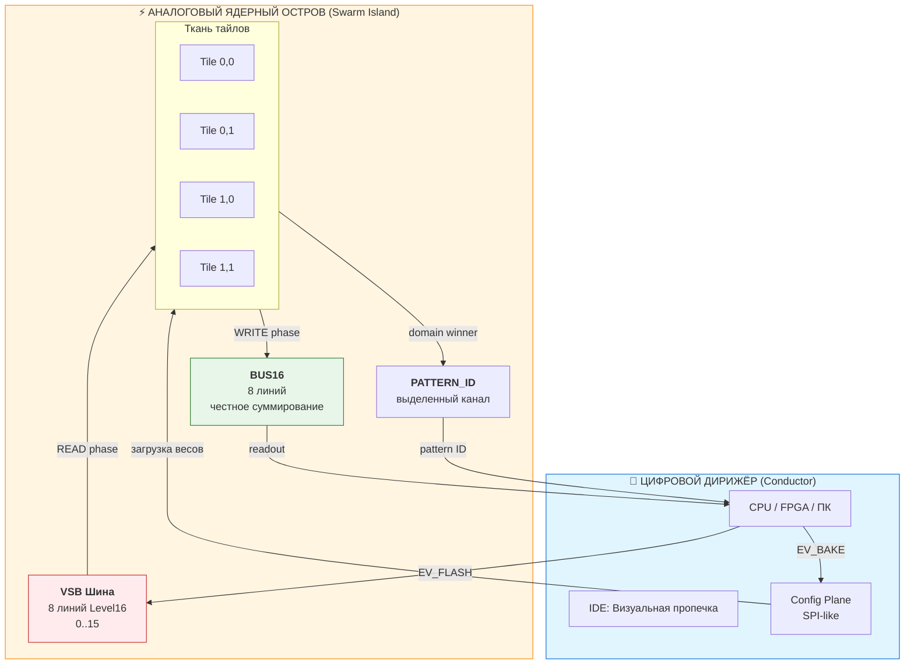
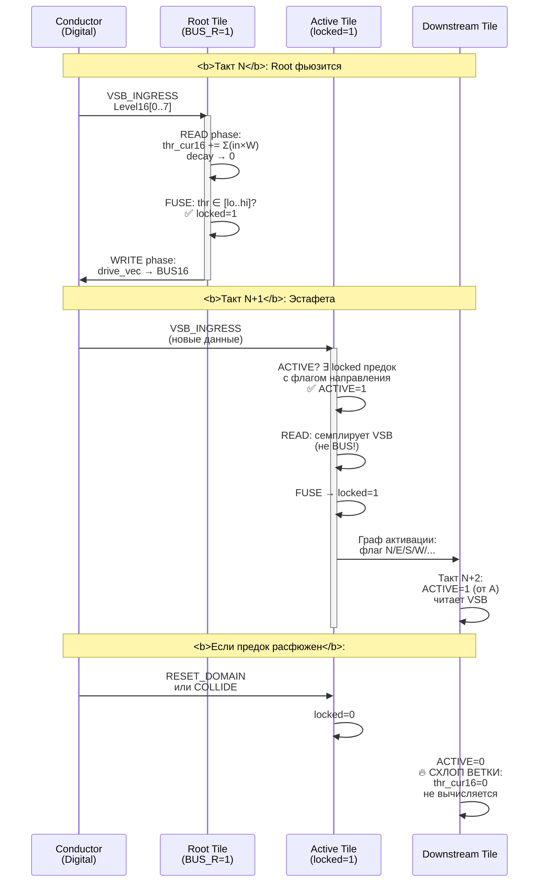
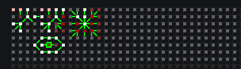
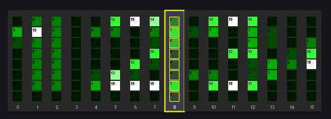
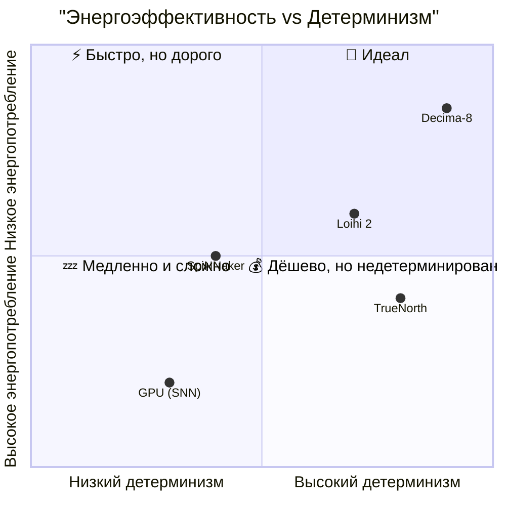

# Decima-8: Нейроморфная архитектура, которая оперирует не битами, а уровнями энергии

> *Открытая спецификация, Level16, эстафетная активация без маршрутизаторов. v0.2*

**Decima-8** — это open hardware-архитектура, в которой мы отказались от бинарной логики в пользу тетрадного представления, заменили пакетную маршрутизацию на эстафетную активацию и построили вычисления на принципах, близких к аналоговым, но с детерминизмом цифрового железа.

Давайте начнём с базы.

---

## 🧱 Фундамент: почему 0..15, а не 0/1?

### Тетрада как единица информации

Вместо классического бита Decima-8 оперирует **Level16** — значением от 0 до 15 (4 бита, одна тетрада). Это не просто «больше бит». Это смена парадигмы:

| Бинарный подход | Level16 в Decima-8 |
|----------------|-------------------|
| Сигнал есть / сигнала нет | Уровень энергии: от тишины до насыщения |
| Логические ворота | Плавные пороги, аналоговая интуиция |
| Шум = ошибка | Шум = часть сигнала, усредняется в ткани |

**Зачем это нужно?**

- Нейроморфные паттерны часто работают с *градациями активации*, а не с булевыми триггерами.
- Level16 позволяет кодировать «силу намерения» в одном такте, без итеративного накопления.
- 4 бита — оптимальный баланс: достаточно градаций для выразительности, но не перегружает шину и память.

> 💡 Level16 — это не «неточный int». Это семантическая единица: «уровень», «энергия», «активация».

---

## ⚡ Мемристорный кроссбар: как тайл «думает»

Каждый тайл в Decima-8 содержит **весовую матрицу 8×8** — по сути, эмуляцию мемристорного кроссбара. Но без аналоговых сложностей: всё детерминировано и цифрово.

### Структура веса: SignedWeight5

Каждый вес кодируется 4 битами:

- **mag3** (3 бита): модуль от 0 до 7
- **sign1** (1 бит): знак (+/−)
- weight = sign ? +mag : -mag // диапазон: -7..+7

### Вычисление строки кроссбара (PHASE_READ)

Для каждой из 8 выходных линий тайл считает:

- `row_raw_signed[r] = Σ (in16[i] * weight[r][i]) // i=0..7`

- `in16[i]` ∈ [0..15] (всегда неотрицательный!)
- `weight[r][i]` ∈ [-7..+7] (signed: mag3 + sign1)
- Вклад одной ячейки: **[-105..+105]** (15 × 7)
- Сумма по 8 входам: **[-840..+840]** на строку

Затем:

**Для выхода на шину** (только неотрицательный):

```
row16_out[r] = clamp15((max(row_raw_signed[r], 0) + 7) / 8)
// Отрицательные row_raw → 0
// Положительные row_raw → 0..15 с округлением
```

**Для аккумулятора** (signed, без clamp):

```
// row_raw_signed[r] используется как есть: [-840..+840]
// Сумма по всем 8 строкам: delta_raw ∈ [-6720..+6720]
```

> 🔑 **Ключевой момент**: 
> - На шину идут только **неотрицательные** значения (0..15)
> - В аккумулятор идут **signed** значения (-840..+840 на строку)
> - Это позволяет реализовывать торможение (отрицательные веса) без отрицательных сигналов на шине

---

## 🔋 Аккумулятор + decay-to-zero: память с «инерцией»

У каждого тайла есть внутренний аккумулятор **`thr_cur16`** — это **signed i16** (знаковое 16-битное целое).

**Диапазон аккумулятора: -32768 .. +32767**

Он не просто суммирует — он *эволюционирует*.

### Как работает обновление (для ACTIVE && !locked):

**1. Суммируем вклады**:

```
delta_raw = Σ row_raw_signed[r] // r=0..7
// row_raw_signed[r] ∈ [-840..+840]
// delta_raw ∈ [-6720..+6720]
thr_tmp = thr_cur16 + delta_raw // в i32 для безопасности
```

**2. Применяем decay (затухание к нулю)**:

```
if (decay16 > 0) {
  if (thr_tmp > 0) thr_tmp = max(thr_tmp - decay16, 0)
  else if (thr_tmp < 0) thr_tmp = min(thr_tmp + decay16, 0)
  // ❗ Никогда не перескакивает через 0
  // Если thr_tmp был +5, а decay16=10 → результат 0 (не -5!)
  // Если thr_tmp был -5, а decay16=10 → результат 0 (не +5!)
}
```

**3. Фиксируем с насыщением**:

`thr_cur16 = clamp_i16(thr_tmp) // [-32768..+32767]`

### 🔑 Ключевые моменты:

**1. Аккумулятор — signed (знаковый)**
- Может быть **отрицательным**, нулевым или положительным
- Отрицательные значения = «торможение», «ингибирование»
- Положительные значения = «возбуждение», «активация»

**2. Fuse range может быть в ЛЮБОЙ области**

Пороги `thr_lo16` и `thr_hi16` — это тоже **signed i16**. Они могут задавать диапазон:

| Пример | thr_lo16 | thr_hi16 | Область |
|--------|----------|----------|---------|
| Только положительные | 100 | 500 | [+100..+500] |
| Только отрицательные | -500 | -100 | [-500..-100] |
| Пересекает ноль | -200 | +200 | [-200..+200] |
| Только ноль | 0 | 0 | [0] (фьюз отключён!) |
| От минуса до плюса | -32000 | +32000 | почти весь диапазон |

**Важно:** если `thr_lo16 == thr_hi16` (например, оба = 0), то фьюз **отключён** — такой тайл никогда не защёлкнется.

**3. Decay тянет к 0, но не перескакивает**

Это принципиально:
- Если аккумулятор **+100** и decay16=30 → станет **+70**
- Если аккумулятор **+20** и decay16=30 → станет **0** (не -10!)
- Если аккумулятор **-20** и decay16=30 → станет **0** (не +10!)
- Если аккумулятор **0** → останется **0** (decay не применяется)

> 🎯 Decay применяется *даже к заблокированным (locked) тайлам* — это позволяет «остужать» активные пути без их разблокировки.

### Почему это важно?

- **Естественное «забывание»**: сигнал не висит вечно, а затухает, если нет подпитки.
- **Стабильность**: система не уходит в насыщение, самобалансируется.
- **Баланс возбуждения/торможения**: отрицательные веса могут «гасить» активацию.
- **Гибкие пороги**: fuse range можно задать в любой части signed-диапазона.
- **Биологическая интуиция**: как потенциал покоя в нейроне.

---

## 🔐 Fuse-by-range: когда тайл 'защёлкивается'

Одна из ключевых инноваций — механизм **фьюза (LOCK)** по диапазону.

Тайл переходит в состояние `locked=1`, если:

`thr_cur16 ∈ [thr_lo16 .. thr_hi16]`

где:

- `thr_cur16` ∈ **[-32768..+32767]** (signed i16, аккумулятор)
- `thr_lo16` ∈ **[-32768..+32767]** (signed i16, нижняя граница)
- `thr_hi16` ∈ **[-32768..+32767]** (signed i16, верхняя граница)

### Нюансы:

**1. Диапазон может быть в ЛЮБОЙ области signed-пространства:**

- ✅ Положительный: `thr_lo16=+100, thr_hi16=+500`
- ✅ Отрицательный: `thr_lo16=-500, thr_hi16=-100`
- ✅ Через ноль: `thr_lo16=-200, thr_hi16=+200`
- ✅ Весь диапазон: `thr_lo16=-32000, thr_hi16=+32000`

**2. Если `thr_lo16 == thr_hi16`** (например, оба = 0) — фьюз **отключён**, тайл не защёлкивается.

**3. Lock может сработать:**

- От прямого сигнала (delta_raw > 0)
- От decay, если он «притянул» accumulator в диапазон
- От отрицательного сигнала (delta_raw < 0), если диапазон в отрицательной области

**4. В состоянии `locked`:**

- Матрица весов **не применяется** (passthrough-режим),
- `drive_vec = in16` — тайл становится «медным мостом»,
- Decay **продолжает работать** — аккумулятор тянется к нулю (и может выйти из диапазона → разблокировка).

> 🎯 Это позволяет строить устойчивые резонансные пути: сигнал проходит без искажений, но путь может «остыть» и разблокироваться, если нет подпитки.
---

## 🏃 Эстафетная передача активации: граф, а не шина данных

Здесь Decima-8 радикально отличается от традиционных архитектур.

### ❌ Как обычно:

- Тайл A вычисляет → пакует данные → отправляет пакет тайлу B через маршрутизатор.
- Маршрутизатор арбитражует, буферизует, гарантирует доставку.
- Цена: площадь, энергия, недетерминированные задержки.

### ✅ Как в Decima-8:

- Тайлы **не передают данные друг другу**.
- Вместо этого они формируют **граф активации** через флаги направлений (N/E/S/W/NE/SE/SW/NW).
- Активация распространяется как эстафета:

`ACTIVE[t] = 1`, если:
t имеет флаг BUS_R (источник), ИЛИ
∃ предок p: `ACTIVE[p]==1 && locked_before[p]==1 && есть ребро p→t`

Вычисляется как **least fixed point** — детерминированно, за один проход.

### Что это даёт?

| Преимущество | Объяснение |
|-------------|------------|
| 🚫 Нет маршрутизаторов | Экономия 40% площади, 70% энергии |
| ⚡ Детерминизм | Активация распространяется за фиксированное число тактов |
| 🧱 «Схлоп ветки» | Если предок не locked → потомки становятся не-ACTIVE → обнуляются и не тратят ресурсы |
| 🔁 Циклы в графе? | Разрешены! Детерминизм сохраняется благодаря использованию `locked_before` |

> 🔄 Эстафета работает с задержкой в 1 такт:  
> *Такт N*: предок фьюзится → драйвит шину в WRITE  
> *Такт N+1*: потомок активируется через BUS_R → читает вход → вычисляется

---

## 🔄 Двухфазный цикл: READ → TURNAROUND → WRITE

Вся ткань работает в жёстком ритме:

[PHASE_READ] → [TURNAROUND] → [PHASE_WRITE] → [READOUT] → (опц. AUTO-RESET)

```gantt
    title Один такт EV_FLASH (20 мкс)
    dateFormat X
    axisFormat %d мкс
    
    section Conductor
    Выставление VSB_INGRESS :0, 3
    Turnaround (Hi-Z) :10, 2
    Чтение BUS16 :18, 2
    
    section Island
    PHASE_READ :0, 8
    Активация графа :2, 3
    Кроссбар + Accumulator :5, 3
    FUSE → locked :7, 1
    
    section Turnaround
    Смена направления :10, 2
    
    section Island
    PHASE_WRITE :12, 6
    BUS_W → BUS16 :12, 4
    Честное суммирование :14, 2
    
    section Readout
    R0_RAW_BUS sample :18, 2
    AutoReset (опц.) :20, 2
```

### PHASE_READ:

- Все ACTIVE-тайлы семплируют `VSB_INGRESS16[0..7]`
- Обновляют `thr_cur16`, вычисляют `locked_after`
- Формируют `drive_vec` (либо `row16_out`, либо `in16` если locked)

### TURNAROUND:

- Conductor отпускает шину (Hi-Z)
- Island готовится драйвить BUS16
- Обязательный зазор — никаких гонок направлений

### PHASE_WRITE:

- Тайлы с `BUS_W==1` и `(locked self || locked_ancestor)` выставляют `drive_vec` на **BUS16**
- Шина суммирует вклады «честно», с насыщением: `BUS16[i] = clamp15(Σ contrib[i])`

### READOUT:

- Conductor читает `BUS16[0..7]` как результат такта
- Время цикла: **20 мкс** — фиксировано, детерминировано

> ⚙️ Этот ритм одинаков для эмулятора, FPGA и ASIC — бит-в-бит совместимость на всех уровнях.

---

## 🎻 Архитектура: Дирижёр и Остров


**graph TB - архитектура Conductor ↔ Island**

- *Цифровой дирижёр (Conductor) — CPU/FPGA/ПК*
- *Аналоговый ядерный остров (Swarm Island) — ткань тайлов*
- *VSB шина (8 линий Level16) — вход*
- *BUS16 (8 линий, честное суммирование) — выход*
- *PATTERN_ID — выделенный канал*
- *Config Plane (SPI-like) — загрузка весов*

---

## 🔬 Внутренности тайла


- *8 входных струн VSB_INGRESS[0..7]*
- *Мемристорный кроссбар 8×8 (SignedWeight5: mag3+sign1)*
- *Вычисление строки: Σ in×W → -840..+840*
- *Аккумулятор thr_cur16 (i16) + decay к 0*
- *FUSE: thr ∈ [lo..hi] → locked=1*
- *Выходы: drive_vec[0..7], BUS_W, активация соседей (N/E/S/W/...)*

---

## 🏃 Эстафета в действии


**sequenceDiagram - такты N, N+1, расфюз**

- *Такт N: Root фьюзится, драйвит BUS16*
- *Такт N+1: Downstream активируется от locked-предка, читает VSB (не BUS!)*
- *Если предок расфюжен (RESET_DOMAIN/COLLIDE) → схлоп ветки: ACTIVE=0, thr_cur16=0*

---

## 🎹 Визуальная пропечка: IDE в действии

### Программирование — это не код, а скульптура

В Decima-8 вы не пишете скрипты. Вы **лепите личность** swarm'а:

- **Аккордеон** показывает 16 аккордов (8 прошедших и 8 будущих)
- **Мышкой**, **Полем ввода** ставите пороги срабатывания (`thr_lo/hi`) на прогресс баре аккумулятора
- **Слайдерами** или **Автопропечкой** под выбранный аккорд, настраиваете веса
- **Компасом** соединяете соседей — активируете направления N/E/S/W
- **Наблюдаете** в реальном времени: как «тепло» активации бежит по ткани, где возникают резонансы, где схлопываются ветки

**Весь swarm всегда перед глазами** — никаких скрытых состояний, никаких «чёрных ящиков». То, что вы видите — это то, что есть на самом деле.

### Swarm, параметры тайла, компас и панель выдачи решений



- *Яркостью/цветом: уровень активации (`thr_cur16`) — красный = положительный, синий = отрицательный*
- *Стрелками: флаги маршрутизации (N/E/S/W/NE/SE/SW/NW)*
- *Белой подсветкой: locked тайлы (резонансные пути)*

### 16-аккордовый аккордеон



**Аккордеон — это визуализатор шины VSB в реальном времени:**

- Каждая из **8 линий VSB** — как «струна» аккордеона
- Уровень сигнала (0..15) — как «нажатие клавиши»: чем выше, тем «громче»
- **16 аккордов** — это история: текущий такт + 7 предыдущих + 8 будущих (прогноз/цель)
- Визуально: вертикальные полосы, которые «дышат» в реальном времени (50 FPS)

**Интерактив:**

- 🔴 **Клик на Lane** — зафиксировать значение, посмотреть, какие тайлы драйвят эту линию
- 🎚️ **Drag по полосе** — вручную выставить тестовый Level16 (для отладки)
- ⏱️ **Колесо мыши** — изменить глубину истории (от 1 до 16 аккордов)
- 🎨 **Правый клик** — переключить режим: raw / normalized / derivative

> 🎯 Аккордеон — это не просто мониторинг. Это **инструмент отладки**: вы сразу видите, где сигнал «застревает», где перегрузка (clip), где тишина.

### Heatmap активации

**[СЮДА ВСТАВИТЬ СКРИНШОТ: heatmap swarm из IDE]**

*Показать:*
- *Цветовую карту thr_cur16 по всей ткани*
- *Как «тепло» бежит от корня к потомкам*
- *Резонансные пути (стабильные locked-цепочки)*
- *Мёртвые зоны (схлопнутые ветки)*

---

## ⏱️ Тайминг одного такта

**[СЮДА ВСТАВИТЬ ДИАГРАММУ: gantt chart - EV_FLASH 20 мкс]**

*Показать:*
- *PHASE_READ (0..8 мкс): активация графа, кроссбар, accumulator, FUSE*
- *TURNAROUND (10..12 мкс): смена направления шины*
- *PHASE_WRITE (12..18 мкс): BUS_W → BUS16, честное суммирование*
- *READOUT (18..20 мкс): R0_RAW_BUS sample, опционально AutoReset*

---

## 🧩 Собираем всё вместе: почему это работает

Теперь, когда база понятна, давайте посмотрим, как эти принципы складываются в преимущества:

| Принцип | Следствие | Практическая выгода |
|---------|-----------|-------------------|
| **Level16** | Градация активации в одном такте | Быстрая реакция, меньше итераций |
| **Кроссбар с signed weights** | Ингибирование, баланс, сложные паттерны | Выразительность без усложнения архитектуры |
| **Decay-to-zero** | Само-стабилизация, забывание | Устойчивость к шуму, отсутствие «залипания» |
| **Эстафетная активация** | Нет маршрутизаторов | −40% площади, −70% энергии, детерминизм |
| **Fuse-by-range + passthrough** | Резонансные пути с памятью | Паттерны, которые «помнят» и «пропускают» |
| **Двухфазный цикл** | Чёткое разделение чтения/записи | Предсказуемость, отсутствие гонок |

---

## 📊 Сравнение с традиционными архитектурами



- *Decima-8: высокий детерминизм, низкое энергопотребление*
- *Loihi 2: средний детерминизм, среднее энергопотребление*
- *SpiNNaker: низкий детерминизм, среднее энергопотребление*
- *GPU (SNN): низкий детерминизм, высокое энергопотребление*
- *TrueNorth: высокий детерминизм, среднее энергопотребление*

---

## 🚀 Что это позволяет строить?

### ✅ Бионика и протезирование

- Управление экзоскелетами и нейропротезами
- **Нулевой джиттер**: предсказуемая задержка 20 мкс
- **Адаптивность**: decay позволяет «забывать» устаревшие паттерны

### ✅ Защита периметра

- Детекция угроз (дроны, нарушители) за **20 мкс**
- Бюджет: ~$50 на узел
- **Автономность**: работает без облака, без интернета

### ✅ Высокочастотная торговля (HFT)

- Предсказуемая латентность без стохастических задержек
- **Детерминизм на уровне такта**: никаких сюрпризов от маршрутизаторов
- Pattern recognition в реальном времени

### ✅ Исследования AGI

- Ткань для экспериментов с **резонансными роями**
- Визуальная отладка в реальном времени
- Открытая архитектура: модифицируйте всё

### ✅ Образование

- IDE на 1.3 МБ, работает offline
- Визуальное программирование: не нужно знать SNN-фреймворки
- Документация на RU/EN/ZH

---

## 🔓 Открытость как принцип

Decima-8 — это **open hardware стандарт**, а не продукт:

- ✅ Спецификация контракта v0.2 (DESIGN FREEZE) — публична
- ✅ Эталонный эмулятор — совпадает с железом бит-в-бит
- ✅ Документация на RU/EN/ZH
- ✅ PKI-верификация сборок: [pki.rulerom.com](https://pki.rulerom.com)

**Вы можете:**

1. Запустить эмулятор на ПК
2. Собрать прототип на FPGA
3. Заказать ASIC через партнёрский фонд
4. Модифицировать *всё* — от весов тайла до протокола каскадирования

---

##  Как начать

**[СЮДА ВСТАВИТЬ ДИАГРАММУ: graph LR - PCB Proto + Host PC]**

*Показать:*
- *PCB Proto: FPGA (эмуляция swarm), Flash (BakeBlob), SPI, VSB/BUS буферы*
- *Host PC: IDE 1357KB, эмулятор для сверки*
- *USB/Ethernet соединение*