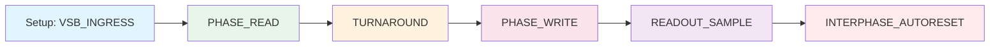

# DECIMA-8 🧠 — Нейроморфный Движок

> **Детерминированный ритм для нейроморфных вычислений: Emulator → Proto (PCB) → FPGA → ASIC**

**Статус:** v0.2 DESIGN FREEZE

**Кодовое имя:** Siberian Tank Interface

---

## 📖 Обзор

**DECIMA-8** — это архитектура нейроморфного движка с детерминированным ритмом и программируемой тканью тайлов.

### Открытая Спецификация

Спецификация Decima-8 открыта для реализации. Мы приветствуем создание альтернативных ядер, совместимых с данной спецификацией. Единственное условие — верификация через Rule-ROM PKI для сохранения детерминизма.

---

## 📜⚙️ Систолическое Сито: Технический Манифест

**Современная архитектура вычислений перегружена логистикой.** В классическом ИИ данные постоянно копируются, маршрутизируются и стоят в очередях к процессору (Bus Contention). Это создает задержки, которые невозможно исправить программно.

**Decima-8 — это систолическое сито.** Здесь нет маршрутизации, нет очередей и нет «принятия решений». Есть только геометрия и резонанс.

### 1. Двухфазный Пульс (The Heartbeat)

Система работает как ирригационная сеть с жестким тактом.

- **PHASE_READ:** Данные («вода») заполняют общую шину VSB. Все тайлы одновременно получают доступ к этому потоку. Это момент максимальной энтропии.
- **PHASE_WRITE:** Тайлы, которые «узнали» входной паттерн, защелкиваются (Latch) и передают свой ID в выделенный канал или — если установлен флаг BUS_W — выдают свой вес обратно в шину для следующего каскада.

### 2. Механика Просеивания

Тайл в этой системе — не вычислитель, а ячейка сита.

- Входящий поток данных пролетает сквозь субстрат.
- Если конфигурация потока совпадает с геометрией «отверстий» (настроенных порогов и весов) в тайле, происходит физический резонанс.
- Тайл срабатывает мгновенно, не тратя время на арифметические операции суммирования. Это и есть детерминизм: либо паттерн прошел через сито, либо нет.

### 3. Иерархия Без Роутеров

Вместо сложных сетевых протоколов мы используем иерархию «Отец — Сын».

- Верхний узел (Conductor/Father) открывает «шлюзы» (активационные графы) для нижних узлов (Islands/Children).
- Данные всегда общие, но доступ к ним управляется структурой самой сети. Это исключает коллизии и позволяет достичь цикла в 20–40 мкс.

### 4. Цель Синтеза

Систолическое сито превращает рыночный шум, видеопоток или аудио-сигналы в **Pattern ID**. Мы не «анализируем» данные — мы отсеиваем из них лишнее, оставляя только чистый **Intent**.

---

### Ключевые Принципы v0.2

| Принцип | Описание |
|---------|----------|
| **Level16** | Данные 0..15 на каждой из 8 линий |
| **Двунаправленный VSB** | Conductor задаёт вход до READ, Island драйвит в WRITE |
| **Tile = минимальная сущность** | RuleROM адресует тайлы напрямую |
| **BUS16 (8 lane)** | Все данные через общую шину, соседи данные не передают |
| **Граф активации** | Соседи формируют эстафету для чтения BUS |
| **Фьюз по диапазону** | LOCK если thr_cur16 ∈ [thr_lo16..thr_hi16] |
| **Decay-to-Zero** | Аккумулятор тянется к 0, не перескакивая |
| **Схлоп ветки** | Неактивный тайл сбрасывается в 0 |

---

## 🏗 Архитектура

### Компоненты

```
┌─────────────────────────────────────────────────────┐
│  Conductor (Digital Island)                         │
│  - CPU / Эмулятор                                   │
│  - Выставляет VSB_INGRESS                           │
│  - Читает BUS16 после WRITE                         │
│  - Управляет EV_FLASH / EV_RESET / EV_BAKE          │
└─────────────────────────────────────────────────────┘
                         │
                         │ VSB[0..7] + BUS16[0..7]
                         ▼
┌─────────────────────────────────────────────────────┐
│  Island / Swarm (Analog Core)                       │
│  ┌─────────────────────────────────────────────┐    │
│  │  Массив Тайлов (16×16 = 256)                │    │
│  │  ┌─────┬─────┬─────┐                        │    │
│  │  │ Tile│ Tile│ ... │                        │    │
│  │  ├─────┼─────┼─────┤  Каждый тайл:          │    │
│  │  │ ... │ ... │ ... │  - 8 вход/вых lanes    │    │
│  │  └─────┴─────┴─────┘  - FUSE (thr/lock)     │    │
│  │         │                - Веса 8×8          │    │
│  └─────────┼───────────────────────────────────┘    │
│             │                                        │
│  ┌──────────▼──────────────────────────────────┐    │
│  │  BUS16 (общая шина 8 lane)                  │    │
│  │  Честное суммирование вкладов               │    │
│  └─────────────────────────────────────────────┘    │
└─────────────────────────────────────────────────────┘
```

### Hard Constants

| Константа | Значение |
|-----------|----------|
| **VSB** | 8 линий данных VSB[0..7] |
| **BUS16** | 8 lane, суммирование в WRITE |
| **Domains** | 16 доменов (0..15) |
| **Level16** | 0..15 (4 бита) |
| **RoutingFlags16** | 10 бит: N,E,S,W,NE,SE,SW,NW,BUS_R,BUS_W |

---

## 🔄 Канонический Tick (EV_FLASH)



### Фазы

| Фаза | Описание |
|------|----------|
| **Setup** | Conductor выставляет VSB_INGRESS16[0..7] |
| **PHASE_READ** | Тайлы семплируют вход, обновляют runtime |
| **TURNAROUND** | Conductor: Hi-Z, Island: prepare drive |
| **PHASE_WRITE** | Island драйвит BUS16 |
| **READOUT_SAMPLE** | Conductor читает BUS16[0..7] |
| **AUTORESET** | Опциональный сброс доменов |

---

## 🧩 Модель Тайла

### Baked State

| Параметр | Тип | Описание |
|----------|-----|----------|
| **thr_lo16** | i16 | Нижний порог фьюза |
| **thr_hi16** | i16 | Верхний порог фьюза |
| **decay16** | u16 | Затухание к нулю |
| **domain_id4** | 0..15 | Группа сброса |
| **priority8** | 0..255 | Приоритет при коллизии |
| **pattern_id16** | 0..32767 | ID паттерна |
| **routing_flags16** | u16 | Направления активации |
| **W[8][8]** | SignedWeight5 | Матрица весов |

### Runtime

| Параметр | Тип | Описание |
|----------|-----|----------|
| **thr_cur16** | i16 | Текущий аккумулятор |
| **locked** | 0/1 | Фьюз защёлкнут |

---

## 📊 Протоколы

### Внешние События (API)

| Событие | Описание |
|---------|----------|
| **EV_FLASH(tag_u32)** | Один цикл READ→WRITE |
| **EV_RESET_DOMAIN(mask16)** | Сброс доменов |
| **EV_BAKE()** | Применение BakeBlob |

### Bake Binary TLV

| TLV Type | ID | Описание |
|----------|-----|----------|
| **TLV_TOPOLOGY** | 0x0100 | Топология массива |
| **TLV_TILE_PARAMS_V2** | 0x0121 | Параметры тайлов (13 bytes/tile) |
| **TLV_TILE_ROUTING_FLAGS16** | 0x0131 | Флаги маршрутизации |
| **TLV_TILE_WEIGHTS_PACKED** | 0x0160 | Веса 8×8 |
| **TLV_RESET_ON_FIRE_MASK16** | 0x0150 | Авто-сброс по fire |
| **TLV_READOUT_POLICY** | 0x0140 | Политика readout |
| **TLV_CRC32** | 0xFFFE | Контрольная сумма |

### UDP Protocol (packet_v1)

Формат: 37 bytes, little-endian

| Поле | Размер | Описание |
|------|--------|----------|
| **magic** | u32 | 'D8UP' |
| **version** | u16 | 1 |
| **flags** | u16 | has_winner, has_bus, has_cycle, has_flags |
| **frame_tag** | u32 | Тег кадра |
| **domain_id** | u8 | ID домена |
| **pattern_id** | u16 | ID паттерна |
| **reset_mask16** | u16 | Маска сброса |
| **collision_mask16** | u16 | Маска коллизий |
| **winner_tile_id** | u16 | ID победителя |
| **cycle_time_us** | u32 | Время цикла |
| **flags32_last** | u32 | FLAGS последнего цикла |
| **bus16[8]** | u8×8 | Значения шины |

---

## 🛠️ Инструменты

- **Эмулятор** — программная модель Decima-8
- **IDE** — визуальное пропекание личностей
- **Bake Compiler** — компиляция в TLV-формат

---

## 🔗 Документы

- [Архитектура тайлов](arch/tiles.md)
- [Шина BUS16](arch/bus.md)
- [Фазы READ/WRITE](arch/phase.md)
- [Маршрутизация](arch/routing.md)
- [Bake TLV спецификация](spec/bake.md)
- [Протокол](spec/protocol.md)

---

**Bake the Future. Build the Substrate.** 🛠️⚡️
