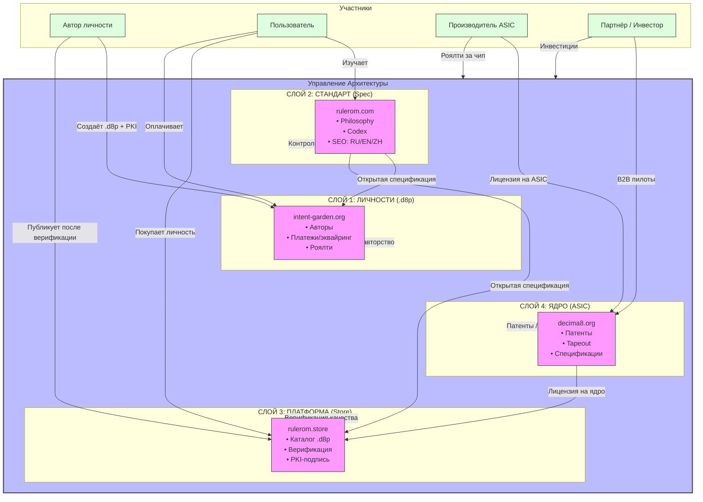

# Экосистема Decima-8: Архитектурное Управление

> «Не владей всем. Владей сутью. Остальное — отдай тем, кто умножит.»



## Коротко: что где и зачем

| Слой | Домен | Что отдаётся | Что сохраняется | Зачем |
| ---- | ----- | ------------ | --------------- | ----- |
| Личности (.d8p) | <https://intent-garden.org> | Доступ к личностям для мира | Авторство, роялти (через PKI) | Масштабирование через сообщество |
| Стандарт (.d8p spec) | <https://rulerom.com> | Спецификация как открытый формат | Контроль версий, эволюция | Стандарт = общий, эволюция = управляема |
| Store (платформа) | <https://rulerom.store> | Доступ для авторов после верификации | Платформа, аудит, комиссии | Доверие + монетизация экосистемы |
| ASIC (ядро) | <https://decima8.org> | Лицензия на использование архитектуры | Патенты, спецификации, роялти | Железо = финальный контролируемый слой |

## Три уровня контроля (Управление Архитектуры)

| Уровень | Что контролируется | Инструмент | Цель |
| ------- | ------------------ | ---------- | ---- |
| Ядро | Архитектура, патенты, эволюция спеки | Патенты, лицензирование, закрытое ООО | Защита от форков, ломающих детерминизм |
| Платформа | Кто попадает в Store, качество .d8p | PKI-подпись, аудит на коррупцию весов | Доверие: «проверено, работает» |
| Сообщество | Авторы личностей, распределение роялти | Лицензионный договор, прозрачный реестр | Стимул: «твори → получай → масштабируй» |

## Поток ценности

```txt
Автор создаёт .d8p 
    ↓
intent-garden.org: подпись PKI + оплата
    ↓
rulerom.store: верификация → публикация
    ↓
Пользователь покупает → запускает на эмуляторе / ASIC
    ↓
Роялти → Автор + Управление Архитектуры
    ↓
decima8.org: лицензия на ASIC для производителя
    ↓
Роялти за чип → Управление Архитектуры
```

---

## Главный принцип

> **Открытость без контроля = хаос.**

> **Контроль без открытости = диктатура.**

> **Слои = устойчивость.**

Управление Архитектуры не выбирает между «открыто» и «закрыто».

Управление Архитектуры **проектирует систему, где каждый слой — на своём месте**.

---