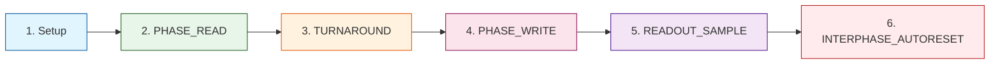

# READ / WRITE 阶段

> **两相保护器：DECIMA-8 的确定性节奏**

---

## 🔄 标准周期 (EV_FLASH)



---

## 1️⃣ Setup (Conductor)

### 动作

```
Conductor 设置 VSB_INGRESS16[0..7] (Level16)
保持稳定直到 READ 孔径结束
```

### 要求

| 要求 | 描述 |
|------|------|
| **稳定性** | READ 期间数据不变 |
| **范围** | Level16: 0..15 每条线路 |
| **所有 8 lanes** | 无 per-lane 掩码 |

---

## 2️⃣ PHASE_READ (Island)

### READ 开始

```python
# 为所有图块拍摄 locked 快照
locked_before[t] = locked[t]

# 计算 ACTIVE 闭包 (最小不动点)
ACTIVE[t] = 从激活图计算

# 如果 ACTIVE[t] == 0 → 强制重置
if ACTIVE[t] == 0:
  thr_cur16[t] := 0
  locked[t] := 0
  drive_vec[t] := {0..0}
  # 权重/row/decay 不应用
```

### 对 ACTIVE[t] == 1

#### 输入读取

```python
for i in 0..7:
  in16[t][i] = clamp15(VSB_INGRESS16[i])
  IN_CLIP[t][i] = (VSB_INGRESS16[i] > 15)
```

#### 如果 locked_before == 0

```python
# 1. Row-pipeline (对每行 r=0..7)
row_raw_signed[r] = Σ_{i=0..7} (in16[i] * Wmag[r][i] * sign)
row16_out[r] = clamp15((max(row_raw_signed[r], 0) + 7) / 8)
row16_signed[r] = row_raw_signed[r]

# 2. 累加器 + decay
delta_raw = Σ_{r=0..7} row16_signed[r]
thr_tmp = thr_cur16 + delta_raw

# Decay 到 0 (不跳过)
if decay16 > 0:
  if thr_tmp > 0: thr_tmp = max(thr_tmp - decay16, 0)
  elif thr_tmp < 0: thr_tmp = min(thr_tmp + decay16, 0)

thr_cur16 = clamp_range(thr_tmp, -32768, 32767)

# 3. 范围熔丝
in_range = (thr_lo16 <= thr_cur16 <= thr_hi16) AND (thr_lo16 < thr_hi16)
has_signal = (delta_raw != 0)
entered_by_decay = (decay16 > 0) AND (in_range) AND (!in_range_before_decay)

locked_after = (BAKE_APPLIED == 1) AND in_range AND (has_signal OR entered_by_decay)
```

#### 如果 locked_before == 1

```python
locked_after := 1
# thr_cur16 不变，矩阵/decay 不应用
```

#### Drive Vector 选择

```python
if locked_after == 1:
  drive_vec[i] = in16[i]  # passthrough
else:
  drive_vec[i] = row16_out[i]
```

---

## 3️⃣ TURNAROUND

### 方向改变

```
Conductor: 移除 VSB 驱动 (Hi-Z / no-drive)
Island: 启用 BUS16 驱动
```

> **重要：** Turnaround (方向间隙) 是必需的，以便 Conductor 释放 VSB 且 Island 可以驱动它。

---

## 4️⃣ PHASE_WRITE (Island)

### 写入条件

图块写入 BUS16 仅当：

```
BUS_W == 1 AND (locked self OR locked_ancestor)
```

### 写入

```python
# 写入整个 drive_vec[0..7] (所有 8 lanes)
for t 其中 BUS_W[t]==1 and (locked[t] or locked_ancestor[t]):
  contrib += drive_vec[t]

# 诚实地累加
for i in 0..7:
  BUS16[i] = clamp15(contrib[i])
  BUS_CLIP[i] = (contrib[i] > 15)
```

---

## 5️⃣ READOUT_SAMPLE (Conductor)

### Default R0_RAW_BUS

```python
R0_RAW_BUS: readout = BUS16[0..7] 为 8×Level16
```

### 时序

```
Conductor 在 PHASE_WRITE 完成后立即读取 BUS16

在 SHM 中：EV_FLASH 填充 OUT_buf
Conductor 在调用返回后读取
```

---

## 6️⃣ INTERPHASE_AUTORESET (可选)

### AutoReset-by-Fire

在 readout 和 FLAGS32_LAST 锁定后应用：

```python
# 计算自动重置掩码
AUTO_RESET_MASK16 = OR_{d | cnt(d)>0} reset_on_fire_mask16[winner(d)]

# 应用
apply_reset_domain(AUTO_RESET_MASK16)
```

### 效果

```
对掩码中的域:
  thr_cur16 := 0
  locked := 0

# 除了重置图块及其祖先链
```

---

## ⏱️ 时序 (参考)

| 阶段 | 持续时间 |
|------|----------|
| **READ** | ~10µs |
| **TURNAROUND** | ~2µs |
| **WRITE** | ~8µs |
| **READOUT** | ~1µs |
| **AUTORESET** | ~1µs |
| **总计** | **~22µs** |

> **注意：** 时序取决于实现 (仿真器/PCB/FPGA/ASIC)。

---

## 🚫 约束

| 约束 | 描述 |
|------|------|
| **EV_RESET_DOMAIN** | 仅在 EV_FLASH 之间 |
| **EV_BAKE** | 仅在 EV_FLASH 之间 |
| **BAKE_APPLIED** | 仅当 BAKE_APPLIED==1 时允许 EV_FLASH |
| **无烘焙变化** | EV_FLASH 内烘焙参数不变 |

---

## 📊 FLAGS32 (运行时)

Island 返回 FLAGS32 (最小)：

| 比特 | 标志 | 描述 |
|------|------|------|
| **bit0** | READY_LAST | 上一周期完成 |
| **bit1** | OVF_ANY_LAST | 上一周期溢出 |
| **bit2** | COLLIDE_ANY_LAST | 上一周期碰撞 |

---

**Bake the Future. Build the Substrate.** 🛠️⚡️
