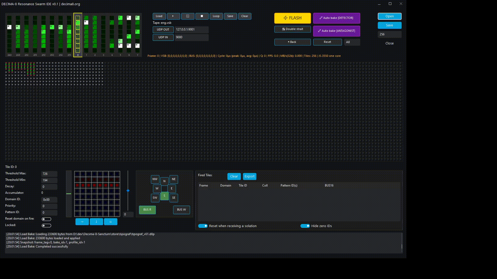
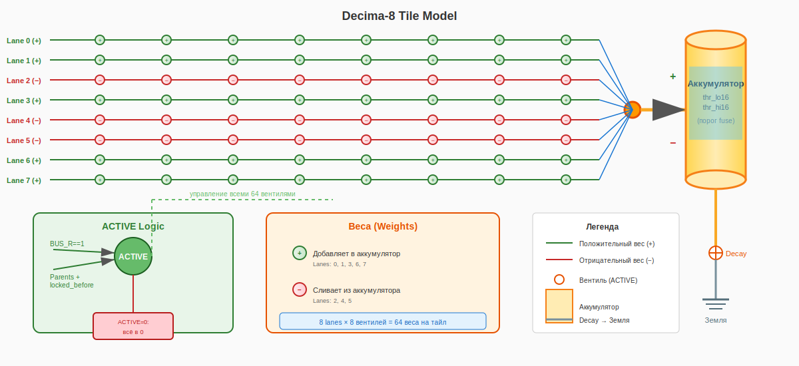
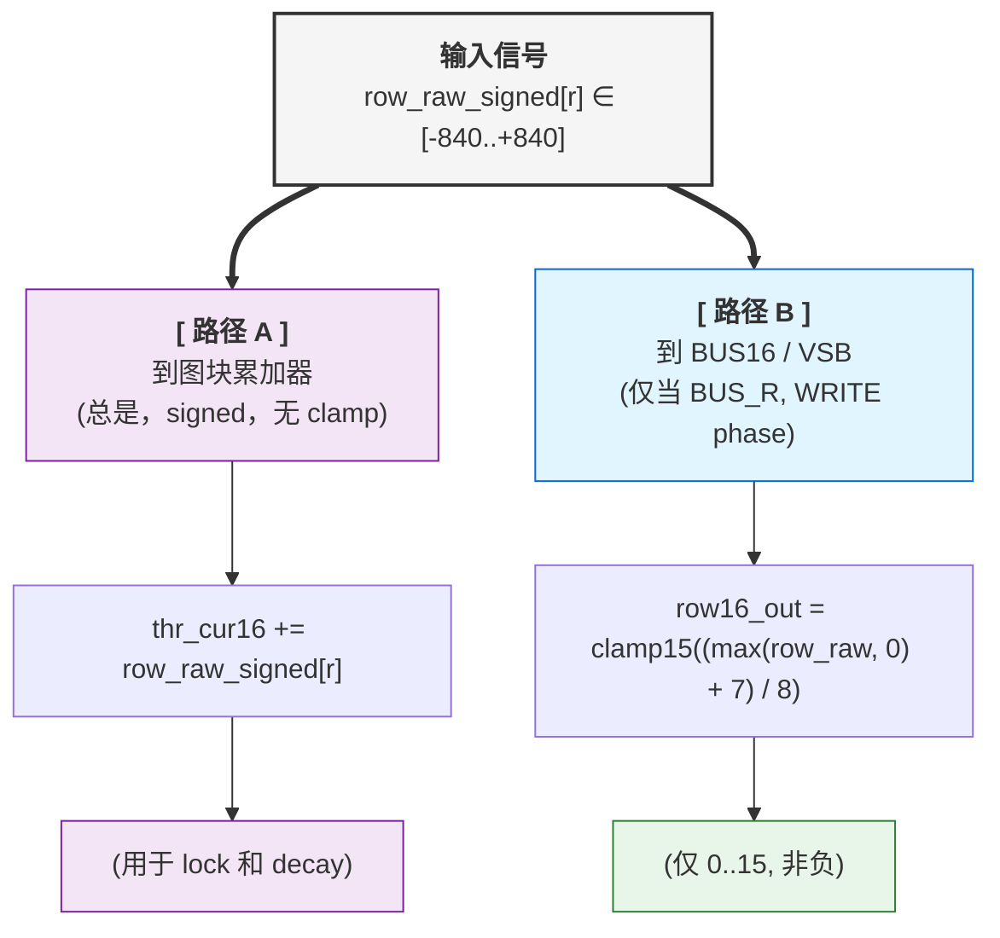
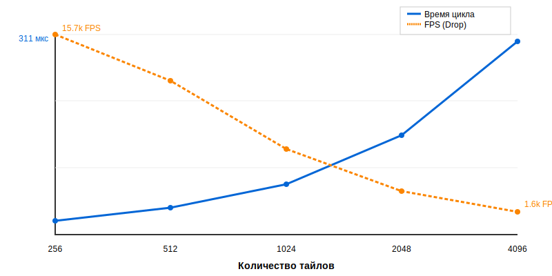

# Decima-8：神经形态架构

> *开放规范，Level16，无路由器中继激活。v0.2*


## 1. 简介

现代神经形态系统面临两个独立问题。

**问题 1：信息编码**

**二值脉冲神经网络 (SNN) 通过以下方式传输信号梯度：**

- 频率编码（每值多时钟）
- 增加传输线路数量

**问题 2：硬件实现**

**模拟忆阻器交叉阵列承诺自然神经形态，但存在以下问题：**

- 噪声和参数漂移
- 非确定性计算
- 每芯片需要单独校准

**传统片上网络 (NoC) 增加开销：**

- ~40% 芯片面积用于路由器
- ~70% 能量用于数据传输，而非计算

**Decima-8 提供：**

- **Level16：** 单时钟单线路编码激活电平 (0..15)。这是二进制表示和模拟连续性之间的折衷。
- **数字交叉阵列（忆阻器矩阵仿真）：** 确定性、可重复性、无噪声
- **中继激活替代分组路由：** 图块不互相传输数据，激活通过依赖图传播
- **结果：** 固定延迟、可预测行为、0% 面积用于路由器。

> *⚛︎ 我们不仿真神经元。我们构建识别即物理的织构。*

---



**Decima-8 IDE 具备 OCR 功能**

[Download IDE](../tools/ide.md)

---

## 2. 数学基础

Decima-8 架构基于确定性整数算术。本节提供计算规范：数据格式、激活公式和图块逻辑。所有值都有固定范围，保证在任何硬件上可重复结果。

### 2.1 Level16：语义四比特


*Level16 在 IDE 手风琴中*

在传统脉冲架构中，信号强度要么在时间中编码（脉冲频率），要么在空间中编码（并行通道数量）。两种方法都需要折衷：要么延迟，要么布线复杂性。

Decima-8 使用**Level16** — 将激活电平表示为 4 比特值 (0..15)，单时钟单线路：

```
thr_cur16 ∈ [0..15]  // 4 比特，一四比特
```

这不是"用数字仿真模拟"的尝试，而是有意识的数据格式选择：

- **足够梯度** 用于神经形态模式表达力
- **适配四比特** — 便于打包格式和位操作
- **固定大小** — 确定性算术，无动态归一化

**Level16 的物理意义：**

- `0` — 无激活
- `15` — 饱和
- `1..14` — "意图强度"梯度

在 VSB 总线上这只是信号电平。在图块内 — 与 SignedWeight5 权重算术的操作数。

> *💭 **本质：** Level16 不是"不精确的 int"。它是架构的语义单元，如同经典神经网络中的 float32。只是确定性的且硬件友好的。*

### 2.2 SignedWeight5：带抑制的加权连接



*图块结构：8 弦 → 交叉阵列 → 累加器*

每个图块包含 8×8 数字仿真忆阻器交叉阵列。8 个值 `in16[0..7]`（Level16）作为输入。每个值乘以其权重并按行求和。

**权重编码：** *SignedWeight5（5 比特）*

```
bits 0-2: magnitude (0..7)   // 模
bit 3:    sign (0=-, 1=+)    // 符号
bit 4:    reserved (0)       // 对齐
```

权重范围：**[-7..+7]**。负权重在硬件层面实现横向抑制 — 这不是仿真，而是符号算术的直接结果。

单交叉阵列行公式：
```
row_raw_signed[r] = Σ (in16[i] × weight[r][i])  // i=0..7
```

由于 `in16[i] ∈ [0..15]` 且 `weight ∈ [-7..+7]`，单单元格贡献在范围**[-105..+105]**。8 输入求和得**[-840..+840]**每行。

这 8 行 (`row_raw_signed[0..7]`) 然后分两条路径：

1. 到累加器（无变换） — 用于累加和 lock 决策的 signed 值
2. 到 VSB 总线（通过归一化和 clamp15） — 仅非负值 0..15

> *💭 **物理意义：** 如果 lane0 传来兴奋信号 (+5)，lane1 传来抑制信号 (-3)，它们的贡献简单求和：+5 + (-3) = +2。"兴奋/抑制"平衡内置于算术，不需要单独逻辑。*

**为什么每权重 5 比特？**

- 3 比特用于模 (0..7) — 足够梯度用于连接表达力
- 1 比特用于符号 — 抑制支持
- 1 比特保留 — 字节对齐，v1.0 扩展可能性

这是精度和打包密度之间的折衷：64 权重 × 5 比特 = 40 字节每图块，适配缓存行。

结果 `row_raw_signed[r]` 去累加器（总是）和总线（如果 BUS_R 标志设置）。

### 2.3 激活函数：一信号双路径

计算 `row_raw_signed[r]` 后，信号走两条路径。**到累加器路径是主要的**，到总线路径是有条件的。



**路径 1：到累加器（主要的，总是激活）**

**公式：**
```
thr_cur16 += row_raw_signed[r]  // signed i16，无变换
```

**特点：**

- `row_raw_signed[r] ∈ [-840..+840]` **原样**使用，保留符号
- 8 行求和：`delta_raw ∈ [-6720..+6720]`
- 累加器 `thr_cur16 ∈ [-32768..+32767]`（signed i16）

**为什么：**

- 累加激活用于 fuse 决策 (`thr_cur16 ∈ [thr_lo16..thr_hi16]`)
- 应用 decay（衰减到零）
- 维持图块内部状态在时钟之间

> *💭 **物理意义：** 累加器是图块的"记忆"。它存储兴奋和抑制的平衡，即使总线上现在寂静。*

**路径 2：到 VSB 总线（有条件的，仅 BUS_R 在 WRITE phase）**

**公式：**

```
row16_out[r] = clamp15((max(row_raw_signed[r], 0) + 7) / 8)
```

**分解：**

| 步骤 | 做什么 | 为什么 |
|------|--------|--------|
| max(..., 0) | 切断负和 | 如果抑制赢了 → 总线上寂静 (0) |
| + 7 | 舍入偏移 | (x + 7) / 8 = 整数除前向上舍入 |
| / 8 | 范围归一化 | [-840..+840] → [0..105] → clamp15 → [0..15] |
| clamp15 | 硬限制 0..15 | 溢出保护，Level16 兼容 |

**示例：**

```
row_raw_signed[r] = +500
→ max(500, 0) = 500
→ (500 + 7) / 8 = 63.375 → 63 (整数)
→ clamp15(63) = 15  ← 饱和

row_raw_signed[r] = +50
→ max(50, 0) = 50
→ (50 + 7) / 8 = 7.125 → 7
→ clamp15(7) = 7  ← 正常值

row_raw_signed[r] = -100
→ max(-100, 0) = 0
→ (0 + 7) / 8 = 0.875 → 0
→ clamp15(0) = 0  ← 完全抑制（抑制赢了）
```

> *💭 **物理意义：** 只有**能级** (0..15) 去 VSB 总线。负值对传输无意义 — "寂静"编码为 0。*

**为什么 /8，不是自适应归一化？**

**因为总是 8 输入。** 不是 1，不是 64，不是"多少活跃"。

这保证：

- 确定性：相同配置 → 相同结果
- 硬件简单：`>>3` 替代 runtime 除法
- 可预测性：无"突然饱和"随输入密度变化

如果需要不同动态范围 — 调整图块参数：

- `weights` (mag3+sign1) — 连接强度
- `thr_lo/hi` — 累加器激活范围
- `decay16` — 衰减速率

> *💭 哲学：不隐藏复杂度于"智能架构"，给显式控制杆。*

### 2.4 累加器 + Signed Decay：带惯性的记忆

图块状态存储在累加器 `thr_cur16`：

```
thr_cur16 ∈ [-32768..+32767]  // signed i16
```

**为什么 signed：** 累加器求和加权贡献 `row_raw_signed[r] ∈ [-840..+840]`。负值（抑制）必须减小电位，不在零处切断。

**Decay 机制：**

每时钟，如果 decay16 > 0，累加器趋向零：

```
if (decay16 > 0) {
  if (thr_tmp > 0) thr_tmp = max(thr_tmp - decay16, 0);
  else if (thr_tmp < 0) thr_tmp = min(thr_tmp + decay16, 0);
  // 零穿越保护：符号不变
}
```

**关键属性：**

1. **无零跳跃。** 如果 `thr_cur16 = +20` 且 `decay16 = 30`，结果将是 `0`，不是 `-10`。电位符号相对 decay 不变。
2. **总是应用。** Decay 甚至对 `locked` 图块工作。这允许激活路径"冷却"并无供给解锁。
3. **可配置参数。** `decay16` 在 `TileParams` 中为每个图块单独设置。

**为什么需要：**

- **噪声过滤：** 弱信号 (`|delta| < decay16`) 不累加，它们湮灭。
- **积分窗口限制：** 信号仅当在衰减速率设置的时间窗口内到达时求和。
- **稳定性：** 防止长时间激活时累加器饱和。

> *注意：如果任务需要弱信号积分 — 设置 decay16 = 0 或小值。架构不强加"遗忘"，你通过配置控制它。*

### 2.5 范围熔丝：阈值逻辑

图块基于当前累加器值 `thr_cur16` 和可配置范围 `[thr_lo16..thr_hi16]` 做出 lock 决策：

```
locked = 1, 如果 thr_cur16 ∈ [thr_lo16, thr_hi16]
```

**参数：**

- `thr_lo16, thr_hi16` ∈ `[-32768..+32767]`（signed i16）
- 验证：`如果 thr_lo16 > thr_hi16` → 错误 `FuseRangeError` 在 bake
- 如果 `thr_lo16 == thr_hi16` → 熔丝禁用（图块从不 lock）

**`locked=1` 时的行为：**

1. **维持后代激活：** 图块 locked 时，它在图中的后代保持 `ACTIVE` 并可在下时钟计算。
2. **Decay 继续工作：** 累加器衰减到零即使在 locked 状态。如果 `thr_cur16` 退出 [`thr_lo16..thr_hi16`] 范围，图块解锁。
3. **中继传播：** locked 图块形成激活图中的稳定链接。

**关键原则：**

`locked` 不是数据传输，而是后代的计算许可。数据从 Conductor 通过 `VSB_INGRESS` 来，不从其他图块。图块只在累加器中累加状态并通过 `locked` 标志管理激活图。

> *注意：范围 [`thr_lo16..thr_hi16`] 可在 signed 谱的任何部分：仅正、仅负、或穿越零。这允许调整图块对兴奋、抑制或偏离静止的响应。*

---

## 🧩 数学总结

| 组件 | 范围 | 公式 |
|------|------|------|
| Level16 | [0..15] | thr_cur16 — 能级 |
| SignedWeight5 | [-7..+7] | mag3 + sign1 |
| row_raw_signed | [-840..+840] | Σ(in16 × weight) 每行 |
| delta_raw | [-6720..+6720] | Σ row_raw_signed (8 行) |
| 累加器 | [-32768..+32767] | thr_cur16 += delta_raw - decay |
| 熔丝范围 | [-32768..+32767] | thr_lo16 .. thr_hi16 |

---

## 3. 架构

第 2 节固定了数学计算规则。第 3 节描述它们的硬件实现：Conductor/Island 分离、确定性 READ→WRITE 周期、无路由器中继激活和能效机制。

所有组件设计保证：

- 固定延迟（不依赖负载）
- 可扩展性（随织构增长线性时间增长）
- 确定性（相同输入相同结果）

---

### 3.1 Conductor ↔ Island

（图表同英文）

Decima-8 分为两个平面：**Conductor**（控制）和**Island**（计算）。

**Conductor** — 外部控制器（CPU/FPGA/PC）：

- 调用事件 `EV_FLASH`、`EV_BAKE`、`EV_RESET_DOMAIN`
- 在 READ phase 开始设置 `VSB_INGRESS[0..7]`
- 在 WRITE phase 后读取 `BUS16[0..7]` 和 `PATTERN_ID`
- 通过 SPI-like 接口（CFG）加载配置（权重、阈值）

**Island** — 计算织构：

- 图块阵列（可扩展：8×32 .. 32×128）
- 每时钟所有图块并行处理
- **VSB**（值信号总线）：8 输入线 Level16 从 Conductor
- **BUS16：** 8 输出线用于图块贡献求和
- **PATTERN_ID：** 专用通道用于获胜模式 ID

**配置接口：**

- SPI/QSPI：BakeBlob 加载 — 高达 50 MB/s
- Parallel CFG bus（FPGA）：高达 200 MB/s
- PCIe/Ethernet（主机控制器）：高达 1 GB/s
- UART：仅调试，不用于 runtime

> *💭 原则：Conductor 不参与计算。它只指挥周期和读取结果。所有动力学发生在 Island 内。*

---

### 3.2 两相周期

（甘特图同英文）

整个织构在严格节奏中工作。一时钟由四相组成：

```
┌─────────────┬──────────────┬─────────────┬─────────────┐
│ PHASE_READ  │ TURNAROUND   │ PHASE_WRITE │ READOUT     │
└─────────────┴──────────────┴─────────────┴─────────────┘
```

**PHASE_READ：**

1. Conductor 设置 `VSB_INGRESS16[0..7]`（Level16）
2. 所有 ACTIVE 图块采样输入
3. 计算每行 `row_raw_signed[r]`
4. 更新 `thr_cur16 += delta_raw`
5. 应用 decay（衰减到零）
6. 检查 fuse：`locked_after = (thr_cur16 ∈ [thr_lo16..thr_hi16])`
7. 形成 `drive_vec[0..7]`

**TURNAROUND：**

- Conductor 释放 VSB（Hi-Z / no-drive）
- Island 启用 BUS16 驱动
- **强制间隙** — 无方向竞争

**PHASE_WRITE：**

- 有 `BUS_W==1` 和 `(locked self || locked_ancestor)` 的图块在 BUS16 上设置 `drive_vec`
- 诚实求和：`BUS16[i] = clamp15(Σ contrib[i])`
- 锁存：`locked := locked_after`

**READOUT：**

- Conductor 读取 `BUS16[0..7]` 作为时钟结果
- 可选：AutoReset-by-Fire（按获胜者掩码域重置）

**周期确定性：**

每时钟执行时间固定，不依赖：

- 活跃图块数量
- 模式复杂性
- 累加器状态

在仿真器（i5-3550）上完整周期耗时**~20-311 μs**，取决于织构大小（见第 4 节）。在 FPGA/ASIC 上时间将由时钟频率和流水线深度决定。

> *💭 关键原则：无论图块是否激活，所有计算相同时钟数。这保证架构层面零抖动。*

---

### 3.3 中继激活（无路由器 NoC）

（序列图同英文）

在传统神经形态架构中，图块通过分组交换网络（Network-on-Chip）交换数据。这需要：

- 节点间路由器
- 分组队列缓冲区
- 流量冲突仲裁

**Decima-8 工作不同：**

图块**不互相传输数据**。相反，它们通过方向标志（N/E/S/W/NE/SE/SW/NW）形成**激活图**。

**机制：**

```
ACTIVE[t] = 1, 如果:
t 有 BUS_R 标志 == 1（源/根）, 或
∃ 祖先 p: ACTIVE[p]==1 && locked_before[p]==1 && 有边 p→t
```

计算为**最小不动点** — 确定性地，一次遍历。

**实际中继：**

- **时钟 N：** 根图块激活并变为 `locked`。
- **时钟 N+1：** 后代看到 locked_before[p]==1 并变为 ACTIVE

> *💭 关键原则：激活 2 时钟传播（祖先 → 后代）。数据不传输 — 每图块只从 Conductor 读取 `VSB_INGRESS`。激活图是**计算许可**，不是数据传输通道。*

---

### 3.4 分支坍缩

**逻辑：**

如果祖先未 locked（`locked=0`），后代变为非活跃：

```
if (ACTIVE[t] == 0) {
  thr_cur16 := 0
  locked := 0
  drive_vec := {0..0}
  // 图块不计算，不驱动总线
}
```

**效果：**

- 能量不花在处理已知非活跃路径
- 死织构分支自动"关闭"
- 资源只导向活路径

**示例：**

时钟 N：

- 根图块不 fuse（thr_cur16 未命中 [lo..hi]）
- locked_after = 0

时钟 N+1：

- 后代：ACTIVE = false（无 locked 祖先）
- 强制重置：thr_cur16=0, locked=0

分支坍缩。

> 💭 **类比：** 树掉落死枝。如果根无供给（locked=0），整枝枯萎（ACTIVE=0 → thr_cur16=0）。

---

### 3.5 双注（Double Strait）

**目的：** 提高识别小 Hamming 距离模式时的选择性（例如，8 VSB 弦上 32 比特编码的 ASCII 字符）。

**问题：** 直接检测时，相似字符（如"3"和"8"）可能激活相同图块由于位掩码重叠。这导致误报。

**机制：**

如果设置标志 `BAKE_FLAG_DOUBLE_STRAIT`（.d8p header 中 bit 0），核心每调用一次 `EV_FLASH` 执行两次内部注：

**第一注（搜索）：**

- 所有图块计算 `row_raw_signed`，更新 `thr_cur16`。
- 检测器图块（第一线）如果命中 [`thr_lo..thr_hi`] 范围则锁存（`locked=1`）。
- 无决策输出。BUS16 输出总线不更新。

**第二注（验证）：**

- 相同输入和弦再次处理。
- 锁存的检测器通过激活图向拮抗剂图块开放路径。
- 拮抗剂验证模式：只有一个拮抗剂（匹配输入字符）保持累加器近零。其他深入负（抑制）。
- **决策输出：** 仅第二注完成后。

**对 Conductor：**

- 一次 EV_FLASH 调用。
- 执行时间加倍（例如，仿真器上 ~40 μs 替代 ~20 μs）。
- API 不变：输入喂一次，完成后读结果。

**何时使用：**

- 是：小 Hamming 距离字符/数字识别。
- 是：类重叠分类，准确性重要时。
- 否：严格延迟要求任务（HFT、电机控制）。
- 否：大 Hamming 距离模式（单注足够）。

**在 IDE 中：** bake 设置中"Double Strait"复选框自动在 .d8p 中设置标志。

> *注意：大多数个性（ASR、电机控制、简单检测器）无双注工作。这是准确性优先于延迟任务的可选模式。*

---

## 🧩 架构总结

| 组件 | 原则 | 收益 |
|------|------|------|
| **Conductor ↔ Island** | 控制与计算分离 | 清晰纪律、可扩展性 |
| **两相周期** | READ → TURNAROUND → WRITE | 确定性 20 μs，无竞争条件 |
| **中继激活** | 图非数据传输 | 0% 面积用于路由器，零抖动 |
| **分支坍缩** | ACTIVE=false → 重置为 0 | 能效、自动优化 |
| **双注** | 每 EV_FLASH 两内部时钟 | 选择性优先延迟 |

---

## 4. 基准测试

### 测试平台

**IDE Decima-8** — 原生 C++23 应用（libwui，静态构建）。测试在 Intel Core i5-3550（2012，4 核，3.3 GHz），单核。

**测量结果：**

| 图块数 | 周期时间 | 频率 |
|--------|---------|------|
| 256 | ~22 μs | 45 kHz |
| 512 | ~43 μs | 23 kHz |
| 1024 | ~81 μs | 12 kHz |
| 2048 | ~160 μs | 6 kHz |
| 4096 | ~311 μs | 3 kHz |



*i5-3550 性能图（单核）*

**扩展：**

加倍图块数时，执行时间**约加倍**（系数 1.88–1.98）。1024 图块后增长加速 — 缓存未中和内存压力生效。这是**物理 CPU 限制**，非算法。

> ***重要：** 每配置时间恒定，不依赖网络活动。100% 图块负载不增加延迟。*

**内存：**

仿真器每图块用 ~57 字节。4096 图块需 ~228 KB — 适配现代 CPU 的 L2/L3 缓存。

**确定性**

周期时间 spread 最小（± OS 抖动）。这是架构结果：

- runtime 无动态分配
- 无数据依赖分支
- 固定 READ → WRITE 周期

在 FPGA/ASIC 上时间将由时钟频率和流水线深度决定，非网络负载。

**应用：**

| 任务 | 要求 | Decima-8（4096 图块） |
|------|------|---------------------|
| 机器人 | 1–10 ms 周期 | 0.3 ms（余量 3–30×） |
| HFT（分析） | < 1 ms | 0.3 ms |
| 音频处理（块处理） | 1-10 ms 块 | 0.3 ms（余量 3-30×） |

> *注意：Decima-8 仿真器（4096 图块，~311 μs）适用于交易周期预测分析和音频 DSP 块处理（64+ 样本）。亚毫秒要求任务 — 直接订单执行（tick-to-trade < 1 μs）或逐样本处理（22.7 μs @44.1 kHz） — 需要 FPGA/ASIC 或更小织构配置。*

---

## 🧩 基准总结

| 指标 | 值 |
|------|-----|
| **最小延迟** | 22 μs（256 图块） |
| **最大尺寸** | 311 μs 4096 图块 |
| **扩展** | 线性（O(n)） |
| **抖动** | 无（确定性） |
| **内存** | 紧凑（L3 缓存） |

---

## 5. 软件生态

Decima-8 不仅是硬件。它是创建、测试和运行神经形态个性的工具集。

### 5.1 D8P 格式

**状态：** 开放规范（MIT）

文件 `.d8p`（Decima 8 Personality）是集群"个性"容器。无代码。仅数据。

**结构：** TLV（Type-Length-Value）带 CRC32 校验和。

**为什么 TLV：**

- 新块类型不破坏旧解析器
- 易检查文件完整性
- 无需加载整个文件到内存验证

**libd8p** — 开放库（C++, MIT）用于格式：解析、验证、生成。

> *💭 任何人都可写自己的 .d8p 生成器：Python（PyTorch/NumPy）、Rust、C++，甚至手动在 hex 编辑器。*

### 5.2 IDE

**状态：** 闭源二进制，免费使用

**特点：**

- 静态构建，无依赖
- Windows（MSVC 2026）/ Linux（Clang latest）
- offline 工作，无需互联网


*Decima-8 IDE 总览*

**主组件：**

| 组件 | 描述 |
|------|------|
| **集群面板** | 个性织构可视化（激活热图） |
| **图块参数** | 权重、thr_lo/hi、decay、路由 |
| **16 和弦手风琴** | VSB 可视化器（8 弦 × 16 和弦历史） |
| **录音机和网络** | 加载/保存 VBS 带、通过 UDP 接收/发送 VSB |
| **控制面板** | Flash：运行机器时钟、Reset：重置域、Autobake |
| **决策输出面板** | 显示 PATTERN_ID、BUS16、FLAGS |

**可视化烘焙：** 鼠标调整阈值、权重和连接，实时观察集群响应。

### 5.3 核心仿真器

**状态：** *开源*（MIT）

仿真器是数学验证的"真相源"。

**用途：**

- FPGA/ASIC 加载前个性测试
- 集成到 CI/CD、自动测试
- "从内部"学习架构

**功能：**

- 与硬件位级兼容（仿真器 → FPGA → ASIC）
- API：`EV_FLASH`、`EV_BAKE`、`EV_RESET_DOMAIN`
- 读取 FLAGS、BUS16、统计
- C-API 用于 Python/Rust/C++ 集成

**使用示例（Python）：**

```python
import d8p

swarm = d8p.load("personality.d8p")

for i in range(1000):
    swarm.ev_flash(vsb_ingress=[7,12,3,10,4,14,0,9])
    readout = swarm.read_bus()
    print(f"Tick {i}: BUS16 = {readout}")
```

### 5.4 Store（个性市场）

**状态：** 精选平台

Store 是发布和分享 готовых个性的地方。

**工作流：**

1. **生成 .d8p** — 任何方式（IDE、脚本、神经网络）
2. **PKI 密钥签名** — 作者身份和完整性保证
3. **发布在 Store** — 规范验证 + 签名检查
4. **社区使用** — 下载、集成、评论、货币化

**发布要求：**

- 有效 .d8p（规范合规）
- PKI 签名（通过 Tile/Cluster/Council 订阅获得）
- 最小前端（运行的 Conductor 代码）
- 文档（输入/输出描述）

> *💭 Store 不检查 Conductor 代码（作者责任），但检查 `.d8p` 规范合规和签名有效性。*

**为什么 PKI 签名？**

这不是付费墙，而是信任链：

- 保证个性由验证作者创建
- 防止文件替换
- 声誉系统（评论、作者评分）

已发布个性**不删除**在订阅过期时。

## 🧩 生态总结

| 组件 | 状态 | 用途 |
|------|------|------|
| 格式 .d8p | ✅ 开放 | 个性容器 |
| libd8p | ✅ 开放 | 解析、验证、生成 |
| 仿真器 | ✅ 开放 | 测试、验证 |
| IDE | 🔒 闭源（免费） | 可视化调整 |
| Store | 🔒 闭源（精选） | 发布和分享 |

**开放核心，闭源驾驶舱。** 你可任何方式创建 `.d8p`，但 Store 发布需要 PKI 签名。

---

## 6. 安全

Decima-8 不使系统"不可攻破"。它使风险可预测和局部化。

**架构风险模型**

| 组件 | 风险 | 保护 |
|------|------|------|
| .d8p | ❌ 无 | 数据（TLV）、无代码、无指针 |
| 仿真器（核心） | ❌ 无 | 确定性、有界算术、饱和 |
| 个性前端 | ⚠️ 有 | Sandbox、限制、作者声誉 |
| Conductor（你的代码） | ⚠️ 有 | 经典安全实践 |

**.d8p 是数据，非程序**。无执行代码、无 `eval`、无递归。文件不能执行 RCE、溢出栈或分配内存。

**仿真器是确定性机器**。固定时钟、Level16、clamp 算术。"坏"数据不存在 — 只有值 0..15。溢出按设计不可能。

**前端和 Conductor** — 你的责任。转换外部数据到 Level16 并读取 BUS16 的代码，与网络、FS、JSON 工作。经典漏洞适用（解析、缓冲区、网络）。

> **原则：** 核心干净。边界你的。

**拓扑验证**

除 CRC32 和 PKI 签名外，仿真器加载前执行静态图分析：

- 检查正反馈循环
- 限制最大图块连接度
- 限制组件中总增益系数

如果图未通过验证 — 加载拒绝，错误 `TopologyValidationError`。

> *这不是"杀毒软件"。这是个性物理健全性检查。*

**Store：发布要求**

发布个性到 Store 时作者提供：

| 组件 | 状态 | 检查 |
|------|------|------|
| .d8p 文件 | 必须 | 规范验证 + PKI 签名 |
| 前端（最小） | 必须 | 不检查（用户代码） |
| 文档 | 必须 | 8 弦描述、输出解释 |
| 运行示例 | 必须 | 脚本/说明 |

**为什么不检查前端：**

- 技术不可能（代码在 Python/Rust/Go/C++）
- 法律复杂（不想承担责任）
- 哲学错误（Decima-8 是开放标准）

**代替检查：**

- 发布要求（无前端 = 无发布）
- 用户警告（"在 sandbox 运行"）
- 评级系统（评论、作者声誉）

**推荐**

**从 Store 加载个性时：**

- 在 sandbox 运行（Docker、VM、seccomp、AppArmor）
- 限制网络访问（如果不需要）
- 设置内存和 CPU 限制（cgroups、ulimit）
- 检查作者声誉（评分、评论）

**发布时：**

- 提供最小可运行前端
- 文档化输入/输出（8 弦、BUS16、PATTERN_ID）
- 警告风险（网络、FS、外部 API）

**我们不保证什么**

| 不保证 | 为什么 |
|--------|--------|
| 无 bug 前端 | 作者代码、你负责 |
| Conductor 稳定性 | 你的代码、你负责 |
| .d8p 描述"好"个性 | 检查物理、非语义 |
| PKI 密钥未泄露 | 安全存储密钥 |

**总结：** Decima-8 局部化漏洞。攻击核心不可能（无代码、确定性）。攻击边界可能 — 但这是经典向量，有经典防护。

> *💭 **架构诚实：** 你确切知道哪里风险、哪里无。*

---

## 7. 分发模式

Decima-8 作为开放规范项目和精选个性市场发展。以下是分发和支持如何工作。

### 7.1 开放和封闭组件

| 组件 | 状态 | 用途 |
|------|------|------|
| 规范 + 仿真器 | ✅ 开放 | 验证、集成、fork |
| 格式 .d8p | ✅ 开放 | 个性容器（TLV） |
| libd8p（解析器） | ✅ 开放 | 验证、生成、签名 |
| IDE | 🔒 闭源（免费） | 个性调整参考工具 |
| Store | 🔒 闭源（精选） | 个性发布和交换 |

> *💭 **原则：** 规范开放 — 任何人都可写自己的 .d8p 生成器、仿真器或工具。Store — 带签名检查和规范合规的精选场地。*

### 7.2 Store 发布

发布个性到 Store 需要**.d8p 文件 PKI 签名**。

**为什么：**

- 作者身份保证（密钥绑定到账户）
- 文件完整性（加载时检查签名）
- 声誉系统（对作者评论、非匿名文件）

**如何获得密钥：**

- 订阅 Tile/Cluster/Council 费率（自动发行）
- 或来自信任中心的自己的 PKI 密钥（Corporate CA 等）

**重要：** 已发布个性**不删除**在订阅过期时。订阅仅需要加载新的或更新现有的。

**替代签名：自己的 PKI 密钥**

Store 接受来自任何信任中心的密钥，不仅我们的。

**过程：**

1. **获得密钥** 在你的 CA（公司、政府等）
2. **签名** .d8p：
```bash
openssl dgst -sha256 -sign decima_key.pem \
  -out personality.d8p.sig \
  personality.d8p
```

3. **加载到 Store：** 系统将检查到 Root CA 的信任链

**细微差别：**

- 对于公共 Store 更简单使用我们的 PKI（Tile/Cluster/Council） — 默认信任所有用户
- 自己的密钥需要用户导入你的 Root CA
- 公司使用：内部 Store + 自己的 CA

### 7.3 发展计划

**未来 6 个月：**

- 软件进一步发展：libd8p、core、IDE
- Store 启动（首批个性）
- 俄语和英语文档

**6–24 个月：**

- 从常见格式转换器（ONNX → D8P）
- 与大学合作（研究、课程）
- FPGA 原型（硬件验证）

**2–4 年：**

- B2B 试点（机器人、预测分析）
- 与框架集成（ROS 2、Azure IoT）
- 认证合作伙伴（FPGA/ASIC）

**4+ 年：**

- IP 许可给芯片制造商
- 销售版税（如果使用 Decima-8 标准）
- 支持开放 SDK 和固件

> *💭 这不是承诺，而是指南。优先级可能根据社区和资源改变。*

## 🧩 总结

| 方面 | 实现 |
|------|------|
| 规范 | 开放、fork 允许 |
| Store | 精选、带 PKI 签名 |
| 货币化 | PKI 密钥订阅（Tile/Cluster/Council）、ASIC 版税 |
| 社区 | Observer/Seed/Gardener — 用户；Tile/Cluster/Council — 作者 |
| 长期性 | 项目设计 10+ 年、非 3 年 exit |

> *💭 Decima-8 是基础设施项目。我们不卖软件订阅、我们建生态。*

---

## 8. 架构演化

Decima-8 v0.2 是**最小可行架构**。非教条、而是起点、证明原则可行性。

**永远固定的（原则）：**

| 原则 | 为什么是基础 |
|------|-------------|
| **两相周期** READ → WRITE | 确定性、无竞争条件 |
| **中继激活**（图非分组） | 0% 面积用于路由器、零抖动 |
| **LevelN**（多比特激活） | 单时钟编码"意图强度" |
| **Signed Decay**（衰减到零） | 稳定性、自然"遗忘" |
| **范围熔丝**（阈值逻辑） | 灵活模式、谐振路径 |

**可扩展的（参数）：**

| 参数 | v0.2（现在） | v1.0+（未来） | 为什么 |
|------|-------------|--------------|--------|
| **Level** | 16 (0..15) | 32 / 64 | 细激活梯度、少量化 |
| **权重** | SignedWeight5 [-7..+7] | SignedWeight7 [-31..+31] | 更大连接表达力 |
| **Lanes** | 8 | 16 / 32 | 带宽、并行性 |
| **织构** | 8×32 .. 32×128 | 256×1024 / 集群 | 复杂层次模式 |
| **域** | 16 | 32 / 64 | 细重置和优先级控制 |
| **周期时间** | 22-311 μs（仿真器） | <1 μs（ASIC） | 极端任务硬实时 |

**向后兼容：**

所有变化**在原则层面兼容**：
- 两相周期保留
- 中继激活是基础
- 范围熔丝、decay-to-zero 是基础

**开放规范允许：**

1. **实验：** fork 仿真器、改 `Level16` → `Level32`、看集群行为变化
2. **提议扩展：** 如果扩展证明优势 — 可通过 Spec RFC 进入 v1.0
3. **构建专用变体：**
   - `Decima-8-Lite`：用于 IoT（少图块、少权重、低功耗）
   - `Decima-8-Pro`：用于 HFT（多 lanes、少周期、确定性优先）
   - `Decima-8-Research`：用于科学（扩展指标、调试、日志）

> *💭 **哲学：** 我们固定*原则*、非*参数*。Level16 和 SignedWeight5 非教条、而是起点。*

---

## 9. 结论

Decima-8 是单时钟编码激活电平（Level16）、用中继激活替代分组路由、保证确定性执行时间的架构。

**关键属性：**

- **Level16：** 每激活 4 比特、每值一时钟
- **SignedWeight5：** 符号权重 [-7..+7]、硬件级横向抑制
- **中继激活：** 依赖图替代路由器、0% 面积用于路由
- **两相周期：** READ → WRITE、固定延迟、零抖动
- **开放规范：** 规范、仿真器、格式 .d8p — 基于 MIT/Apache 2.0

**我们不承诺 AGI。**

我们提供确定性计算织构用于可预测性、效率和模式表达力重要的任务。

**下一步**

**验证：**

- 仿真器：github.com/rulerom/decima8
- 规范：decima.rulerom.com/ru/CONTRACT/
- 在自己硬件上运行基准

**实验：**

- 写 Python/Rust/Go 的 .d8p 生成器
- 修改仿真器（Level32、其他权重、新模式）
- 通过 Spec RFC 提议扩展

**使用：**

- IDE（1.3 MB、offline）用于个性可视化调整
- Store 用于发布和交换（带 PKI 签名）
- 仿真器用于集成到 CI/CD、自动测试、原型

**资源**

| 资源 | 描述 |
|------|------|
| 合同 v0.2 | decima.rulerom.com/ru/CONTRACT |
| 仿真器（GitHub） | github.com/rulerom/decima8 |
| Bakery（参考） | bakery.rulerom.com |
| PKI 中心 | pki.rulerom.com |
| libwui（UI 引擎） | libwui.org |

**Decima-8 非"又一个神经形态项目"。这是尝试基于能级、谐振和中继激活构建计算。**

> *💭 如果"从物理、非营销"方法更接近你 — 欢迎。*

---

## FAQ

**Q：为什么非 float32/float16？**
A：Level16（0..15）非"不精确 float"、而是语义单元：能级。对神经形态模式 16 梯度足够、固定范围给确定性和硬件效率。

**Q：如何训练？**
A：手动通过 IDE：调整 thr_lo/hi、decay、routing、观察集群响应。非 ML 训练（梯度下降）、而是个性雕塑 — 你通过参数设置行为。
Bakery（bakery.rulerom.com） — 模式参考、非自动训练器。计划 — AI 代理 API、但最终验证留给人。

**Q：可在激活图中用循环？**
A：是。确定性保留通过 locked_before — READ phase 开始的状态快照。

**Q：如果同一域两图块同时 fuse？**
A：Winner 按 priority8 选择、平局 — 按最小 tile_id。COLLIDE 标志信号冲突。

**Q：什么是"双注"、何时用？**
A：核心每 `EV_FLASH` 调用执行两内部时钟提高选择性的模式。用于小 Hamming 距离模式识别（如 VSB 中 ASCII 字符）。IDE 中"Double Strait"复选框启用、.d8p 中设置 BAKE_FLAG_DOUBLE_STRAIT。代价：~40 μs 替代 ~20 μs。

**Q：为什么开放规范？**
A：任何人都可验证数学、写自己的 .d8p 生成器或 fork 仿真器。Decima-8 是标准、非封闭产品。

**Q：如果我想本地用 .d8p、无 Store？**
A：请。签名不需要用于本地使用。仿真器接受任何 .d8p 在 CRC32 验证后。PKI — 仅用于 Store 发布。

**Q：可用自己的 PKI 密钥签名 .d8p？**
A：是。Store 接受来自任何信任中心的密钥（Corporate CA、政府 UC）。对公共 Store 更简单用我们的 PKI（Tile/Cluster/Council） — 默认信任用户。

---

**Bake the Future. Build the Substrate.** 🛠️⚡️
