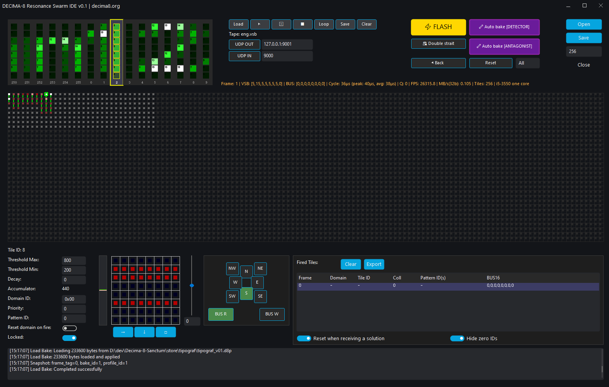

# Decima8 IDE

> **烘焙神经形态个性的可视化环境**

**状态：** Public  
**版本：** 1.0

---

## 🎯 什么是 Decima8 IDE?

**Decima8 IDE** 是一个用于烘焙神经形态个性的可视化环境。在这里您手动配置图块、权重和阈值，同时实时观察识别过程。

---

## 📥 下载

### 系统要求

| 要求 | 值 |
|------|-----|
| **操作系统** | Windows 10/11, Linux (Ubuntu 20.04+) |
| **内存** | 8 GB RAM 最小 |
| **磁盘** | 2 MB 可用空间 |

---

## 🏗️ IDE 界面



*可视化烘焙环境：输入模式和弦、图块集群、参数和解决方案面板*

---

## 🧩 界面组件

### 🛠 控制面板

| 按钮 | 功能 |
|------|------|
| **▶ FLASH** | 运行 EV_FLASH 周期 |
| **⏸ RESET** | 重置选定域或所有的累加器 |
| **🔁 Auto-Bake** | 在模式下自动烘焙 |
| **⚙ 集群参数** | 全局设置 (大小、域) |

---

### 🪗 手风琴 (输入模式)

**VSB 磁带** — 输入数据的可视化表示：

| 参数 | 描述 |
|------|------|
| **8 列** | 8 线路 VSB[0..7] |
| **值 0..15** | Level16 |
| **磁带滚动** | 数据按 tick 送入 |

---

### 🕸 集群 (图块阵列)

**图块阵列可视化：**

| 元素 | 描述 |
|------|------|
| **每个图块** | 一个具有局部内存的神经元 |
| **颜色** | 活动 (thr_cur16) |
| **白色** | Locked 状态 (熔丝锁定) |
| **箭头** | 子代激活方向 (N,E,S,W...) |

**显示模式：**

| 模式 | 描述 |
|------|------|
| **Weights** | 8×8 权重矩阵 |
| **Activation** | 当前 thr_cur16 |
| **Routing** | 路由标志 |

---

### 🎛 图块参数面板

点击图块打开编辑器：

| 参数 | 描述 | 范围 |
|------|------|------|
| **BUS_R** | 读取总线 (ACTIVE 源) | 0/1 |
| **BUS_W** | 写入总线 (WRITE 阶段) | 0/1 |
| **阈值** | 熔丝范围 [thr_lo..thr_hi] | -32768..+32767 |
| **衰减** | 衰减到零的力 | 0..32767 |
| **模式 ID** | 识别的模式 ID | 0..32767 |
| **域** | 重置组 | 0..15 |
| **优先级** | 碰撞时的获胜者 | 0..255 |
| **方向** | 子代激活 (N,E,S,W,NE,SE,SW,NW) | 8 比特 |

---

### 🎯 解决方案面板

**识别模式输出：**

| 字段 | 描述 |
|------|------|
| **Pattern** | 识别的模式 ID |
| **Confidence** | 置信度 (0..1) |
| **Tile ID** | 哪个图块做出决定 |

---

## 🔄 工作流程

### 1. 加载个性

```
1. 打开个性文件 (.d8p)
2. 集群显示图块拓扑
3. 从文件加载 vsb 磁带或启用 UDP 监听
4. 手风琴显示 VSB 和弦 - 这是送入机器输入的内容
5. 如果从文件加载磁带，可以按 FLASH/BACK/RESET 运行模式
6. 通过网络工作时，集群对来自 socket 的和弦做出反应
```

### 2. 配置图块

```
1. 点击集群中的图块
2. 配置阈值、权重、衰减
3. 设置激活方向
4. 对所有图块重复
```

### 3. 烘焙

```
1. 在手风琴中选择需要的和弦 (右键)
2. 选择应该锁定的图块
3. 按 🔁 Auto-Bake
4. IDE 为模式选择权重
5. 检查 FLASH，调整触发走廊
6. 保存为 .d8p
```

### 4. 识别

```
1. 按 ▶ Play
2. 磁带穿过集群
3. 解决方案面板显示识别的模式
4. 通过网络工作时，集群对来自 socket 的和弦做出反应
```

---

## 🤗 AI Agent (即将推出)

开发中 — 用于自动选择权重和拓扑的 AI 代理：

| 阶段 | 描述 |
|------|------|
| **任务** | 您设置模式库和目标指标 |
| **代理** | 运行机器，选择权重和拓扑 |
| **结果** |  готовая пропечённая личность для магазина |

---

**Bake the Future. Build the Substrate.** 🛠️⚡️
